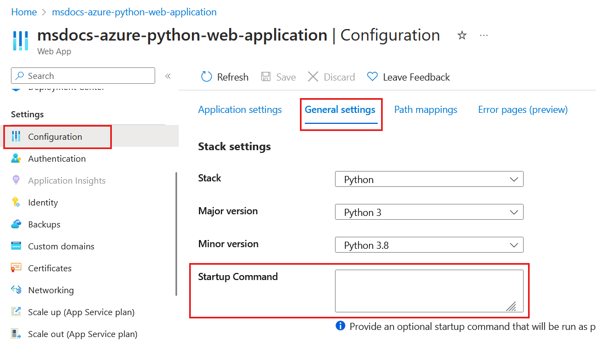

# Configure a custom startup file for Python apps on Azure App Service

In this article, you learn about configuring a custom startup file, if needed, for a Python web app hosted on Azure App Service. For running locally, you don't need a startup file. However, when you deploy a web app to Azure App Service, your code is run in a Docker container that can use any startup commands if they are present.

You need a custom startup file in the following cases:

* You want to start the [Gunicorn](https://gunicorn.org/) default web server with extra arguments beyond the defaults, which are `--bind=0.0.0.0 --timeout 600`.

* Your app is built with a framework other than Flask or Django, or you want to use a different web server besides Gunicorn.

* You have a Flask app whose main code file is named something **other** than *app.py* or *application.py**, or the app object is named something **other** than `app`.

    In other words, unless you have an *app.py* or *application.py* in the root folder of your project, *and* the Flask app object is named `app`, then you need a custom startup command.

For more information, see [Configure Python Apps - Container startup process](/azure/app-service/configure-language-python#container-startup-process).

## Create a startup file

When you need a custom startup file, use the following steps:

1. Create a file in your project named *startup.txt*, *startup.sh*, or another name of your choice that contains your startup command(s). See the later sections in this article for specifics on Django, Flask, and other frameworks.

    A startup file can include multiple commands if needed.

1. Commit the file to your code repository so it can be deployed with the rest of the app.

1. In Visual Studio Code, select the Azure icon in the Activity Bar, expand **RESOURCES**,  find and expand your subscription, expand **App Services**, and right-click the App Service, and select **Open in Portal**.

1. In the [Azure portal](https://portal.azure.com/), on the **Configuration** page for the App Service, select **General settings**, enter the name of your startup file (like *startup.txt* or *startup.sh*) under **Stack settings** > **Startup Command**, then select **Save**.

    

    > [!NOTE]
    > Instead of using a startup command file, you can put the startup command itself directly in the **Startup Command** field on the Azure portal. Using a command file is preferable, however, because this part of your configuration is then in your repository where you can audit changes and redeploy to a different App Service instance altogether.

1. The App Service restarts when you save the changes.

    If you haven't deployed your app code, however, visiting the site at this point shows "Application Error." This message indicates that the Gunicorn server started but failed to find the app, and therefore nothing is responding to HTTP requests. 

## Django startup commands

By default, App Service automatically locates the folder that contains your *wsgi.py* file and starts Gunicorn with the following command:

```sh
# <module> is the folder that contains wsgi.py. If you need to use a subfolder,
# specify the parent of <module> using --chdir.
gunicorn --bind=0.0.0.0 --timeout 600 <module>.wsgi
```

If you want to change any of the Gunicorn arguments, such as using `--timeout 1200`, then create a command file with those modifications. For more information, see [Container startup process - Django app](/azure/app-service/configure-language-python#django-app).

## Flask startup commands

By default, the App Service on Linux container assumes that a Flask app's WSGI callable is named `app` and is contained in a file named *application.py* or *app.py* and resides in the app's root folder.

If you use any of the following variations, then your custom startup command must identify the app object's location in the format *file:app_object*:

- **Different file name and/or app object name**: for example, if the app's main code file is *hello.py* and the app object is named `myapp`, the startup command is as follows:

    ```text
    gunicorn --bind=0.0.0.0 --timeout 600 hello:myapp
    ```

- **Startup file is in a subfolder**: for example, if the startup file is *myapp/website.py* and the app object is `app`, then use Gunicorn's `--chdir` argument to specify the folder and then name the startup file and app object as usual:

    ```text
    gunicorn --bind=0.0.0.0 --timeout 600 --chdir myapp website:app
    ```

- **Startup file is within a module**: in the [python-sample-vscode-flask-tutorial](https://github.com/Microsoft/python-sample-vscode-flask-tutorial) code, the *webapp.py* startup file is contained within the folder *hello_app*, which is itself a module with an *\_\_init\_\_.py* file. The app object is named `app` and is defined in *\_\_init\_\_.py* and *webapp.py* uses a relative import.

    Because of this arrangement, pointing Gunicorn to `webapp:app` produces the error, "Attempted relative import in non-package," and the app fails to start.

    In this situation, create a shim file that imports the app object from the module, and then have Gunicorn launch the app using the shim. The [python-sample-vscode-flask-tutorial](https://github.com/Microsoft/python-sample-vscode-flask-tutorial) code, for example, contains *startup.py* with the following contents:

    :::code language="python" source="~/../python-sample-vscode-flask-tutorial/startup.py" range="12":::

    The startup command is then:

    :::code language="txt" source="~/../python-sample-vscode-flask-tutorial/startup.txt" :::

For more information, see [Container startup process - Flask app](/azure/app-service/configure-language-python#flask-app).

## Other frameworks and web servers

The App Service container that runs Python apps has Django and Flask installed by default, along with the Gunicorn web server.

To use a framework other than Django or Flask (such as [Falcon](https://falconframework.org/), [FastAPI](https://fastapi.tiangolo.com/), etc.), or to use a different web server:

- Include the framework and/or web server in your *requirements.txt* file.

- In your startup command, identify the WSGI callable as described in the [previous section for Flask](#flask-startup-commands).

- To launch a web server other than Gunicorn, use a `python -m` command instead of invoking the server directly. For example, the following command starts the [uvicorn](https://www.uvicorn.org/) server, assuming that the WSGI callable is named `app` and is found in *application.py*:

    ```sh
    python -m uvicorn application:app --host 0.0.0.0
    ```

    You use `python -m` because web servers installed via *requirements.txt* aren't added to the Python global environment and therefore can't be invoked directly. The `python -m` command invokes the server from within the current virtual environment.
