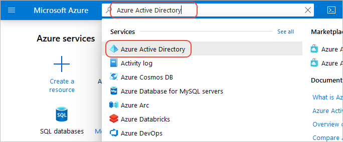
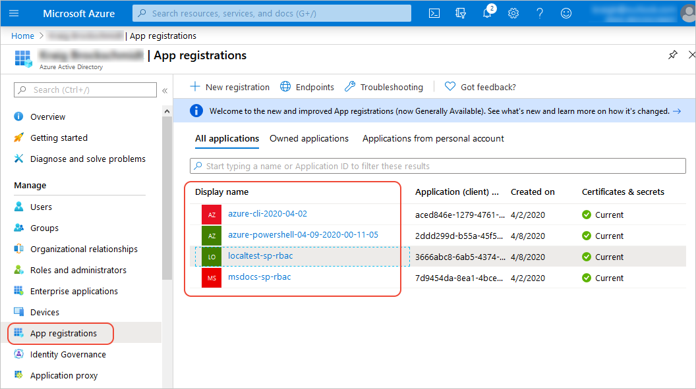

# How to manage service principals

For security purposes, you always want to carefully manage how app code is authorized to access and modify any Azure resources. When testing code locally, you should always use a local *service principal* rather than running as a fully privileged user, as described in [Configure your local Python dev environment - Authentication](configure-local-development-environment.md#configure-authentication).

Over time, you'll probably need to delete, rename, or otherwise manage these service principals, which you can do through the Azure portal or by using the Azure CLI.

## Basics of Azure authorization

Whenever your code attempts to perform any operation on Azure resources (which you do through classes in the Azure libraries), Azure ensures that the application is authorized to perform that action. You use the [Azure portal](https://portal.azure.com) or the Azure CLI to grant specific role- or resource-based permissions to the application's identity. (This procedure avoids granting excess permissions to the application that could be exploited if your application's security is ever compromised.)

When deployed to Azure, the application's identity is typically the same as the name you give the app within the service that's hosting it (such as Azure App Service, Azure Functions, a virtual machine, etc., when managed identity is enabled). When you run your code locally, however, no such hosting service is involved, so you need to present Azure with a suitable substitute.

For this purpose, you use a local *service principal*, which is another name for an app identity as opposed to a user identity. The service principal has a name, a "tenant" identifier (essentially an ID for your organization), an app or "client" identifier, and a secret/password. These credentials are sufficient to authenticate the identity with Azure, which can then check whether that identity is authorized to access any given resource.

Each developer should have his or her own service principal that's secured within their user account on their workstation and never stored in a source control repository. If any one service principal is every stolen or compromised, you can easily delete it on the Azure portal to revoke all of its permissions, and then recreate the service principal for that developer.

## Manage service principals using the Azure portal

1. Sign in to the [Azure portal](https://portal.azure.com).

1. Navigate to the **Azure Active Directory** page, using either the icon on the portal home page or searching for "Azure Active Directory" in the portal search bar.

    

1. Select **Manage** > **App registrations** in the left-hand navigation menu. Your local development service principals appear in the list:

    

1. Select any of the service principals to navigate to its properties page where you can examine ID values, rename or delete the service principal, and obtain various endpoint URLs.

1. The process of authorizing a service principal to access a specific resource typically depends on the service in question. For more information, see the documentation for that service. For example, the articles [Authorization for Blob storage](/azure/storage/common/storage-auth-aad-rbac-portal) and [Authorization for Queue storage](/azure/storage/common/storage-auth-aad-rbac-portal) describe the process in part of Azure Storage.

## Manage service principals using the Azure CLI

Using the Azure CLI, you can perform many of the same operations on service principals that you can through the Azure Portal:

- Create, view, update, and delete service principals: [az ad sp](/cli/azure/ad/sp?view=azure-cli-latest) command. Also see [Create an Azure service principal with the Azure CLI](/cli/azure/create-an-azure-service-principal-azure-cli?view=azure-cli-latest).
- Manage role assignments: [az role assignment](/cli/azure/role/assignment?view=azure-cli-latest) command.

See also:

- [Authenticate with Azure using the Azure libraries](azure-sdk-authenticate.md)
