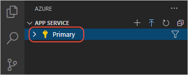

Once you've installed the Azure extension, sign into your Azure account:

1. Navigate to the **Azure** explorer.
1. Select **Sign in to Azure** and follow the prompts. 

    

1. After signing in, verify that **Azure: \<your-account-name\>"** appears in the Status Bar and your subscription(s) appears in the **Azure** explorer:

    

    

[!INCLUDE [proxy-note](../../includes/proxy-note.md)]
