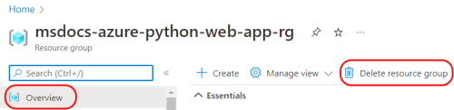
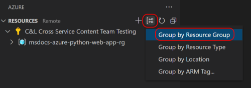

You can delete a resource group by using the Azure portal, the Visual Studio Code extension for Azure, or the Azure CLI:

- In the [Azure portal](https://portal.azure.com), search for the  **Resource groups** service, select the resource group to delete, and in the **Overview** select **Delete resource group**.

    

- In the [Azure Resources extension](https://marketplace.visualstudio.com/items?itemName=ms-azuretools.vscode-azureresourcegroups) for Visual Studio Code, sort resources by resource group. Then, find the resource group to be deleted, right-click and select **Delete Resource Group...**.

    

 
- Run the following [Azure CLI](/cli/azure/install-azure-cli) command (locally or using the [Cloud Shell](/azure/cloud-shell/overview)), replacing `<resource_group>` with the name of the group used in this tutorial:

    ```azurecli
    az group delete --no-wait --name <resource_group>
    ```
