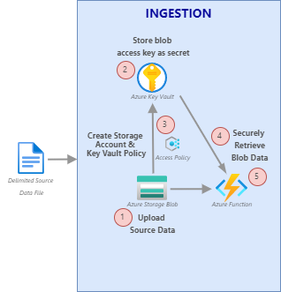

# Quickstart: Access Azure Blob Storage using Azure Key Vault with a Python Function

In this quickstart, you'll learn how to retrieve a secret from Azure Key Vault to access Azure Storage Blob, using a serverless Python Function.



## Prerequisites

* An active Azure subscription - [create one for free](https://azure.microsoft.com/free/)
* [Azure CLI](/cli/azure/install-azure-cli) or [PowerShell 7](/powershell/scripting/install/installing-powershell-core-on-windows)
* The [Azure Functions Core Tools](/azure/azure-functions/functions-run-local) version 3.x.
* [Visual Studio Code](https://code.visualstudio.com/) on one of the [supported platforms](https://code.visualstudio.com/docs/supporting/requirements#_platforms).
* The [PowerShell extension for Visual Studio Code](https://marketplace.visualstudio.com/items?itemName=ms-vscode.PowerShell).
* The [Azure Functions extension](https://marketplace.visualstudio.com/items?itemName=ms-azuretools.vscode-azurefunctions) for Visual Studio Code.
* [Python 3.6+](/azure/developer/python/configure-local-development-environment) is required and the following packages:
  * azure-storage-blob `pip install azure-storage-blob`
  * azure-identity `pip install azure-identity`
  * azure-keyvault-keys `pip install azure-keyvault-secrets`

This quickstart assumes the following Azure Resources have **already been provisioned**:

* Azure Active Directory (Azure AD), sign-up or learn more about [Azure AD](azure/active-directory/fundamentals/sign-up-organization)
* Azure Storage Account, to create a new Storage Account you can use the [Azure portal](/azure/storage/common/storage-quickstart-create-account?tabs=azure-portal), [Azure PowerShell](/azure/storage/common/storage-quickstart-create-account?tabs=azure-powershell), or [Azure CLI](/azure/storage/common/storage-quickstart-create-account?tabs=azure-cli)
* Azure Key Vault, to create a new Key Vault you can use the [Azure portal](/azure/key-vault/keys/quick-create-portal), [PowerShell](/azure/key-vault/keys/quick-create-powershell), or [Azure CLI](/azure/key-vault/keys/quick-create-cli)
* HTTP Trigger or Blob Trigger Azure Function, to create a new Function you can use the [Visual Studio Code](/azure/azure-functions/create-first-function-vs-code-python), [Azure PowerShell](/azure/azure-functions/create-first-function-vs-code-powershell), or [Azure CLI](/azure/azure-functions/create-first-function-cli-python)

## 1. Upload a CSV to a blob container

To ingest relational data using a serverless Python Azure Function, upload a data (blob) to an Azure Storage container. If you already have your data (blob) uploaded, you can skip to the next section.

Create a file named '*financial_sample.csv*' locally that contains this data.

|Segment|Country|Product|Units Sold|Manufacturing Price|Sale Price|Gross Sales|Date|
|----|----|----|----|----|----|----|----|
|Government|Canada|Carretera|1618.5|$3.00|$20.00|$32,370.00|1/1/2014|
|Government|Germany|Carretera|1321|$3.00|$20.00|$26,420.00|1/1/2014|
|Midmarket|France|Carretera|2178|$3.00|$15.00|$32,670.00|6/1/2014|
|Midmarket|Germany|Carretera|888|$3.00|$15.00|$13,320.00|6/1/2014|
|Midmarket|Mexico|Carretera|2470|$3.00|$15.00|$37,050.00|6/1/2014|

Copy the below data into the file:

```csv
Segment,Country,Product,Units Sold,Manufacturing Price,Sale Price,Gross Sales,Date
Government,Canada,Carretera,1618.5,$3.00,$20.00,"$32,370.00",1/1/2014
Government,Germany,Carretera,1321,$3.00,$20.00,"$26,420.00",1/1/2014
Midmarket,France,Carretera,2178,$3.00,$15.00,"$32,670.00",6/1/2014
Midmarket,Germany,Carretera,888,$3.00,$15.00,"$13,320.00",6/1/2014
Midmarket,Mexico,Carretera,2470,$3.00,$15.00,"$37,050.00",6/1/2014
```

Run the following code from your favorite IDE to upload your data (blob) to the storage container (We recommend [VSCode](https://code.visualstudio.com/)).

### [PowerShell](#tab/azure-powershell)

```powershell
Set-AzStorageBlobContent -File "<file-path>" -Container "<container-name>" -Blob "financial_sample.csv" -Context "<storage-account-context>" 
```

### [Azure CLI](#tab/azure-cli)

```azurecli
az storage blob upload --account-name "<storage-account>" --container-name "<container>" --name "financial_sample" --file "financial_sample.csv" --auth-mode login
```

* * *

## 2. Set a secret to the blob access key

Create a 'secret' in Azure Key Vault to store the Storage Account access key.

Run the following code from your favorite IDE to create a secret to store the access key.

### [PowerShell](#tab/azure-powershell)

``` powershell
Set-AzKeyVaultSecret -VaultName "<keyvault-name>" -Name "BlobAccessKey" -SecretValue "<secret-value>"
```

### [Azure CLI](#tab/azure-cli)

``` azurecli
az keyvault secret set --vault-name "<keyvault-name>" --name "BlobAccessKey" --value "<secret-value>"
```

* * *

>[!IMPORTANT]
>A common approach for storing sensitive information is to move the data from the application code into a 'config.json' file. However, this practice still stores the sensitive information in plain text. We recommend instead using [Azure Key Vault](https://azure.microsoft.com/services/key-vault/). Azure Key Vault is a secure centralized cloud solution for storing and managing sensitive information, such as passwords, certificates, and keys.

## 3. Configure access between Azure Storage Account and Azure Key Vault

Next, you need to authorize Azure Key Vault to access your Azure Storage Account to manage your Storage Account access key. Learn more about the [built-in Azure roles](/azure/role-based-access-control/built-in-roles) and [Access Policies](/azure/key-vault/general/security-features#privileged-access).

Run the following code from your favorite IDE to authorize Key Vault to access your Storage Account.

### [PowerShell](#tab/azure-powershell)

```powershell
# Set the Storage Account keys regeneration period to 30 days
$regenPeriod = [System.Timespan]::FromDays(30)

# Assign Azure role "Storage Account Key Operator Service Role" to Key Vault, limiting the access scope to your Storage Account
New-AzRoleAssignment -ApplicationId "<your-function-app-id>" -RoleDefinitionName "Storage Account Key Operator Service Role" -Scope "<storage-account-id>"

# Give your user account permission to managed Storage Accounts
Set-AzKeyVaultAccessPolicy -VaultName "<keyvault-name>" -UserPrincipalName "<user@domain.com>" -PermissionsToSecrets get,set,delete

# Add your Storage Account to your Key Vault's managed Storage Accounts
Add-AzKeyVaultManagedStorageAccount -VaultName "<keyvault-name>" -AccountName "<storage-account-name>" -AccountResourceId "<storage-account-id>" -ActiveKeyName "<key1>" -RegenerationPeriod $regenPeriod
```

### [Azure CLI](#tab/azure-cli)

```azurecli
# Assign Azure role "Storage Account Key Operator Service Role" to Key Vault, limiting the access scope to your Storage Account
az role assignment create --role "Storage Account Key Operator Service Role" --assignee 'https://vault.azure.net' --scope "/subscriptions/<subscription-id>/resourceGroups/<storage-account-resource-group-name>/providers/Microsoft.Storage/storageAccounts/<storage-account-name>"

# Give your user account permission to managed Storage Accounts
az keyvault set-policy --name "<keyvault-name>" --upn user@domain.com --storage-permissions get,set,delete

# Add your Storage Account to your Key Vault's managed Storage Accounts
az keyvault storage add --vault-name "<keyvault-name>" -n "<storage-account-name>" --active-key-name key1 --auto-regenerate-key --regeneration-period P90D --resource-id "/subscriptions/<subscription-id>/resourceGroups/<storage-account-resource-group-name>/providers/Microsoft.Storage/storageAccounts/<storage-account-name>"
```

* * *

## 4. Retrieve Key Vault secret in an Azure Function

The storage access key is now securely stored in a centralized Key Vault. Now the secret value (blob access key) can be retrieved within the Azure Function.

Storing secrets in Azure Key Vault, rather than storing the sensitive data in plain text, improves the security of your sensitive information.

>[!IMPORTANT]
>Be sure to add the Environment Variable values to both the 'local.setting.json' file for local development, and the [Azure Function appsettings configuration](/azure/azure-functions/functions-how-to-use-azure-function-app-settings).

``` Python
import logging
import os
from azure.keyvault.secrets import SecretClient
from azure.identity import DefaultAzureCredential

# Set variables to storage account information.
storage_account_name = "<your-storage-account-name>"
blob_container_name = "<your-blob-container-name>"
storage_account_url = f"https://{storage_account_name}.blob.core.windows.net/"
blob_csv_filename = "financial_sample.csv"

try:
  # Set variables from appsettings configurations/Environment Variables.
  key_vault_name = os.environ["AKV_NAME"]
  blob_secret_name = os.environ["AKVS_BLOB_ACCESS_KEY"]
  key_vault_Uri = f"https://{key_vault_name}.vault.azure.net"

  # Authenticate and securely retrieve Key Vault secret for access key value.
  az_credential = DefaultAzureCredential()
  client = SecretClient(vault_url=key_vault_Uri, credential= az_credential)
  access_key_secret = client.get_secret(blob_secret_name)
  
except Exception as e:
  logging.info(e)

.....

```

>[!NOTE]
>In this quickstart, the logged in user is used to authenticate to Key Vault, which is the preferred method for local development. For applications deployed to Azure, managed identity should be assigned to App Service or Virtual Machine, for more information, see [Managed Identity Overview](/azure/active-directory/managed-identities-azure-resources/overview).

## 5. Get data from Azure Storage with serverless Function

Extract, Transform, and Load (ETL) is a common approach used in data processing solutions. In this approach, data is extracted from one or more source systems, then transformed in a 'staging' area. Finally, the processed data is loaded into a data store to be consumed by analytic tools.

Append the below code to your existing code to begin the ETL process. This function will securely *extract* raw data from blob storage into your serverless Azure Function.

``` python
.....

from azure.keyvault.secrets import SecretClient
from azure.identity import DefaultAzureCredential

blob_client = BlobClient( account_url=storage_account_url, 
                          container_name=blob_container_name, 
                          blob_name=blob_csv_filename, 
                          credential=access_key_secret.value )

# Store data stream from blob in Function.
download_stream = blob_client.download_blob()

# Split the financial_data_blob string with newline.
data_stream_arr = download_stream.readall().splitlines()

# Check the stored blob data by printing one line at a time.
for line in data_stream_arr:
    print(line)

.....
```

```console
Segment,Country,Product,Units Sold,Manufacturing Price,Sale Price,Gross Sales,Date
Government,Canada,Carretera,1618.5,$3.00,$20.00,"$32,370.00",1/1/2014
Government,Germany,Carretera,1321,$3.00,$20.00,"$26,420.00",1/1/2014
Midmarket,France,Carretera,2178,$3.00,$15.00,"$32,670.00",6/1/2014
Midmarket,Germany,Carretera,888,$3.00,$15.00,"$13,320.00",6/1/2014
Midmarket,Mexico,Carretera,2470,$3.00,$15.00,"$37,050.00",6/1/2014
```

## Next steps

This quickstart showed you how to use Azure CLI/Powershell to create secure access between a serverless Azure Function, Azure Key Vault, and Azure Storage Account. You also learned how to use the Python Azure SDK to retrieve the secret from the Key Vault to securely extract the raw file data from Azure Storage. In the following article, we can expand this Azure Function to include transforming and loading the extracted data into an Azure relational database.
