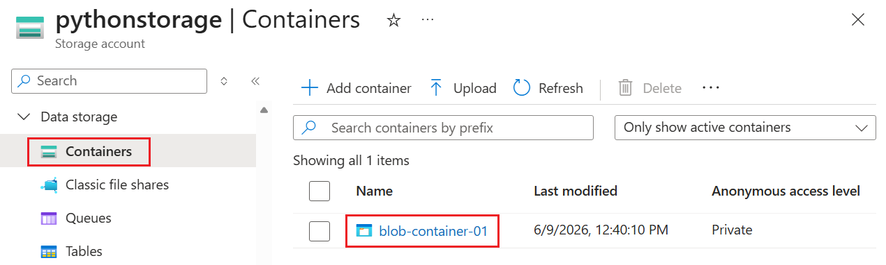

# Example: Create Azure Storage using the Azure libraries for Python

In this article, you learn how to use the Azure management libraries for Python to create a resource group, along with an Azure Storage account and a Blob storage container.

After provisioning these resources, refer to the section [Example: Use Azure Storage](azure-sdk-example-storage-use.md) to see how to use the Azure client libraries in Python to upload a file to the Blob container.

The [Equivalent Azure CLI commands](#for-reference-equivalent-azure-cli-commands) for bash and PowerShell are listed later in this article. If you prefer to use the Azure portal, see [Create an Azure storage account](/azure/storage/common/storage-account-create?tabs=azure-portal) and [Create a blob container](/azure/storage/blobs/storage-quickstart-blobs-portal).

## 1: Set up your local development environment

If you haven't already, set up an environment where you can run the code. Here are some options:

[!INCLUDE [create_environment_options](../../includes/create-environment-options.md)]

## 2: Install the needed Azure library packages

1. In your console, create a *requirements.txt* file that lists the management libraries used in this example:

    ```azurecli
    azure-mgmt-resource
    azure-mgmt-storage
    azure-identity
    ```

1. In your console with the virtual environment activated, install the requirements:

    ```console
    pip install -r requirements.txt
    ```

## 3. Set environment variables

In this step, you set environment variables for use in the code in this article. The code uses the `os.environ` method to retrieve the values.

# [Bash](#tab/bash)

```azurecli
#!/bin/bash
export AZURE_RESOURCE_GROUP_NAME="<ResourceGroupName>" # Change to your preferred resource group name
export LOCATION="<Location>" # Change to your preferred region
export AZURE_SUBSCRIPTION_ID=$(az account show --query id --output tsv)
export STORAGE_ACCOUNT_NAME="<StorageAccountName>" # Change to your preferred storage account name
export CONTAINER_NAME="<ContainerName>" # Change to your preferred container name

```

# [PowerShell](#tab/powershell)

```azurecli
# PowerShell syntax
$env:AZURE_RESOURCE_GROUP_NAME = "<ResourceGroupName>" # Change to your preferred resource group name
$env:LOCATION = "<Location>" # Change to your preferred region
$env:AZURE_SUBSCRIPTION_ID = $(az account show --query id --output tsv)
$env:STORAGE_ACCOUNT_NAME = "<StorageAccountName>" # Change to your preferred storage account name
$env:CONTAINER_NAME = "<ContainerName>" # Change to your preferred container name
```

---

## 4: Write code to create a storage account and blob container

In this step, you create a Python file named *provision_blob.py* with the following code. This Python script uses the Azure SDK for Python management libraries to create a resource group, Azure Storage account, and Blob container.

```Python
import os

# Import the needed credential and management objects from the libraries.
from azure.identity import DefaultAzureCredential
from azure.mgmt.resource import ResourceManagementClient
from azure.mgmt.storage import StorageManagementClient
from azure.mgmt.storage.models import BlobContainer

# Acquire a credential object.
credential = DefaultAzureCredential()

# Retrieve subscription ID from environment variable.
subscription_id = os.environ["AZURE_SUBSCRIPTION_ID"]

# Retrieve resource group name and location from environment variables
RESOURCE_GROUP_NAME = os.environ["AZURE_RESOURCE_GROUP_NAME"]
LOCATION = os.environ["LOCATION"]

# Step 1: Provision the resource group.
resource_client = ResourceManagementClient(credential, subscription_id)

rg_result = resource_client.resource_groups.create_or_update(RESOURCE_GROUP_NAME,
    { "location": LOCATION })

print(f"Provisioned resource group {rg_result.name}")

# For details on the previous code, see Example: Create a resource group:
# https://learn.microsoft.com/azure/developer/python/sdk/examples/azure-sdk-example-resource-group


# Step 2: Provision the storage account, starting with a management object.

storage_client = StorageManagementClient(credential, subscription_id)

STORAGE_ACCOUNT_NAME = os.environ["STORAGE_ACCOUNT_NAME"] 

# Check if the account name is available. Storage account names must be unique across
# Azure because they're used in URLs.
availability_result = storage_client.storage_accounts.check_name_availability(
    { "name": STORAGE_ACCOUNT_NAME, "type": "Microsoft.Storage/storageAccounts" }
)

if not availability_result.name_available:
    print(f"Storage name {STORAGE_ACCOUNT_NAME} is already in use. Try another name.")
    exit()

# The name is available, so provision the account
poller = storage_client.storage_accounts.begin_create(RESOURCE_GROUP_NAME, STORAGE_ACCOUNT_NAME,
    {
        "location" : LOCATION,
        "kind": "StorageV2",
        "sku": {"name": "Standard_LRS"}
    }
)

# Long-running operations return a poller object; calling poller.result()
# waits for completion.
account_result = poller.result()
print(f"Provisioned storage account {account_result.name}")


# Step 3: Retrieve the account's primary access key and generate a connection string.
keys = storage_client.storage_accounts.list_keys(RESOURCE_GROUP_NAME, STORAGE_ACCOUNT_NAME)

print("Retrieved the primary key for the storage account")

conn_string = f"DefaultEndpointsProtocol=https;EndpointSuffix=core.windows.net;AccountName={STORAGE_ACCOUNT_NAME};AccountKey={keys['keys'][0].value}"

# print(f"Connection string: {conn_string}")

# Step 4: Provision the blob container in the account (this call is synchronous)
CONTAINER_NAME = os.environ["CONTAINER_NAME"]
container = storage_client.blob_containers.create(RESOURCE_GROUP_NAME, STORAGE_ACCOUNT_NAME, CONTAINER_NAME, BlobContainer())

print(f"Provisioned blob container {container.name}")
```

### Authentication in the code

Later in this article, you sign in to Azure by using the Azure CLI to execute the sample code. If your account has sufficient permissions to create resource groups and storage resources in your Azure subscription, the script runs successfully without additional configuration.

To use this code in a production environment, authenticate by using a service principal and set environment variables. This approach enables secure, automated access without relying on interactive sign-in. For detailed guidance, see [How to authenticate Python apps with Azure services](../authentication-overview.md).

Ensure that the service principal is assigned a role with sufficient permissions to create resource groups and storage accounts. For example, assigning the Contributor role at the subscription level provides the necessary access. To learn more about role assignments, see [Role-based access control (RBAC) in Azure](/azure/role-based-access-control/overview).

### Reference links for classes used in the code

- [DefaultAzureCredential (azure.identity)](/python/api/azure-identity/azure.identity.defaultazurecredential)
- [ResourceManagementClient (azure.mgmt.resource)](/python/api/azure-mgmt-resource/azure.mgmt.resource.resourcemanagementclient)
- [StorageManagementClient (azure.mgmt.storage)](/python/api/azure-mgmt-storage/azure.mgmt.storage.storagemanagementclient)

## 5. Run the script

1. If you didn't already, sign in to Azure by using the Azure CLI:

    ```azurecli
    az login
    ```

    ---

1. Run the script:

    ```console
    python provision_blob.py
    ```

    The script takes a minute or two to complete.

## 6: Verify the resources

1. Open the [Azure portal](https://portal.azure.com) to verify that the resource group and storage account were created as expected. You might need to wait a minute and then refresh the resource group view.

1. Select the storage account, and then select **Data storage** > **Containers** in the left-hand menu to verify that the container you created appears:

    

1. If you want to try using these resources from application code, continue with [Example: Use Azure Storage](azure-sdk-example-storage-use.md).

For another example of using the Azure Storage management library, see the [Manage Python Storage sample](/samples/azure-samples/azure-samples-python-management/storage/).

## 7: Clean up resources

If you want to use these resources in app code, follow the article [Example: Use Azure Storage](azure-sdk-example-storage-use.md). Otherwise, run the [az group delete](/cli/azure/group#az-group-delete) command if you don't need to keep the resource group and storage resources that you created in this example.

Resource groups don't incur any ongoing charges in your subscription, but resources, like storage accounts, in the resource group might incur charges. It's a good practice to clean up any resource group that you aren't actively using. The `--no-wait` argument allows the command to return immediately instead of waiting for the operation to finish.

# [Bash](#tab/bash)

```azurecli
#!/bin/bash
az group delete -n $AZURE_RESOURCE_GROUP_NAME --no-wait
```

# [PowerShell](#tab/powershell)

```azurecli
# PowerShell syntax
az group delete -n $env:AZURE_RESOURCE_GROUP_NAME --no-wait
```

---

### For reference: equivalent Azure CLI commands

The following Azure CLI commands complete the same creation steps as the Python script:

# [Bash](#tab/bash)

```azurecli
#!/bin/bash

# Set variables
export LOCATION="<Location>" # Change to your preferred region
export AZURE_RESOURCE_GROUP_NAME="<ResourceGroupName>" # Change to your preferred resource group name
export STORAGE_ACCOUNT_NAME="<StorageAccountName>" # Change to your preferred storage account name
export CONTAINER_NAME="<ContainerName>" # Change to your preferred container name

# Provision the resource group
echo "Creating resource group: $AZURE_RESOURCE_GROUP_NAME"
az group create \
    --location "$LOCATION" \
    --name "$AZURE_RESOURCE_GROUP_NAME"

# Provision the storage account
az storage account create \
    --resource-group "$AZURE_RESOURCE_GROUP_NAME" \
    --location "$LOCATION" \
    --name "$STORAGE_ACCOUNT_NAME" \
    --kind StorageV2 \
    --sku Standard_LRS

echo "Storage account name is $STORAGE_ACCOUNT_NAME"

# Retrieve the connection string
CONNECTION_STRING=$(az storage account show-connection-string \
    --resource-group "$AZURE_RESOURCE_GROUP_NAME" \
    --name "$STORAGE_ACCOUNT_NAME" \
    --query connectionString \
    --output tsv)

# Provision the blob container
az storage container create \
    --name "$CONTAINER_NAME" \
    --account-name "$STORAGE_ACCOUNT_NAME" \
    --connection-string "$CONNECTION_STRING"
```

# [PowerShell](#tab/powershell)

```azurecli
# PowerShell syntax
# Define variables
$env:LOCATION = "<Location>" # Change to your preferred region
$env:AZURE_RESOURCE_GROUP_NAME = "<ResourceGroupName>" # Change to your preferred resource group name
$env:STORAGE_ACCOUNT_NAME = "<StorageAccountName>" # Change to your preferred storage account name
$env:CONTAINER_NAME = "<ContainerName>" # Change to your preferred container name

# Provision the resource group
az group create -n $env:AZURE_RESOURCE_GROUP_NAME -l $env:LOCATION

# Provision the storage account
az storage account create `
  --resource-group $env:AZURE_RESOURCE_GROUP_NAME `
  --location $env:LOCATION `
  --name $env:STORAGE_ACCOUNT_NAME `
  --kind StorageV2 `
  --sku Standard_LRS

# Retrieve the connection string
Write-Output "Storage account name is $env:STORAGE_ACCOUNT_NAME"

$CONNECTION_STRING = az storage account show-connection-string `
  --resource-group $env:AZURE_RESOURCE_GROUP_NAME `
  --name $env:STORAGE_ACCOUNT_NAME `
  --query connectionString `
  --output tsv

# Provision the blob container
az storage container create `
  --name $env:CONTAINER_NAME `
  --account-name $env:STORAGE_ACCOUNT_NAME `
  --connection-string $CONNECTION_STRING

```

---

## See also

- [Example: Use Azure Storage](azure-sdk-example-storage-use.md)
- [Example: Create a resource group](azure-sdk-example-resource-group.md)
- [Example: List resource groups in a subscription](azure-sdk-example-list-resource-groups.md)
- [Example: Create a web app and deploy code](azure-sdk-example-web-app.md)
- [Example: Create and query a database](azure-sdk-example-database.md)
- [Example: Create a virtual machine](azure-sdk-example-virtual-machines.md)
- [Use Azure Managed Disks with virtual machines](azure-sdk-samples-managed-disks.md)
- [Complete a short survey about the Azure SDK for Python](https://microsoft.qualtrics.com/jfe/form/SV_bNFX0HECjzPWMiG?Q_CHL=docs)
