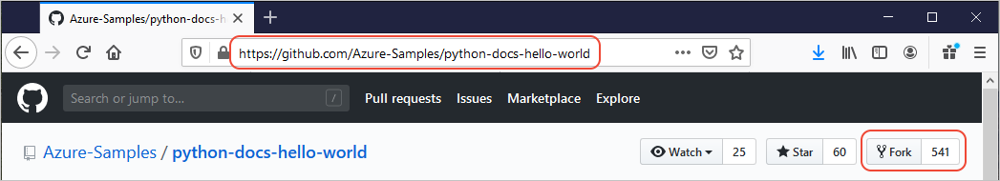

# Example: Use the Azure libraries to create and deploy a web app

This example shows how to use the Azure SDK management libraries in a Python script to create and deploy a web app to Azure App Service, with the app code pulled from a GitHub repository.

The Azure SDK for Python includes management libraries (namespaces beginning with `azure-mgmt`) that let you automate resource configuration and deployment — similar to what you can do with the Azure portal, Azure CLI, or ARM templates. For examples, see [Quickstart: Deploy a Python (Django or Flask) web app to Azure App Service](/azure/app-service/quickstart-python).

## 1: Set up your local development environment

If you haven't already, set up an environment where you can run this code. Here are some options:

[!INCLUDE [create_environment_options](../../includes/create-environment-options.md)]

## 2: Install the required Azure library packages

Create a file named *requirements.txt* with the following contents:

:::code language="txt" source="~/../python-sdk-docs-examples/webapp/requirements.txt":::

In your local development environment, install the requirements using the following code:

```console
pip install -r requirements.txt
```

## 3: Fork the sample repository

1. Visit [https://github.com/Azure-Samples/python-docs-hello-world](https://github.com/Azure-Samples/python-docs-hello-world) and fork the repository into your own GitHub account. Using a fork ensures that you have the necessary permissions to deploy the app to Azure.

    

1. Next, create an environment variable named `REPO_URL` and set it to the URL of your forked repository. This variable is required by the example code in the next section.

# [bash](#tab/bash)

```bash
export REPO_URL=<url_of_your_fork>
export AZURE_SUBSCRIPTION_ID=<subscription_id>
```

# [powershell](#tab/powershell)

```powershell
# Use single quotes to avoid interpolation
$env:REPO_URL='<url_of_your_fork>'
$env:AZURE_SUBSCRIPTION_ID='<subscription_id>'
```

---

## 4: Write code to create and deploy a web app

Create a Python file named **provision_deploy_web_app.py** and add the following code. The in-line comments explain what each part of the script does. The `REPO_URL` and `AZURE_SUBSCRIPTION_ID` environment variables should already be set in the previous step.

:::code language="python" source="~/../python-sdk-docs-examples/webapp/provision_deploy_web_app.py":::

[!INCLUDE [cli-auth-note](../../includes/cli-auth-note.md)]

### Reference links for classes used in the code

- [AzureCliCredential (azure.identity)](/python/api/azure-identity/azure.identity.azureclicredential)
- [ResourceManagementClient (azure.mgmt.resource)](/python/api/azure-mgmt-resource/azure.mgmt.resource.resourcemanagementclient)
- [WebSiteManagementClient (azure.mgmt.web import)](/python/api/azure-mgmt-web/azure.mgmt.web.websitemanagementclient)

## 5: Run the script

```console
python provision_deploy_web_app.py
```

## 6: Verify the web app deployment

To view the deployed website, run the following command:

```azurecli
az webapp browse --name <PythonAzureExample-WebApp-12345> --resource-group PythonAzureExample-WebApp-rg
```

Replace the web app name (`--name`) with the value generated by the script.
You don’t need to change the resource group name (`--resource-group`) unless you changed it in the script. When you open the site, you should see “Hello, World!” in your browser.

> [!Tip]
> If you don't see the expected output, wait a few minutes and try again.

If you're still not seeing the expected output:

1. Go to the [Azure portal](https://portal.azure.com).
1. Navigate to **Resource groups**, and locate the resource group you created.
1. Select the resource group to view its resources. Make sure it includes both an App Service Plan and an App Service.
1. Select the **App Service**, and then go to **Deployment Center**.
1. Open the **logs** tab to check the deployment logs for any errors or status updates.

## 7: Redeploy the web app code (optional)

The script provisions all the necessary resources to host your web app and configures the deployment source to use your forked repository using manual integration. With manual integration, you need to manually trigger the web app to pull updates from the specified repository and branch.

The script uses the [WebSiteManagementClient.web_apps.sync_repository](/python/api/azure-mgmt-web/azure.mgmt.web.websitemanagementclient#azure-mgmt-web-websitemanagementclient-web-apps) method to trigger the web app to pull code from your repository. If you make further changes to your code, you can redeploy by calling this API again, or by using other Azure tools such as the Azure CLI or the Azure portal.

You can redeploy your code using the Azure CLI by running the [az webapp deployment source sync](/cli/azure/webapp/deployment/source#az-webapp-deployment-source-sync) command:

```azurecli
az webapp deployment source sync --name <PythonAzureExample-WebApp-12345> --resource-group PythonAzureExample-WebApp-rg
```

You don’t need to change the resource group name (`--resource-group`) unless you changed it in the script.

To deploy your code from Azure portal:

1. Go to the [Azure portal](https://portal.azure.com).
1. Navigate to **Resource groups**, and locate the resource group you created.
1. Select the resource group name to view its resources. Make sure it includes both an App Service Plan and an App Service.
1. Select the **App Service**, and then go to **Deployment Center**.
1. On the top menu, select **Sync** to trigger the deployment of your code.

## 8: Clean up resources

```azurecli
az group delete --name PythonAzureExample-WebApp-rg --no-wait
```

You do not need to change resource group name (`--resource-group` option) unless you changed it in the script.

If you no longer need the resource group created in this example, you can delete it by running the [az group delete](/cli/azure/group#az-group-delete) command. While resource groups don’t incur ongoing charges, it’s a good practice to clean up any unused resources. Use the `--no-wait` argument to immediately return control to the command line without waiting for the deletion to complete.

You can also delete a resource group programmatically using the [`ResourceManagementClient.resource_groups.begin_delete`](/python/api/azure-mgmt-resource/azure.mgmt.resource.resources.v2021_04_01.operations.resourcegroupsoperations#azure-mgmt-resource-resources-v2021-04-01-operations-resourcegroupsoperations-begin-delete) method.

## See also

- [Example: Create a resource group](azure-sdk-example-resource-group.md)
- [Example: List resource groups in a subscription](azure-sdk-example-list-resource-groups.md)
- [Example: Create Azure Storage](azure-sdk-example-storage.md)
- [Example: Use Azure Storage](azure-sdk-example-storage-use.md)
- [Example: Create and query a MySQL database](azure-sdk-example-database.md)
- [Example: Create a virtual machine](azure-sdk-example-virtual-machines.md)
- [Use Azure Managed Disks with virtual machines](azure-sdk-samples-managed-disks.md)
- [Complete a short survey about the Azure SDK for Python](https://microsoft.qualtrics.com/jfe/form/SV_bNFX0HECjzPWMiG?Q_CHL=docs)
