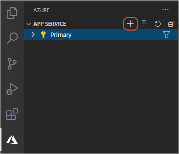
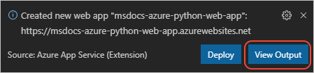
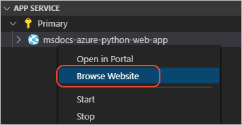
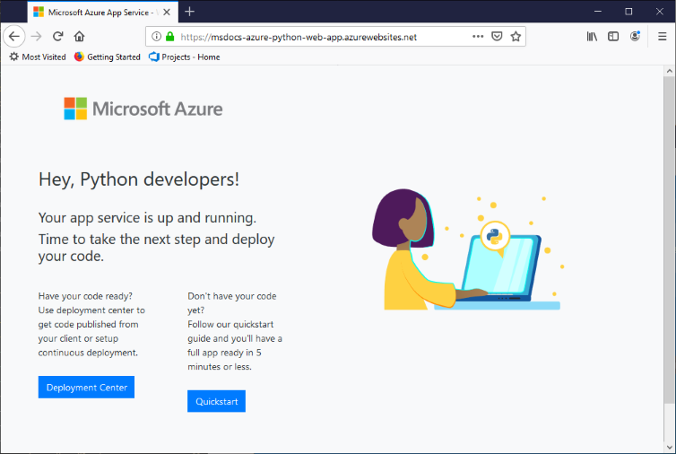

# 3: Create the App Service from Visual Studio Code

[Previous step: prepare your app](tutorial-deploy-app-service-on-linux-02.md)

In this step, create the instance of Azure App Service to which you deploy your app.

You do this step before deploying your code so you can configure a custom startup file if necessary in the next step.

1. In the **Azure: App Service** explorer, select the **+** command to create a new App Service, or open the Command Palette (**F1**) and select **Azure App Service: Create New Web App**. (In App Service terminology, a "web app" is a **host** for web app code, not the app code itself.)

    

1. In the prompts that follow:

    - Enter a name for your app, which must be globally unique on App Service; typically you use your name or company name followed by the app name.
    - Select **Python 3.7** as the runtime.

1. When a message appears indicating that the new App Service was created, select **View Output** to switch to the **Output** window in VS Code. The output shows the names of the Azure resource group and App Service Plan that were created, along with the URL for the App Service.

    

1. To confirm that the App Service is running properly, expand your subscription in the **Azure: App Service** explorer, right-click the App Service name, and select **Browse website**:

    

1. Because you haven't deployed your own code to the App Service yet (which you do in the next step), only a default app appears:

    

## (Optional) Upload an environment variable definitions file

If you have an environment variable definitions file, you can use that file to configure the App Service environment as well. (To learn more about such files, which typically have the *.env* extension, refer to [Visual Studio Code - Python Environments](https://code.visualstudio.com/docs/python/environments#environment-variable-definitions-file).)

1. In the **Azure: App Service** explorer, expand the node for the desired App Service, then right-click the **Application Settings** node and select **Upload Local Settings**.

1. VS Code prompts you for the location of your *.env* file, then uploads it to the App Service.

1. Once the upload is complete, you can expand the **Application Settings** node to see the individual values. You can also view them on the Azure portal by navigating to the App Service and selecting **Configuration**.

1. If you create settings directly on the Azure portal, you can save them in a definitions file by right-clicking the **Application Settings** node and selecting **Download Remote Settings**. This process makes sure that you have those settings in your repository and not only on the portal.

> [!div class="nextstepaction"]
> [I created the App Service - continue to step 4 >>>](tutorial-deploy-app-service-on-linux-04.md)

[I ran into an issue](https://www.research.net/r/PWZWZ52?tutorial=vscode-appservice-python&step=03-create-app-service)
