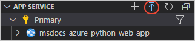
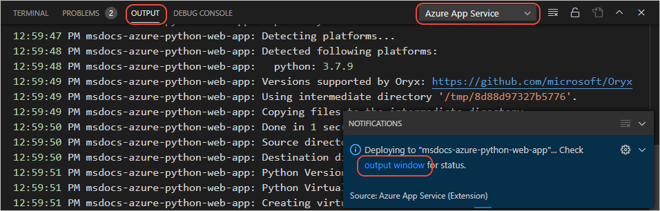
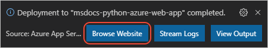
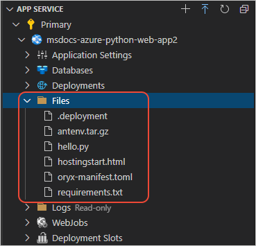

# 5: Deploy your Python web app to Azure App Service on Linux

[Previous step: configure a custom startup file](tutorial-deploy-app-service-on-linux-04.md)

Use this procedure to deploy your Python app to an Azure App Service.

1. In Visual Studio Code, open the **Azure: App Service** explorer and select the blue up arrow:

   

    Alternately, you can right-click the App Service name and select the **Deploy to Web App** command.

1. In the prompts that follow, provide the following details:

    - For "Select the folder to deploy," select your current app folder.
    - For "Select Web App," choose the App Service you created in the previous step.
    - If prompted to update your build configuration to run build commands, answer **Yes**.
    - If prompted about overwriting the existing deployment, answer **Deploy**.
    - If prompted to "always deploy the workspace", answer **Yes**.

1. While the deployment process is underway, you can view progress in the VS Code **Output** window.

    

1. When deployment is complete after a few minutes (depending on how many dependencies need to be installed), the message below appears. Select the **Browse Website** button to view the running site.

    

    

1. If you still see the default app, wait a minute or two for the container to restart after the deployment and try again. If you're using a custom startup command and have verified its correctness, then continue to step 6 to check the logs.

1. To verify that your files are deployed, expand the App Service in the **Azure: App Service** explorer, then expand **Files**:

    

    In case you're wondering, the files *.deployment*, *antenv.tar.gz*, and *oryx-manifest.toml* are used by the App Service build system. The *hostingstart.html* is the default app page.

> [!div class="nextstepaction"]
> [I deployed my app - continue to step 6 >>>](tutorial-deploy-app-service-on-linux-06.md)

[Having issues? Let us know.](https://aka.ms/FlaskVSCQuickstartHelp)
