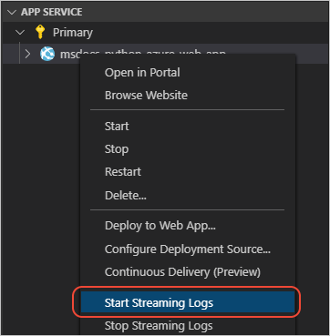

# 6: Stream logs from Azure App Service into Visual Studio Code

[Previous step: deploy the app](tutorial-deploy-app-service-on-linux-05.md)

Use this procedure to stream logs from an Azure App Service to Visual Studio Code.

1. In Visual Studio Code, open the **Azure: App Service** explorer, right-click the App Service, and select **Start streaming logs**:

   

   If prompted to enable file logging and restart the web app, select **Yes**. While the app restarts, the **Output** window in VS Code shows progress. When the app is restarted, select the **Start streaming logs** command again. Enable logging is a one-time process.

1. The **Output** window in VS Code displays "Starting Live Log Stream" and log output begins to appear. Try refreshing the web app in the browser to generate more log information.

1. To stop streaming logs (without disabling logging), right-click the app in the **Azure: App Service** explorer and select **Stop streaming logs**.

> [!div class="nextstepaction"]
> [I see the logs - continue to step 7 >>>](tutorial-deploy-app-service-on-linux-07.md)

[Having issues? Let us know.](https://aka.ms/FlaskVSCQuickstartHelp)
