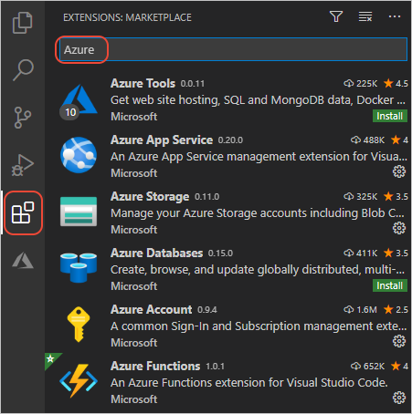

# 7: Clean up resources after deploying to Azure App Service on Linux from Visual Studio Code

[Previous step: stream logs](tutorial-deploy-app-service-on-linux-06.md)

The Azure App Service you created includes a backing App Service Plan that can incur costs. To avoid such costs, delete the resource group that contains all the resources together.

[!INCLUDE [delete-resource-group](includes/delete-resource-group.md)]

## Next steps

Congratulations on completing this walkthrough of deploying Python code to App Service on Linux!

As noted earlier, you can learn more about the App Service extension by visiting its GitHub repository, [vscode-azureappservice](https://github.com/Microsoft/vscode-azureappservice). Issues and contributions are also welcome.

To learn more about Azure services that you can use from Python, including data storage along with AI and Machine Learning services, visit [Azure Python Developer Center](https://docs.microsoft.com/python/azure/?view=azure-python).

There are also other Azure extensions for VS Code that you may find helpful. Just search on "Azure" in the Extensions explorer:

Some popular extensions are:

- [Cosmos DB](https://marketplace.visualstudio.com/items?itemName=ms-azuretools.vscode-cosmosdb)
- [Azure Functions](https://marketplace.visualstudio.com/items?itemName=ms-azuretools.vscode-azurefunctions)
- [Azure CLI Tools](https://marketplace.visualstudio.com/items?itemName=ms-vscode.azurecli)
- [Azure Resource Manager (ARM) Tools](https://marketplace.visualstudio.com/items?itemName=msazurermtools.azurerm-vscode-tools)

> [!div class="nextstepaction"]
> [I'm done!](https://docs.microsoft.com/python/azure/?view=azure-python) 

[Having issues? Let us know.](https://aka.ms/FlaskVSCQuickstartHelp)
