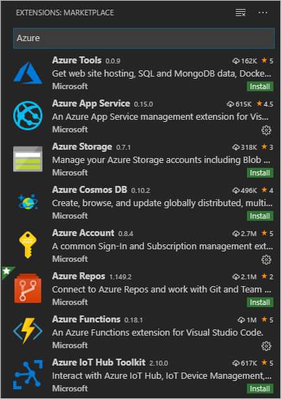

# 5: Clean up Azure resources

[Previous step: stream logs](tutorial-deploy-containers-04.md)

The Azure resources that you created in this tutorial can incur ongoing costs. To avoid such costs, delete the resource group that contains all those resources.

[!INCLUDE [delete-resource-group](includes/delete-resource-group.md)]

## Next steps

You can learn more about the Docker and App Service extensions by visiting their respective repositories on GitHub: [vscode-docker](https://github.com/Microsoft/vscode-docker) and [vscode-azureappservice](https://github.com/Microsoft/vscode-azureappservice). Issues and contributions are also welcome.

To learn more about Azure services that you can use from Python, including data storage along with AI and Machine Learning services, visit [Azure Python Developer Center](/python/azure/?preserve-view=true&view=azure-python).

There are also other Azure extensions for VS Code that you may find helpful. Just search on "Azure" in the Extensions explorer:

Some popular extensions are:

- [Cosmos DB](https://marketplace.visualstudio.com/items?itemName=ms-azuretools.vscode-cosmosdb)
- [Azure Functions](https://marketplace.visualstudio.com/items?itemName=ms-azuretools.vscode-azurefunctions)
- [Azure CLI Tools](https://marketplace.visualstudio.com/items?itemName=ms-vscode.azurecli)
- [Azure Resource Manager Tools](https://marketplace.visualstudio.com/items?itemName=msazurermtools.azurerm-vscode-tools)

> [!div class="nextstepaction"]
> [I'm done!](/python/azure/?preserve-view=true&view=azure-python)