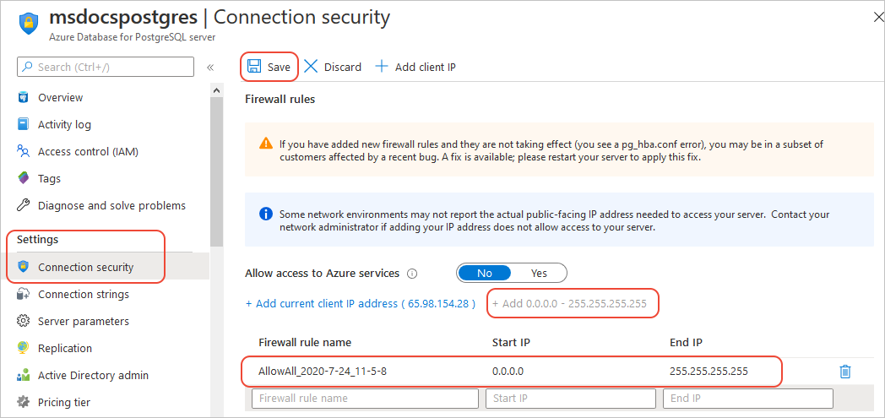
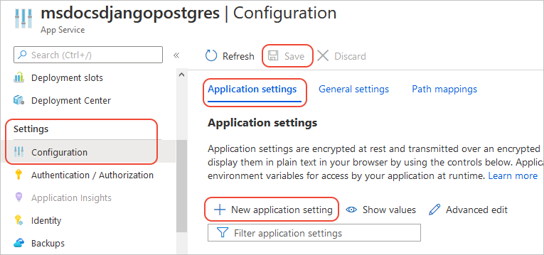

# Tutorial: Deploy a Django web app with PostgreSQL using the Azure portal

Using the Azure portal, you can deploy a data-driven Python [Django](https://www.djangoproject.com/) web app to [Azure App Service](/azure/app-service/overview#app-service-on-linux) and connect it to an [Azure Database for PostgreSQL](/azure/postgresql/) database. You can start with a free pricing tier that can be scaled up at any later time.

The web app code in this case comes from a GitHub repository, and you configure the web app for continuous deployment from GitHub. Once configured, you can do further development on your local computer and commit changes to the repository. The web app on Azure then deploys those changes automatically.

In this tutorial, you use the Azure portal to complete the following tasks:

> [!div class="checklist"]
> - Provision a web app in Azure that deploys from a GitHub repo
> - Provision a PostgreSQL server and database in Azure and connect it to the web app.
> - Update your code and commit changes to automatically redeploy from GitHub.
> - View diagnostic logs
> - Manage the web app in the Azure portal

You can also use the **[Azure CLI-based version of this tutorial](/azure/app-service/tutorial-python-postgresql-app)**.

## Fork the sample repository

In a browser, navigate to [https://github.com/Azure-Samples/djangoapp](https://github.com/Azure-Samples/djangoapp) and fork the repository into your own GitHub account.

You create a fork of this repository so you can make changes and redeploy the code in a later step.

**(Optional) About the sample:** The djangoapp sample contains the data-driven Django polls app you get by following [Writing your first Django app](https://docs.djangoproject.com/en/2.1/intro/tutorial01/) in the Django documentation. The sample is also modified using the [Django deployment checklist](https://docs.djangoproject.com/en/2.1/howto/deployment/checklist/) to run in a production environment like Azure App Service. (These changes are for any production environment and aren't specific to Azure.)

- Production settings are in the *azuresite/production.py* file. Development details are in *azuresite/settings.py*.
- The app uses production settings when the `WEBSITE_HOSTNAME` environment variable is set. Azure App Service automatically sets this variable to the URL of the web app, such as `msdocs-django.azurewebsites.net`.

[Having issues? Let us know.](https://aka.ms/DjangoPortalTutorialHelp)

## Provision the web app in Azure

1. Open the [Azure portal](https://portal.azure.com)

1. Select **Create a resource**, which opens the **New** page.

1. Search for and select **Web App**, then select **Create**.

1. On the **Create Web App** page, enter the following information:

    | Field | Value |
    | --- | --- |
    | Subscription | Select the subscription you want to use if different from the default. |
    | Resource group | Select **Create new** and enter "DjangoPostgres-Tutorial-rg". |
    | App name | A name for your web app that's unique across all Azure (the app's URL is `https://<app-name>.azurewebsites.net`). Allowed characters are `A`-`Z`, `0`-`9`, and `-`. A good pattern is to use a combination of your company name and an app identifier. |
    | Publish | Select **Code**. |
    | Runtime stack | Select **Python 3.8** from the drop-down list. |
    | Region | Select a location near you. |
    | Linux Plan | The portal will populate this field with an App Service Plan name based on your resource group. If you want to change the name, select **Create new**. |
    | Sku and size | For best performance, use the default plan, although it incurs charges in your subscription. To avoid charges, select **Change size**, then select **Dev/Test**, select **B1** (free for 30 days), then select **Apply**. You can scale the plan later for better performance. |

1. Select **Review + Create**, then select **Create**. Azure takes a few minutes to provision the web app.

1. After provisioning is complete, select **Go to resource** to open the overview page for the web app. Keep this browser window or tab open for later steps.

[Having issues? Let us know.](https://aka.ms/DjangoPortalTutorialHelp)

## Provision the PostgreSQL database server in Azure

1. Open a new browser window or tab with the [Azure portal](https://portal.azure.com). You use a new tab for provisioning the database because you'll need to transfer some information from the database page to the web app page still open from the previous section.

1. Select **Create a resource**, which opens the **New** page.

1. Search for and select **Azure Database for PostgreSQL**, then select **Create**.

1. On the next page, select **Create** under **Single server**.

1. On the **Single server** page, enter the following information:

    | Field | Value |
    | --- | --- |
    | Subscription | Select the subscription you want to use if different from the default. |
    | Resource group | Select the "DjangoPostgres-Tutorial-rg" group you created in the previous section. |
    | Server name | A name for the database server that's unique across all Azure (the database server's URL becomes `https://<server-name>.postgres.database.azure.com`). Allowed characters are `A`-`Z`, `0`-`9`, and `-`. A good pattern is to use a combination of your company name and and server identifier. |
    | Data source | **None** |
    | Location | Select a location near you. |
    | Version | Keep the default (which is the latest version). |
    | Compute + Storage | Select **Configure server**, then select **Basic** and **Gen 5**. Set **vCore** to 1, set **Storage** to 5GB, then select **OK**. These choices provision the least expensive server available for PostgreSQL on Azure. You might also have credit in your Azure account that covers the cost of the server. |
    | Admin username, Password, Confirm password | Enter credentials for an administrator account on the database server. Record these credentials as you'll need them later in this tutorial. Note: do not use the `$` character in the username or password. Later you create environment variables with these values where the `$` character has special meaning within the Linux container used to run Python apps. |

1. Select **Review + Create**, then **Create**. Azure takes a few minutes to provision the web app.

1. After provisioning is complete, select **Go to resource** to open the overview page for the database server.

[Having issues? Let us know.](https://aka.ms/DjangoPortalTutorialHelp)

## Create the pollsdb database on the PostgreSQL server

In this section, you connect to the database server in the Azure Cloud Shell and use a PostgreSQL command to create a "pollsdb" database on the server. This database is expected by the sample app code.

1. From the overview page for the PostgreSQL server, select select **Connection security** (under **Settings** on the left side).

    

1. Select the button labeled **Add 0.0.0.0 - 255.255.255.255**, then select **Continue** in the pop up message that appears, followed by **Save** at the top of the page. These actions add a rule that allows you to connect to the database server from the Cloud Shell as well as SSH (as you do in a later section to run Django data model migrations).

1. Open the Azure Cloud Shell from the Azure portal by selecting the Cloud Shell icon at the top of the window:

    

1. In the Cloud Shell, run the following command:

    ```bash
    psql --host=<server-name>.postgres.database.azure.com --port=5432 --username=<user-name>@<server-name> --dbname=postgres
    ```

    Replace `<server-name>` and `<user-name>` with the names used in the previous section when configuring the server. Note that the full username value that's required by Postgres is `<user-name>@<server-name>`.

    You can copy the command above and paste into the Cloud Shell by using a right-click and then selecting **Paste**.

    Enter your administrator password when prompted.

1. When the shell connects successfully, you should see the prompt `postgres=>`. This prompt indicates that you're connected to the default administrative database named "postgres". (The "postgres" database isn't intended for app usage.)

1. At the prompt, run the command `CREATE DATABASE pollsdb;`. Be sure to include the ending semicolon, which completes the command.

1. If the database is created successfully, the command should display `CREATE DATABASE`. To verify that the database was created, run `\c pollsdb`. This command should change the prompt to `pollsdb=>`, which indicates success.

1. Exit psql by running the command `exit`.

[Having issues? Let us know.](https://aka.ms/DjangoPortalTutorialHelp)

## Connect the database

In this section, you create settings for the web app that it needs to connect to the `pollsdb` database. These settings appear to the app code as environment variables. (For more information, see [Access environment variables](/azure/app-service/configure-language-python#access-environment-variables).)

1. Switch back to the browser tab or window for the web app you created in a previous section.

1. Select **Configuration** (under **Settings** on the left side), then select **Application settings** at the top of the page.

    

1. Use the **New application setting** button to create settings for each of the following values (which are expected by the djangoapp sample):

    | Setting name | Value |
    | --- | --- |
    | DBHOST | The name of the database server from the previous section; that is, the `<server-name>` portion of the server's URL that precedes `.postgres.database.azure.com`. (The code in *azuresite/production.py* constructs the full URL automatically.) |
    | DBNAME | `pollsdb` |
    | DBUSER | The administrator user name used when you provisioned the database. (The sample code automatically adds the `@<server-name>` portion; see *azuresite/production.py*.) |
    | DBPASS | The administrator password you created earlier. |

    As noted earlier, you should not use the `$` character in the username or password because that character is escaped within environment variables on the Linux container that hosts Python apps.

1. Select **Save** and then **Continue** to apply the settings.

    > [!IMPORTANT]
    > Selecting **Save** after making changes to settings is essential. Any settings you create with the **New application setting** button aren't applied until you use **Save**.

[Having issues? Let us know.](https://aka.ms/DjangoPortalTutorialHelp)

## Deploy app code to the web app from a repository

With the database and connection settings in place, you can now configure the web app to deploy code directly from a GitHub repository.

1. In the browser window or tab for the web app, select **Deployment Center** (under **Deployment** on the left side).

1. In the **Source Control** step, select **GitHub** and then **Authorize** (if necessary). Then follow the sign-in prompts or select **Continue** to use your current GitHub login.

    If you see a popup window that says authentication succeeded, but the portal still shows the Authorize button, refresh the page and your GitHub login should appear in the GitHub box. Select the GitHub box again, then select **Continue**.

1. In the **Build Provider** step, select **App Service build service**, then select **Continue**.

1. In the **Configure** step, select the following values:

    | Field | Value |
    | --- | --- |
    | Organization | The GitHub account to which you forked the sample repository. |
    | Repository | djangoapp |
    | Branch | master |

1. Select **Continue** to select the repository, then select **Finish**. Azure should deploy the code within a few seconds and start the app.

    App Service detects a Django project by looking for a *wsgi.py* file in each subfolder. When App Service finds that file, it loads the Django web app. For more information, see [Configure built-in Python image](/azure/app-service/configure-language-python).

[Having issues? Let us know.](https://aka.ms/DjangoPortalTutorialHelp)

## Run Django database migrations

With the code deployed and the database in place, the app is almost ready to use. The only piece that remains is to establish the necessary schema in the database itself. You do this by "migrating" the data models in the Django app to the database.

1. In the browser window or tab for the web app, select **SSH** (under **Development Tools** on the left side), and then **Go** to open an SSH console on the web app server. It may take a minute to connect for the first time as the web app container needs to start.

1. In the console, change into the web app's folder:

    ```bash
    cd $APP_PATH
    ```

1. Activate the virtual environment

    ```bash
    source /antenv/bin/activate
    ```

1. Run database migrations:

    ```bash
    python manage.py migrate
    ```

    If you encounter any errors related to connecting to the database, check the values of the application settings created in [Connect the database](#connect-the-database).

1. Create an administrator login for the app:

    ```bash
    python manage.py createsuperuser
   ```

    The `createsuperuser` command prompts you for Django superuser (or admin) credentials, which are used within the web app. For the purposes of this tutorial, use the default username `root`, press **Enter** for the email address to leave it blank, and enter `Pollsdb1` for the password.

[Having issues? Let us know.](https://aka.ms/DjangoPortalTutorialHelp)

### Create a poll question in the app

You're now ready to run a quick test of the app to demonstrate that it is working with the PostgreSQL database.

1. In the browser window or tab for the web app, return to the **Overview** page, then select the **URL** for the web app (of the form `http://<app-name>.azurewebsites.net`).

1. The app should display the message "Polls app" and "No polls are available" because there are no specific polls yet in the database.

1. Browse to `http://<app-name>.azurewebsites.net/admin` (the "Django Administration" page) and sign in using the Django superuser credentials from the previous section (`root` and `Pollsdb1`).

1. Under **Polls**, select **Add** next to **Questions** and create a poll question with some choices.

1. Browse again to `http://<app-name>.azurewebsites.net/` to confirm that the questions are now presented to the user. Answer questions however you like to generate some data in the database.

**Congratulations!** You're running a Python Django web app in Azure App Service for Linux, with an active PostgreSQL database.

[Having issues? Let us know.](https://aka.ms/DjangoPortalTutorialHelp)

## Update the app and redeploy

As described earlier in this tutorial, Azure redeploys your app code whenever you commit changes to the GitHub repository.

If you change the Django app's data models, however, you must migrate those changes to the database:

1. Connect to the web app again via SSH as described under [Run Django database migrations](#run-django-database-migrations).

1. Change into the app folder with `cd $APP_PATH`.

1. Activate the virtual environment with `source /antenv/bin/activate`.

1. Run the migrations again with `python manage.py migrate`.

[Having issues? Let us know.](https://aka.ms/DjangoPortalTutorialHelp)

## View diagnostic logs

You can access the console logs generated from inside the container that hosts the app on Azure.

On the web app's page in the Azure portal, select **Log stream** (under **Monitoring** on the left side). The logs appear as console output.

You can also inspect the log files from the browser at `https://<app-name>.scm.azurewebsites.net/api/logs/docker`.

[Having issues? Let us know.](https://aka.ms/DjangoPortalTutorialHelp)

## Clean up resources

You can leave the app and database running as long as you want for further development work. Otherwise, to avoid incurring ongoing charges, delete the resource group create for this tutorial, which deletes all the resources contained within it:

1. On the Azure portal, enter "DjangoPostgres-Tutorial-rg" in the search bar at the top of the window, then select the same name under **Resource Groups**.

1. On the resource group page, select **Delete resource group**.

1. Enter the name of the resource group when prompted and select **Delete**.

[Having issues? Let us know.](https://aka.ms/DjangoPortalTutorialHelp)

## Next steps

Learn how App Service runs a Python app:

> [!div class="nextstepaction"]
> [Configure a Python app](/azure/app-service/configure-language-python)
