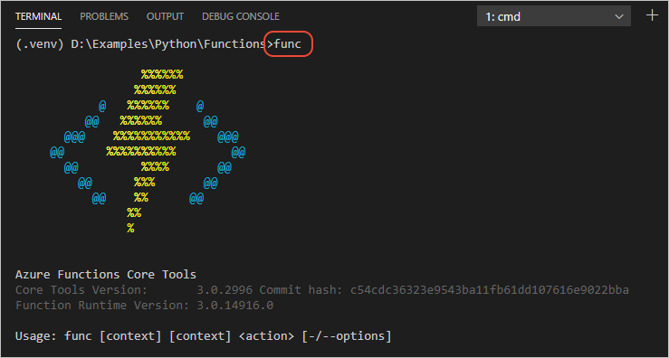

# Tutorial: Create and deploy serverless Azure Functions in Python with Visual Studio Code

In this article, you use Visual Studio Code and the Azure Functions extension to create a serverless HTTP endpoint with Python and to also add a connection (or "binding") to storage.

Azure Functions runs your code in a serverless environment without needing to provision a virtual machine or publish a web app. The Azure Functions extension for Visual Studio Code greatly simplifies the process of using Functions by automatically handling many configuration concerns.

If you encounter issues with any of the steps in this tutorial, we'd love to hear the details. Use the **I ran into an issue** button at the end of each article to submit feedback.

For a demonstration video, see <a href="https://www.youtube.com/watch?v=9bMsdBYy-D0&feature=youtu.be&ocid=AID3006292" target="_blank">Build Azure Functions with VS Code</a> (youtube.com) from virtual PyCon 2020. You might also be interested in the longer session, <a href="https://www.youtube.com/watch?v=PV7iy6FPjAY&feature=youtu.be&t=13&ocid=AID3006292" target="_blank">Easy data processing with Azure Functions</a> (youtube.com). 

## Prerequisites

- An [Azure subscription](#azure-subscription).
- The [Azure Functions Core Tools](#azure-functions-core-tools).
- [Visual Studio Code with the Azure Functions extension](#visual-studio-code-python-and-the-azure-functions-extension).

### Azure subscription

If you don't have an Azure subscription, [sign up now](https://azure.microsoft.com/free/?utm_source=campaign&utm_campaign=vscode-tutorial-functions-extension&mktingSource=vscode-tutorial-functions-extension) for a free 30-day account with $200 in Azure credits to try out any combination of services.

### Azure Functions Core Tools

Install the Azure Functions Core Tools by following the instructions for your operating system on [Work with Azure Functions Core Tools](/azure/azure-functions/functions-run-local#v2). Ignore the comments in the article about the Chocolatey package manager, which are not necessary to complete this tutorial.

When installing Node.js, use the default options and do *not* select the option to automatically install necessary tools.  Also be sure to use the `-g` option with the `npm install` commands so that the Core Tools are available to subsequent commands.

> [!TIP]
> The Core Tools are written in .NET Core, and the Core Tools package is best installed using the Node.js package manager, npm, which is why you need to install .NET Core and Node.js at present, even for working with Azure Functions in Python. You can, however bypass the .NET Core requirement using "extension bundles" as described in the aforementioned documentation. Whatever the case, you need install these components only once, after which Visual Studio Code automatically prompts you to install any updates.

### Visual Studio Code, Python, and the Azure Functions extension

Install the following software:

- A 64-bit version of Python 3.6, 3.7, or 3.8 as required by Azure Functions. Install Python from [python.org](https://www.python.org/downloads). When installing, select **Add Python 3.x to PATH** use the default options by selecting the **Install Now** option. On Windows, also select **Disable Path length limit** at the end of the process.
- [Visual Studio Code](https://code.visualstudio.com/).
- The [Python extension](https://marketplace.visualstudio.com/items?itemName=ms-python.python) as described on [Visual Studio Code Python Tutorial - Prerequisites](https://code.visualstudio.com/docs/python/python-tutorial).
- The [Azure Functions extension](https://marketplace.visualstudio.com/items?itemName=ms-azuretools.vscode-azurefunctions). For general information, visit the [vscode-azurefunctions GitHub repository](https://github.com/Microsoft/vscode-azurefunctions).

    > [!NOTE]
    > The Azure Functions extension is included with the the [Azure Tools extension pack](https://marketplace.visualstudio.com/items?itemName=ms-vscode.vscode-node-azure-pack).

### Sign in to Azure

[!INCLUDE [azure-sign-in](includes/azure-sign-in.md)]

### Verify prerequisites

To verify that all the Azure Functions tools are installed, open the Visual Studio Code Command Palette (**F1**), select the **Terminal: Create New Integrated Terminal** command, and once the terminal opens, run the command `func`:

The output that starts with the Azure Functions logo (you need to scroll the output upwards) indicates that the Azure Functions Core Tools are present.

If the `func` command isn't recognized, then run `npm install -g azure-functions-core-tools` again and verify that the install succeeds. Make sure also that you use the `-g` switch with the install command; otherwise npm installs the package in the current folder only.

The `func` command works through the *func.cmd* file that's installed in the Node.js global folder. To see the location of this folder, run `npm -l` and examine the location at the end of the output.

> [!div class="nextstepaction"]
> [I signed into Azure - continue to step 2 >>>](tutorial-vs-code-serverless-python-02.md)

Issues? Submit a GitHub issue using the "This page" feedback at the bottom of the page.
