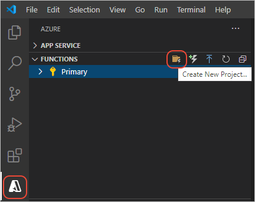
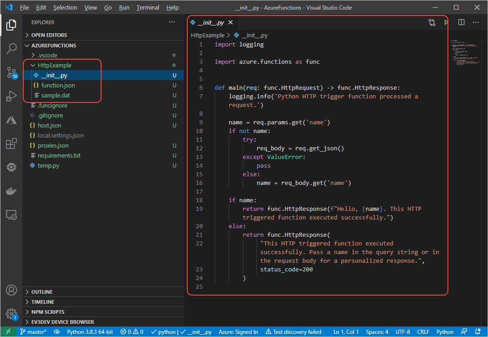
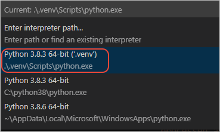
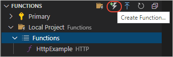

# 2: Create a Python function for Azure Functions

[Previous step: prerequisites](tutorial-vs-code-serverless-python-01.md)

In this article, you create a Python function for Azure Functions with Visual Studio Code. The code for Azure Functions is managed within a Functions _project_, which you create first before creating the code.

1. In **Azure: Functions** explorer (opened using the Azure icon on the left side), select the **New Project** command icon, or open the Command Palette (F1) and select **Azure Functions: Create New Project**.

    

1. In the prompts that follow:

    | Prompt | Value | Description |
    | --- | --- | --- |
    | Specify a folder for the project | Current open folder | The folder in which to create the project. You may want to create the project in a subfolder. |
    | Select a language for your function app project | **Python** | The language to use for the function, which determines the template used for the code. |
    | Select a template for your project's first function | **HTTP trigger** | A function that uses an HTTP trigger is run whenever there's an HTTP request made to the function's endpoint. (There are a variety of other triggers for Azure Functions. To learn more, see [What can I do with Functions?](/azure/azure-functions/functions-overview#what-can-i-do-with-functions).) |
    | Provide a function name | HttpExample | The name is used for a subfolder that contains the function's code along with configuration data, and also defines the name of the HTTP endpoint. Use "HttpExample" rather than accepting the default "HTTPTrigger" to distinguish the function itself from the trigger. |
    | Authorization level | **Anonymous** | Anonymous authorization makes the function publicly accessible to anyone. |
    | Select how you would like to open your project | **Open in current window** | Opens the project in the current Visual Studio Code window. |

    > [!NOTE]
    > If you have both Python 3.6 and 3.7 installed, Visual Studio Code uses Python 3.6 by default for the Azure Functions project. To use Python 3.7 at present, first create and activate a Python 3.7 environment, then use the `func init` command from a terminal. Then restart Visual Studio Code from that folder using the `code .` command.

1. After a short time, a message to indicate that the new project was created. In the **Explorer**, there's the subfolder created for the function, and Visual Studio Code opens the *\_\_init\_\_.py* file that contains the default function code:

    

    > [!NOTE]
    > If Visual Studio Code tells you that you don't have a Python interpreter selected when it opens *\_\_init\_\_.py*, open the Command Palette (**F1**), select the **Python: Select Interpreter** command,  and then select the virtual environment in the local `.env` folder (which was created as part of the project). The environment must be based on Python 3.6x specifically, as noted in the previous article under [Prerequisites](tutorial-vs-code-serverless-python-01.md#prerequisites).
    >
    > 

> [!TIP]
> Whenever you want to create another function in the same project, use the **Create Function** command in the **Azure: Functions** explorer, or open the Command Palette (**F1**) and select the **Azure Functions: Create Function** command. Both commands prompt you for a function name (which is the name of the endpoint), then creates a subfolder with the default files.
>
> 

> [!div class="nextstepaction"]
> [I created the function - continue to step 3 >>>](tutorial-vs-code-serverless-python-03.md)

[I ran into an issue](https://www.research.net/r/PWZWZ52?tutorial=vscode-functions-python&step=02-create-function)
