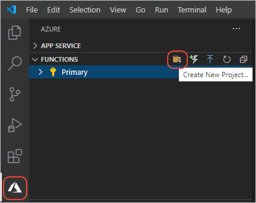

# 2: Create a Python function for Azure Functions

[Previous step: configure your environment](tutorial-vs-code-serverless-python-01.md)

In this article, you create a Python function for serverless Azure Functions with Visual Studio Code. The code for Azure Functions is managed within a Functions _project_, which you create first before creating the code.

1. In **Azure: Functions** explorer (opened using the Azure icon on the left side), select the **Create New Project** command icon, or open the Command Palette (F1) and select **Azure Functions: Create New Project**.

    

1. In the prompts that follow:

    | Prompt | Value | Description |
    | --- | --- | --- |
    | Select a folder that will container your functions project | Current open folder | The folder in which to create the project. You may want to create the project in a subfolder. |
    | Select a language | **Python** | The language to use for the function, which determines the template used for the code. |
    | Select Python interpreter to create a virtual environment | (Use the default path provided, or manually enter the path to a suitable interpreter if none are provided.) | The Python interpreter to use for a virtual environment. |
    | Select a template for your project's first function | **HTTP trigger** | A function that uses an HTTP trigger is run whenever there's an HTTP request made to the function's endpoint. (There are a variety of other triggers for Azure Functions. To learn more, see [What can I do with Functions?](/azure/azure-functions/functions-overview#what-can-i-do-with-functions).) |
    | Provide a function name | HttpExample | The name is used for a subfolder that contains the function's code along with configuration data, and also defines the name of the HTTP endpoint. Use "HttpExample" rather than accepting the default "HTTPTrigger1" to distinguish the function itself from the trigger. |
    | Authorization level | **Anonymous** | Anonymous authorization makes the function publicly accessible to anyone. |

1. The process creates a **Local Project** item that's shown in the explorer, under which is a collection named **Functions**, which then contains the function with the name you indicated (**HttpExample** here):

    

    If Visual Studio Code tells you that you don't have a Python interpreter selected when it opens *\_\_init\_\_.py*, open the Command Palette (**F1**), select the **Python: Select Interpreter** command, and then select the virtual environment in the local `.venv` folder (which was created as part of the project).

    

1. The VS Code editor is also opened to the *\_\_init\_\_.py* file that contains the default function code. At the top of the editor, notice the control **HttpExample > __init.py__** control:

    

    If you select **__init.py__**, VS Code shows you all the files that compose the function: the code in *\_\_init\_\_.py*, configuration in *function.json*, and sample data in *sample.dat*. You can select any of the files to switch between them:

    

    Similarly, if you select **HttpExample**, VS Code shows you all the *project* level files and folders:

    

> [!TIP]
> Whenever you want to create another function in the same project, use the **Create Function** command in the **Azure: Functions** explorer, or open the Command Palette (**F1**) and select the **Azure Functions: Create Function** command. Both commands prompt you for a function name (which is the name of the endpoint), then creates another function subfolder in the project with its own *\_\_init\_\_.py*, *function.json*, and *sample.dat* files.
>
> 

> [!div class="nextstepaction"]
> [I created the function - continue to step 3 >>>](tutorial-vs-code-serverless-python-03.md)

[Having issues? Let us know.](https://aka.ms/python-functions-qs-ms-survey)
