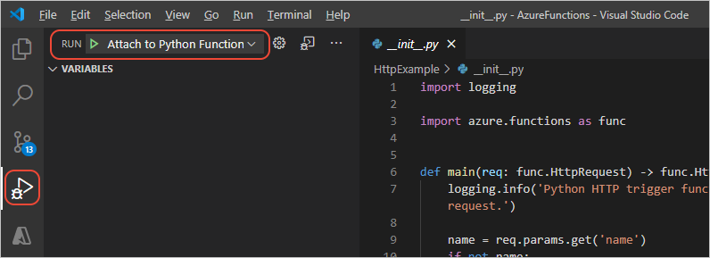

# 4: Debug the Azure Functions Python code locally

[Previous step: examine the code files](tutorial-vs-code-serverless-python-03.md)

You can debug your Azure Functions Python code locally in Visual Studio Code.

1. When you create the Functions project, the Visual Studio Code extension also creates a launch configuration in `.vscode/launch.json` that contains a single configuration named **Attach to Python Functions**. This configuration means you can just press F5 or use the Debug explorer to start the project:

    

1. When you start the debugger, a terminal opens showing output from Azure Functions, including a summary of the available endpoints. Your URL might be different if you used a name other than "HttpExample":

    <pre>
    Http Functions:

            HttpExample: [GET,POST] http://localhost:7071/api/HttpExample
    </pre>

1. Use **Ctrl+click** or **Cmd+click** on the URL in the Visual Studio Code **Output** window to open a browser to that address, or start a browser and paste in the same URL. In either case, the endpoint is `api/<function_name>`, in this case `api/HttpExample`. However, because that URL doesn't include a name parameter, the browser window should just show, "Please pass a name on the query string or in the request body" as appropriate for that path in the code.

    > [!TIP]
    > If you're unable to access the URL and are running behind a corporate proxy (and thus likely have `HTTP_PROXY` and `HTTPS_PROXY` environment variables set), set an environment variable named `NO_PROXY` to `localhost,127.0.0.1` and try again.

1. Now try adding a name parameter to the use, such as `http://localhost:7071/api/HttpExample?name=Visual%20Studio%20Code`, and the browser window should display the message, "Hello Visual Studio Code!", demonstrating that you've run that code path.

1. To pass the name value in a JSON request body, you can use a tool like curl with the JSON inline:

    # [PowerShell](#tab/powershell)

    ```powershell
    # Windows (escaping on the quotes is necessary; also modify the URL
    # if you're using a different function name)
    curl --header "Content-Type: application/json" --request POST \
        --data {"""name""":"""Visual Studio Code"""} http://localhost:7071/api/HttpExample
    ```

    In PowerShell, you can also use the [Invoke-WebRequest cmdlet](/powershell/module/microsoft.powershell.utility/invoke-webrequest?view=powershell-6).

    # [bash](#tab/bash)

    ```bash
    # Mac OS/Linux: modify the URL if you're using a different function name
    curl --header "Content-Type: application/json" --request POST \
        --data '{"name":"Visual Studio Code"}' http://localhost:7071/api/HttpExample
    ```

    ---

    Alternately, create a file like *data.json* that contains `{"name":"Visual Studio Code"}` and use the command `curl --header "Content-Type: application/json" --request POST --data @data.json http://localhost:7071/api/HttpExample`.

1. To test debugging the function, set a breakpoint on the line that reads `name = req.params.get('name')` and make a request to the URL again. The Visual Studio Code debugger should stop on that line, allowing you to examine variables and step through the code. (For a short walkthrough of basic debugging, see [Visual Studio Code Tutorial - Configure and run the debugger](https://code.visualstudio.com/docs/python/python-tutorial#configure-and-run-the-debugger).)

1. When you're satisfied that you've thoroughly tested the function locally, stop the debugger (with the **Debug** > **Stop Debugging** menu command or the **Disconnect** command on the debugging toolbar).

> [!NOTE]
> If you encounter the error, "Failed to verify 'AzureWebJobsStorage' connection specified in 'local.settings.json'.", the *local.settings.json* file in your project contains the line, `"AzureWebJobsStorage": "UseDevelopmentStorage=true"`. This line indicates that the debugger expects to use the Azure Storage Emulator locally, but it's not installed. In this case, you can [install the Azure Storage Emulator](/azure/storage/common/storage-use-emulator#get-the-storage-emulator), [start and initialize the emulator](/azure/storage/common/storage-use-emulator#start-and-initialize-the-storage-emulator), and restart the debugger.
>
> Alternately, change the line in the JSON file to `"AzureWebJobsStorage": ""` and restart the debugger.

> [!div class="nextstepaction"]
> [I ran the debugger locally - continue to step 5 >>>](tutorial-vs-code-serverless-python-05.md)

Issues? Submit a GitHub issue using the "This page" feedback at the bottom of the page.
