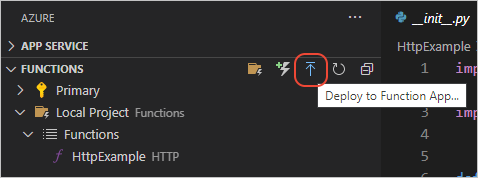
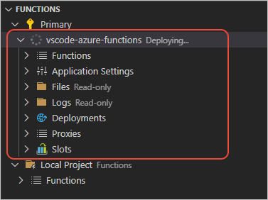
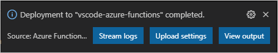

# 5: Deploy Azure Functions in Python

[Previous step: debug locally](tutorial-vs-code-serverless-python-04.md)

Deploying a function to Azure means creating a Functions app in Azure along with other required Azure resources. A function app lets you group functions as a logic unit for easier management, deployment, and sharing of resources.

A function app requires an Azure Storage account for data and a [hosting plan](/azure/azure-functions/functions-scale#hosting-plan-support). All of these resources are organized within a single resource group.

1. In the **Azure: Functions** explorer, select the **Deploy to Function App** command, or open the Command Palette (**F1**) and select the **Azure Functions: Deploy to Function App** command. Again, the function app is where your Python project runs in Azure.

    

1. When prompted (**Select function app in Azure**), select **Create New Function App in Azure**, and provide a name that's unique across Azure (typically using your personal or company name along with other unique identifiers; you can use letters, numbers, and hyphens).

    If you previously created a Function App, its name appears in this list of options.

1. At the next two prompts, select a Python version and Azure location.

1. The extension performs the following actions, which you can observe in Visual Studio Code popup messages and the **Output** window (the process takes a few minutes):

    - Create a resource group using the name you gave (removing hyphens) in the location you selected.
    - In that resource group, create the storage account, hosting plan, and function app. Azure Functions uses a [consumption plan](/azure/azure-functions/functions-scale#consumption-plan) by default. To run your functions in a dedicated plan, you need to [enable publishing with advanced create options](/azure/azure-functions/functions-develop-vs-code).
    - Deploy your code to the function app.

    The **Azure: Functions** explorer also shows progress:

    

1. Once deployment is complete, the Azure Functions extension displays a message with buttons for three additional actions:

    

    For **Stream logs** and **Upload settings**, see the next sections.

1. Select **View output** to switch to the **Output** window. The output shows the public endpoint on Azure (the URL of your specific endpoint will match the name you specified for the function app):

    <pre>
    1:38:04 PM vscode-azure-functions: HTTP Trigger Urls:
      HttpExample: https://vscode-azure-functions.azurewebsites.net/api/HttpExample
    </pre>

    Use this endpoint to run the same tests you did locally, using URL parameters and/or requests with JSON data in the request body. The results of the public endpoint should match the results of the local endpoint you tested previously in [part 4](tutorial-vs-code-serverless-python-04.md).

## Examine logs (Live Metrics)

The **Stream logs** button in the deployment message popup opens a browser to the Azure portal's **Live Metrics** section for your function. You can also connect to metrics using in the **Azure Functions** explorer by right-clicking the functions project name and selecting **Start streaming logs**.

## Sync local settings to Azure

The **Upload settings** button in the deployment message popup applies any changes you've made to your *local.settings.json* file to Azure. You can also invoke the command on the **Azure Functions** explorer by expanding the Functions project node, right-clicking **Application Settings**, and selecting **Upload local settings**. You can also use the Command Palette to select the **Azure Functions: Upload Local Settings** command.

Uploading settings updates any existing settings and adds any new settings defined in *local.settings.json*. Uploading doesn't remove any settings from Azure that aren't listed in the local file. To remove those settings, expand the **Applications Settings** node in the **Azure Functions** explorer, right-click the setting, and select **Delete Setting**. You can also edit settings directly on the Azure portal.

To apply any changes you make through the portal or through the **Azure Explorer** to the *local.settings.json* file, right-click the **Application Settings** node and select the **Download remote settings** command. You can also use the Command Palette to select the **Azure Functions: Download Remote Settings** command.

> [!div class="nextstepaction"]
> [I deployed the functions - continue to step 6 >>>](tutorial-vs-code-serverless-python-06.md)

[Having issues? Let us know.](https://aka.ms/python-functions-qs-ms-survey)
