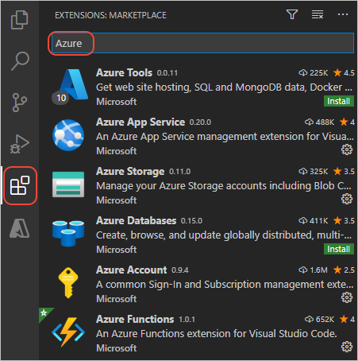

# 8: Clean up Azure resources for Azure Functions

[Previous step: add a storage binding](tutorial-vs-code-serverless-python-07.md)

The Azure Function App you created with Visual Studio Code in the course of this tutorial includes resources that can incur minimal costs. (For more information, see [Functions Pricing](https://azure.microsoft.com/pricing/details/functions/).)

The best way to clean up resources is to delete the resource group that contains all the individual resources used in this tutorial. Resources include the function app, the storage account, and the backing App Service plan.

[!INCLUDE [delete-resource-group](includes/delete-resource-group.md)]

In Visual Studio Code, you might notice that the context menu on the Function App in the **Azure: Functions** explorer has a **Delete Function App** command. The command deletes only the function app, however, and leaves other resources in place, which can incur ongoing costs.

## Next steps

Congratulations on completing this walkthrough of deploying Python code to Azure Functions! You're now ready to create many more serverless functions.

As noted earlier, you can learn more about the Functions extension by visiting its GitHub repository, [vscode-azurefunctions](https://github.com/Microsoft/vscode-azurefunctions). Issues and contributions are also welcome.

Read the [Azure Functions Overview](/azure/azure-functions/functions-overview) to explore the different triggers you can use.

To learn more about Azure services that you can use from Python, including data storage along with AI and Machine Learning services, visit [Azure Python Developer Center](./index.yml).

There are also other Azure extensions for Visual Studio Code that you may find helpful. Just search on "Azure" in the Extensions explorer:

Some popular extensions are:

- [Cosmos DB](https://marketplace.visualstudio.com/items?itemName=ms-azuretools.vscode-cosmosdb)
- [Azure App Service](https://marketplace.visualstudio.com/items?itemName=ms-azuretools.vscode-azureappservice). See the [Deploy to App Service tutorial](tutorial-deploy-app-service-on-linux-01.md)
- [Azure CLI Tools](https://marketplace.visualstudio.com/items?itemName=ms-vscode.azurecli)
- [Azure Resource Manager Tools](https://marketplace.visualstudio.com/items?itemName=msazurermtools.azurerm-vscode-tools)

> [!div class="nextstepaction"]
> [I'm done!](/python/azure/?preserve-view=true&view=azure-python)

[Having issues? Let us know.](https://aka.ms/python-functions-qs-ms-survey)
