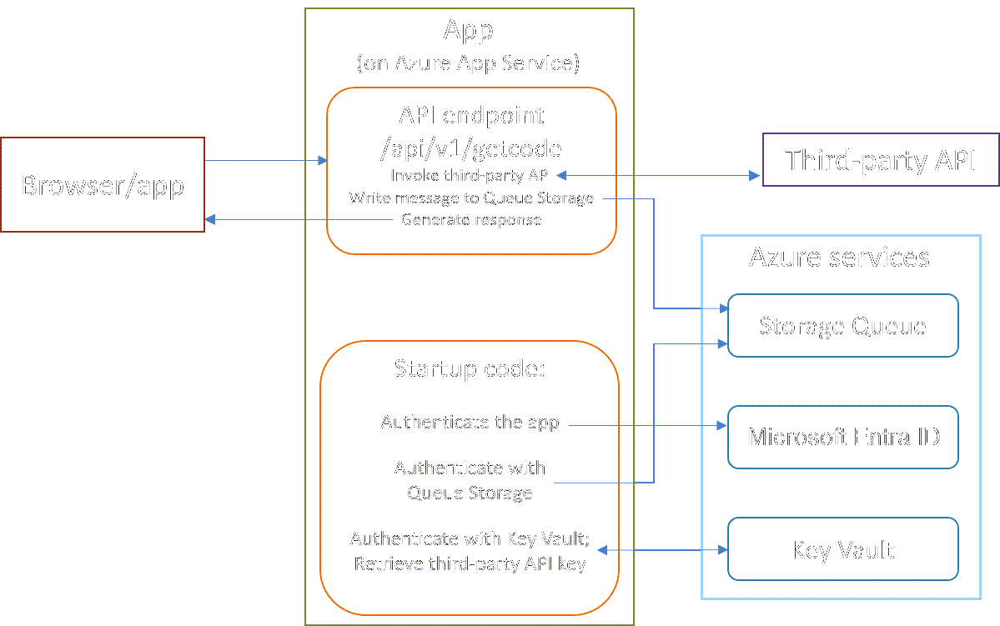

# Walkthrough: Integrated authentication for Python apps with Azure services

Microsoft Entra ID, when used with Azure Key Vault, provides a robust and secure approach for authenticating applications to both Azure services and third-party platforms that require access keys or credentials. This combination eliminates the need to hardcode secrets in application code, instead relying on managed identities, role-based access control (RBAC), and centralized secret management via Key Vault. This approach streamlines identity management and enhances security posture in cloud environments.

This walkthrough explores these authentication mechanisms through a practical example provided in the GitHub repository: [github.com/Azure-Samples/python-integrated-authentication](https://github.com/Azure-Samples/python-integrated-authentication).

The sample demonstrates how a Python application can:

* Authenticate with Azure using DefaultAzureCredential

* Access Azure Key Vault secrets without storing credentials

* Communicate securely with other Azure services like Azure Storage, Cosmos DB, and more

This article is part of a series that provides a detailed walkthrough of how to authenticate a Python app with Microsoft Entra ID, Azure Key Vault, and Azure Queue Storage by using the Azure Python SDK `azure-identity` library.

## Part 1: Background

While many Azure services rely exclusively on role-based access control (RBAC), while others require access via secrets or keys. Such services include Azure Storage, databases, Azure AI services, Key Vault, and Event Hubs

When building cloud applications that interact with these services, developers can use the Azure portal, CLI, or PowerShell to generate and configure service-specific access keys. These keys are tied to particular access policies to prevent unauthorized access. However, this model requires your application to manage keys explicitly and authenticate separately with each service, a process that's both tedious and error-prone.

Embedding secrets directly in code or storing them on developer machines risks exposing them in:

* Source control
* Insecure local environments
* Accidental logs or configuration exports

Azure Offers Two Key Services to Improve Security and Simplify Authentication:

* **Azure Key Vault** Azure Key Vault provides a secure, cloud-based store for secrets, including access keys, connection strings, and certificates. By retrieving secrets from Key Vault only at runtime, applications avoid exposing sensitive data in source code or configuration files.

- With [Microsoft Entra managed identities](/entra/identity/managed-identities-azure-resources/overview), your application can authenticate once with Microsoft Entra ID. From there, it can access other Azure services—including Key Vault—without managing credentials directly.

This approach provides:

* Credential-free code (no secrets in source control)
* Seamless integration with Azure services
* Environment consistency: the same code runs locally and in the cloud with minimal configuration

This walkthrough shows how to use Microsoft Entra managed identity and Key Vault together in the same app. By using Microsoft Entra ID and Key Vault together, your app never needs to authenticate itself with individual Azure services, and can easily and securely access any keys necessary for third-party services.

> [!IMPORTANT]
> This article uses the common, generic term "key" to refer to what are stored as "secrets" in Azure Key Vault, such as an access key for a REST API. This usage shouldn't be confused with Key Vault's management of *cryptographic* keys, which is a separate feature from Key Vault's *secrets*.

## Example cloud app scenario

To understand Azure's authentication process more deeply, consider the following scenario: A Flask web application is deployed to Azure App Service. It exposes a public, unauthenticated API endpoint that returns JSON data in response to HTTP requests.

* To generate its response, the API invokes a third-party API that requires an access key. Instead of storing this key in code or configuration files, the app retrieves it securely at runtime from Azure Key Vault using Microsoft Entra managed identity.

* Before returning its response to the client, the app writes a message to an Azure Storage Queue for asynchronous processing. The message could represent a task, log, or signal, though the downstream processing isn't the focus of this scenario.

> [!NOTE]
> Although public API endpoints are typically protected by their own access keys or authentication mechanisms, this walkthrough assumes the endpoint is open and unauthenticated.
>
> This simplification helps isolate the app’s internal authentication requirements—such as accessing Azure Key Vault and Azure Storage—from any authentication concerns related to external clients.
>
> The scenario focuses solely on the app's behavior and doesn't demonstrate or involve an external caller authenticating with the endpoint.

> [!div class="nextstepaction"]
> [Part 2 - Authentication requirements >>>](walkthrough-tutorial-authentication-02.md)
