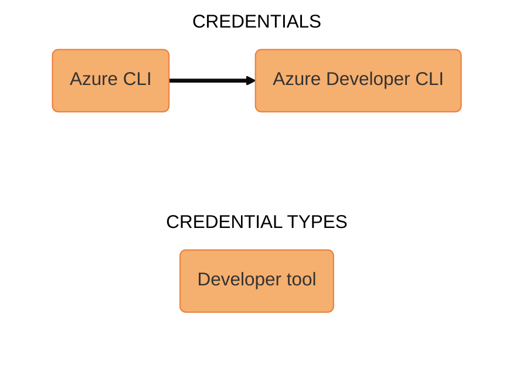

```mermaid
%% STEPS TO GENERATE IMAGE
%% =======================
%% 1. Install mermaid CLI v10.9.1 (see https://github.com/mermaid-js/mermaid-cli/blob/master/README.md):
%%    npm i -g @mermaid-js/mermaid-cli@10.9.1
%% 2. Run command: mmdc -i default-azure-credential-authentication-flow.md -o ../media/mermaidjs/default-azure-credential-authentication-flow.svg -w 300
%% 3. Alternate sizing: 1) change style max width to 300px and width from 100% to 300px.

%%{
  init: {
    'theme': 'base',
    'themeVariables': {
      'tertiaryBorderColor': '#fff',
      'tertiaryColor': '#fff'
    }
  }
}%%

flowchart LR;
    subgraph CREDENTIAL TYPES;
        direction LR;
        Developer(Developer tool):::developer;
    end;

    subgraph CREDENTIALS;
        direction LR;
        A(Azure CLI):::developer ==> B(Azure Developer CLI):::developer;
    end;

    %% Define styles for credential type boxes
    classDef developer fill:#F5AF6F, stroke:#EB7C39;
```