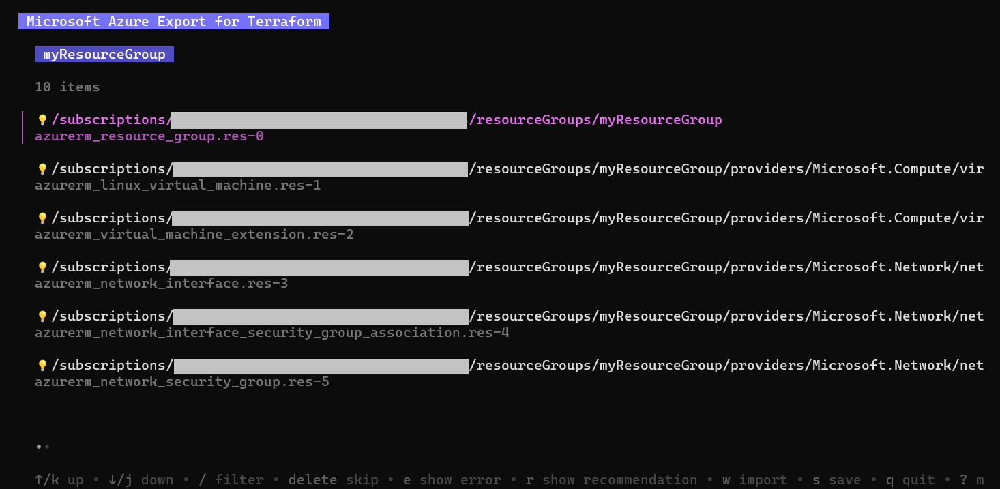
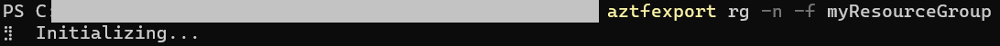
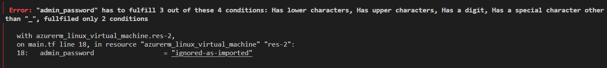

# Quickstart: Export Your First Resources with Azure Export for Terraform
This quickstart shows you how to export your first Azure resources into Terraform HCL and state using Azure Export for Terraform. You'll export a resource group in this quickstart.

> [!NOTE]
>
> **This example uses a virtual machine resource group from the virtual machine documentation tutorial. You do not have to export a virtual machine resource group, but can pick one of your own choosing.**
>
> If you wish to setup this example, please create a Linux or Windows virtual machine from one of the non-Terraform quickstarts on the [Virtual Machines documentation page](https://learn.microsoft.com/en-us/azure/virtual-machines/). You do not have to complete any steps after creating the virtual machine in any tutorial to complete this quickstart.
>
> If using your own resource group, replace *myResourceGroup* with your resource group name for the below commands.

## Interactive Workflow
Run the following command:
```console
aztfexport rg myResourceGroup
```
After the tool takes a few moments to initialize, you should see a list of the resources to be exported in the terminal. Each line has an Azure resourceID matched to the corresponding AzureRM resource type. An example output is below:  
  
A list of commands is available at the bottom of the display. Scroll down to the bottom to ensure all Azure resources are properly mapped to their respective Terraform resource types. Once you have verified the mapping is correct, press `w` to run the import. 
## Non-Interactive Workflow
For a non-interactive resource, run the following command:
```console
aztfexport rg --non-interactive myResourceGroup
```
When you see the tool beginning to show "Initializing" you'll know it's started, as below:

## Verifying a Successful Run
After the tool has finished importing your VM, navigate to the directory that contains the now generated files. Run `terraform init` and `terraform plan` on the directory. If the terminal outputs `"No changes needed"` then congratulations! Your infrastructure and its corresponding state have been successfully imported to Terraform.
## Making Modifications
In our specific example, we see the following error:

This error is caused by the fact that Azure Export for Terraform can only do a read-only on existing properties; thus, the VM password is set to `"ignored-as-imported"` and the user will have to configure the password themselves. For more details on limitations visit [this page](aztfexport-how.md#limitations).
## Cleaning Up Resources
**Please skip this step if using your own resources that you do not wish to delete.** To clean up the resources you created, run `terraform destroy` in the directory through the terminal.
## Summary
In this quickstart, you successfully exported your first resource group in both an interactive and non-interactive workflow.