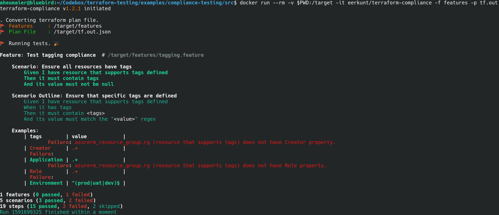
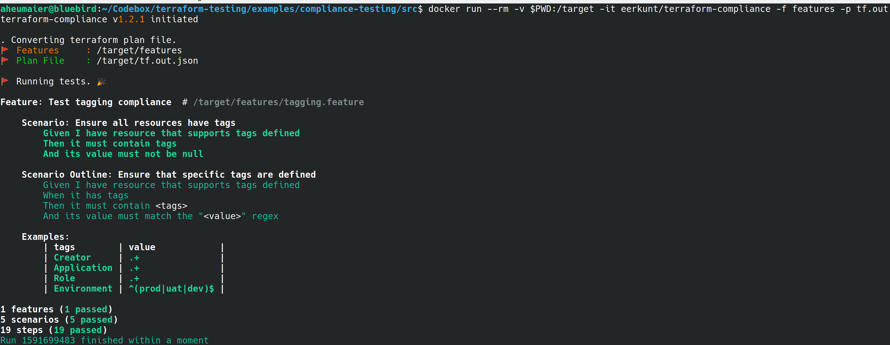

# Tutorial: Compliance testing with Terraform and Azure

[!INCLUDE [terraform-intro.md](includes/terraform-intro.md)]

In this article, you learn how to do the following tasks:

> [!div class="checklist"]
> * Understand when to use compliance testing
> * Learn how to do a compliance check

[!INCLUDE [hashicorp-support.md](includes/hashicorp-support.md)]

## Prerequisites

[!INCLUDE [open-source-devops-prereqs-azure-subscription.md](../includes/open-source-devops-prereqs-azure-subscription.md)]
- **Install Terraform**: Based on your environment, [download and install Terraform](https://www.terraform.io/downloads.html).
- **Docker**: [Install Docker](https://docs.docker.com/get-docker/)
- **Terraform-compliance**: [Install the Terraform compliance tool](https://terraform-compliance.com/pages/installation/docker).
- **Fork the testing samples**: Fork the [Terraform sample project on GitHub](https://github.com/Azure/terraform) and clone it to your dev/test machine.

## What is compliance testing

Compliance testing is a nonfunctional testing technique to determine if a system meets prescribed standards. Compliance testing is also known as *conformance testing*,

Most software teams do an analysis to check that the standards are properly enforced and implemented. Often working simultaneously to improve the standards that, in turn, lead to increased quality.

Compliance testing ensures that the output of each development lifecycle phase conforms to agreed-upon requirements.

Compliance checks should be integrated into the development cycle at the beginning of the projects. Attempting to add compliance checks at a later stage becomes increasingly more difficult when the requirement itself isn't adequately documented.

## Understanding compliance checks

Doing compliance checks is straight forward. A set of standards and procedures is developed and documented for each phase of the development lifecycle. The output of each phase is compared against the documented requirements. The results of the test are any "gaps" in not conforming to the predetermined standards. Compliance testing is done through the inspection process and the outcome of the review process should be documented.

Let's take a look at a specific example.

A common problem is environments that break when multiple developers apply incompatible changes. Let's say one person works on a change and applies resources such as creating a VM in a test environment. Another person then applies a different version of the code that provisions different version of that VM. What is needed here is oversight to ensure conformity to stated rules.

One way to address this issue would be to define a policy of tagging the resources - such as with `role` and `creator` tags. Once you define the policies, a tool like [Terraform-compliance](https://terraform-compliance.com) is used to ensure the policies are followed.

Terraform-compliance focuses on *negative testing*. Negative testing is the process of ensuring that a system can gracefully handle unexpected input or unwanted behavior. *Fuzzing* is an example of negative testing. With fuzzing, a system that receives input is tested to ensure that it can safely handle unexpected input.

Fortunately, Terraform is an abstraction layer for any API that creates, updates, or destroys cloud-infrastructure entities. Terraform also ensures the local configuration and the remote API responses are in synch. Since Terraform is mostly used against Cloud APIs, we still need a way to ensure the code deployed against the infrastructure follows specific policies. Terraform-compliance - a free and open-source tool - provides this functionality for Terraform configurations.

Using the VM example, a compliance policy might be as follows: *"If you're creating an Azure resource, it must contain a tag"*.

The Terraform-compliance tool provides a test framework where you create policies like the example. You then run those policies against your Terraform execution plan.

Terraform-compliance allows you to apply BDD, or *behavior-driven development*, principles. BDD is a collaborative process where all stakeholders work together to define what a system should do. These stakeholders generally include the developers, testers, and anyone with a vested interest in - or who will be impacted by - the system being developed. The goal of BDD is to encourage teams to build concrete examples that express a common understanding of how the system should behave.

## Looking at an example

Previously in this article, you read about a compliance-testing example of creating a VM for a test environment. This section shows how to translate that example into a BDD Feature and Scenario. The rule is first expressed using *Cucumber*, which is a tool used to support BDD.

```Cucumber
when creating Azure resources, every new resource should have a tag
```

The previous rule is translated as follows:

```Cucumber
If the resource supports tags
Then it must contain a tag
And its value must not be null
```

The Terraform HCL code would then adhere to the rule as follows.

```hcl
resource "random_uuid" "uuid" {}

resource "azurerm_resource_group" "rg" {
  name     = "rg-hello-tf-${random_uuid.uuid.result}"
  location = var.location

  tags = {
    environment = "dev"
    application = "Azure Compliance"
  } 
}
```

The first policy could be written as a [BDD feature scenario](https://gherkin.io/docs/gherkin/reference/) as follows:

```Cucumber
Feature: Test tagging compliance  # /target/src/features/tagging.feature
    Scenario: Ensure all resources have tags
        If the resource supports tags
        Then it must contain a tag
        And its value must not be null
```

The following code shows a test for a specific tag:

```Cucumber
Scenario Outline: Ensure that specific tags are defined
    If the resource supports tags
    Then it must contain a tag <tags>
    And its value must match the "<value>" regex

    Examples:
      | tags        | value              |
      | Creator     | .+                 |
      | Application | .+                 |
      | Role        | .+                 |
      | Environment | ^(prod\|uat\|dev)$ |
```

## Running the sample

In this section, you'll download and test the example.

1. [Download the compliance test sample](https://github.com/Azure/terraform/tree/master/samples/compliance-testing).

1. Change directories to the `src` directory.

1. Run [terraform init](https://www.terraform.io/docs/commands/init.html) to initialize the working directory. This step downloads the Azure modules required to create an Azure resource group.

    ```bash
    terraform init
    ```
    
1. Run [terraform validate](https://www.terraform.io/docs/commands/validate.html) to validate the syntax of the configuration files.

    ```bash
    terraform validate
    ```
    
1. Run [terraform plan](https://www.terraform.io/docs/commands/plan.html) to create an execution plan.

    ```bash
    terraform plan -out tf.out
    ```
    
1. Run [terraform apply](https://www.terraform.io/docs/commands/apply.html) to apply the execution plan.

    ```bash
    terraform apply -target=random_uuid.uuid
    ```
    
1. Run [docker pull](https://docs.docker.com/engine/reference/commandline/pull/) to download the terraform-compliance image.

    ```bash
    docker pull eerkunt/terraform-compliance
    ```
    
1. Run [docker run](https://docs.docker.com/engine/reference/commandline/run/) to run the tests in a docker container. **The test will fail**. The first rule requiring existence of tags succeeds. However, the second rule fails in that the `Role` and `Creator` tags are missing.

    ```bash
    docker run --rm -v $PWD:/target -it eerkunt/terraform-compliance -f features -p tf.out
    ```
    
    

1. Modify `main.tf` as follows to fix the error.

    ```terraform
      tags = {
        Environment = "dev"
        Application = "Azure Compliance"
        Creator     = "Azure Compliance"
        Role        = "Azure Compliance"
      } 
    
    ```
    
1. Run `terraform validate` again to verify the syntax.

    ```bash
    terraform validate
    ```
    
1. Run `terraform plan` again to create a new execution plan.

    ```bash
    terraform plan -out tf.out
    ```
    
1. Run [docker run](https://docs.docker.com/engine/reference/commandline/run/) again to test the configuration. This time, the test succeeds as the full spec has been implemented.

    ```bash
    docker run --rm -v $PWD:/target -it eerkunt/terraform-compliance -f features -p tf.out
    ```

    

## Next steps

> [!div class="nextstepaction"]
> [Create and run end-to-end tests in Terraform projects](best-practices-end-to-end-testing.md)
