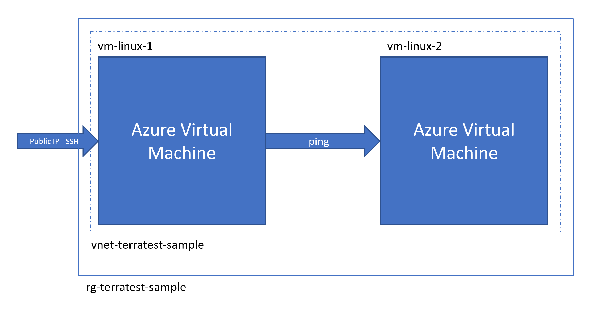

# Tutorial: Setup end-to-end Terratest testing on Terraform projects

[!INCLUDE [terraform-intro.md](includes/terraform-intro.md)]

In this article, you learn how to do the following tasks:

> [!div class="checklist"]
> * Understand the basics of end-to-end testing with [Terratest](https://github.com/gruntwork-io/terratest)
> * Learn how to write end-to-end test using Golang
> * Learn how to use Azure DevOps to automatically trigger end-to-end tests when code is committed to your repo

## Prerequisites

[!INCLUDE [open-source-devops-prereqs-azure-subscription.md](../includes/open-source-devops-prereqs-azure-subscription.md)]
- **Install Terraform**: Based on your environment, [download and install Terraform](https://www.terraform.io/downloads.html).
- **Fork testing samples:** to get started quickly, we recommend that you fork [this repository](https://github.com/Azure/terraform) into your own GitHub organization.
- **Go programming language**: Terraform test cases are written in [Go](https://golang.org/dl/). The sample in this article uses [Go modules](https://blog.golang.org/using-go-modules). Go 1.13 (or later) is recommended for this article.

## What is end-to-end testing

End-to-end tests validate a system works as a collective whole. This type of testing is as opposed to testing specific modules. For Terraform projects, end-to-end testing allows for the validation of what has been deployed. This type of testing differs from many other types that test pre-deployment scenarios. End-to-end tests are critical for testing complex systems that include multiple modules and act on multiple resources. In such scenarios, end-to-end testing is the only way to determine if the various modules are interacting correctly.

This article focuses on using [Terratest](https://github.com/gruntwork-io/terratest) to implement end-to-end testing. Terratest provides all the plumbing that is required to do the following task:

- Deploy a Terraform configuration
- Enables you to write a test using the Go language to validate what has been deployed
- Orchestrate the tests into stages
- Tear down the deployed infrastructure

## Tutorial scenario

For this tutorial, we're using a sample available in the [Azure/terraform sample repo](https://github.com/Azure/terraform/blob/master/samples/end-to-end-testing/README.md).

This sample defines a Terraform configuration that deploys two Linux virtual machines into the same virtual network. One VM - named `vm-linux-1` - has a public IP address. Only port 22 is opened to allow SSH connections. The second VM - `vm-linux-2` - has no defined public IP address.

Our test should validate the following scenarios:

- The infrastructure is deployed correctly
- Using port 22, it's possible to open an SSH session to `vm-linux-1`
- Using the SSH session on `vm-linux-1`, it's possible to ping `vm-linux-2`



If you [downloaded the sample](#prerequisites), the Terraform configuration for this scenario can be found in the `src/main.tf` file. That file contains everything necessary to deploy the Azure infrastructure represented in the preceding figure.

If you're unfamiliar with how to create virtual machines, see [Create a Linux VM with infrastructure in Azure using Terraform](create-linux-virtual-machine-with-infrastructure.md).

> [!CAUTION]
> The sample scenario presented in this article is for illustration purposes only. We've purposely kept things simple in order to focus on the steps of an end-to-end test. We don't recommend having production virtual machines that exposes SSH ports over a public IP address.

## End-to-end test

The end-to-end test is written in the Go language and uses the Terratest framework. If you [downloaded the sample](#prerequisites), it's defined in the `src/test/end2end_test.go` file.

The following source code shows the standard structure of a Golang test using Terratest:

```Go
package test

import (
    "testing"

    "github.com/gruntwork-io/terratest/modules/terraform"
    test_structure "github.com/gruntwork-io/terratest/modules/test-structure"
)

func TestEndToEndDeploymentScenario(t *testing.T) {
    t.Parallel()

    fixtureFolder := "../"

    // User Terratest to deploy the infrastructure
    test_structure.RunTestStage(t, "setup", func() {
        terraformOptions := &terraform.Options{
            // Indicate the directory that contains the Terraform configuration to deploy
            TerraformDir: fixtureFolder,
        }

        // Save options for later test stages
        test_structure.SaveTerraformOptions(t, fixtureFolder, terraformOptions)

        // Triggers the terraform init and terraform apply command
        terraform.InitAndApply(t, terraformOptions)
    })

    test_structure.RunTestStage(t, "validate", func() {
        // run validation checks here
        terraformOptions := test_structure.LoadTerraformOptions(t, fixtureFolder)
		    publicIpAddress := terraform.Output(t, terraformOptions, "public_ip_address")
    })

    // When the test is completed, teardown the infrastructure by calling terraform destroy
    test_structure.RunTestStage(t, "teardown", func() {
        terraformOptions := test_structure.LoadTerraformOptions(t, fixtureFolder)
        terraform.Destroy(t, terraformOptions)
    })
}
```

As you can see in the previous code snippet, the test is composed by three stages:

- **setup**: Runs Terraform to deploy the configuration
- **validate**`: Does the validation checks and assertions
- **teardown**: Cleans up the infrastructure after the test has run

The following list shows some of the key functions provided by the Terratest framework:

- **terraform.InitAndApply**: Enables running `terraform init` and `terraform apply` from Go code
- **terraform.Output**: Retrieves the value of the deployment output variable.
- **terraform.Destroy**: Runs the `terraform destroy` command from Go code.
- **test_structure.LoadTerraformOptions**: Loads Terraform options - such as configuration and variables - from the state
- **test_structure.SaveTerraformOptions**: Saves Terraform options - such as configuration and variables - to the state

## Run the end-to-end test

In this section, you run the test against the sample configuration and deployment. 

1. Open a bash/terminal window.

1. Log in to your Azure account. For information about logging into your Azure subscription, see [Azure authentication section](get-started-cloud-shell.md#authenticate-to-azure).

1. To run this sample test, you need an SSH private/public key pair name `id_rsa` and `id_rsa.pub` in your home directory. Replace `USER` with the name of your home directory.

```bash
export TEST_SSH_KEY_PATH="/home/USER/.ssh/id_rsa"
```

1. Change directories to the `test` directory.

1. Run the test.

```go
go test -v ./ -timeout 10m
```

The test will display results similar to the following output:

```output
--- PASS: TestEndToEndDeploymentScenario (390.99s)
PASS
ok      test    391.052s
```

[!INCLUDE [terraform-troubleshooting.md](includes/terraform-troubleshooting.md)]

## Next steps

> [!div class="nextstepaction"]
> [Terraform testing overview](best-practices-testing-overview.md)
