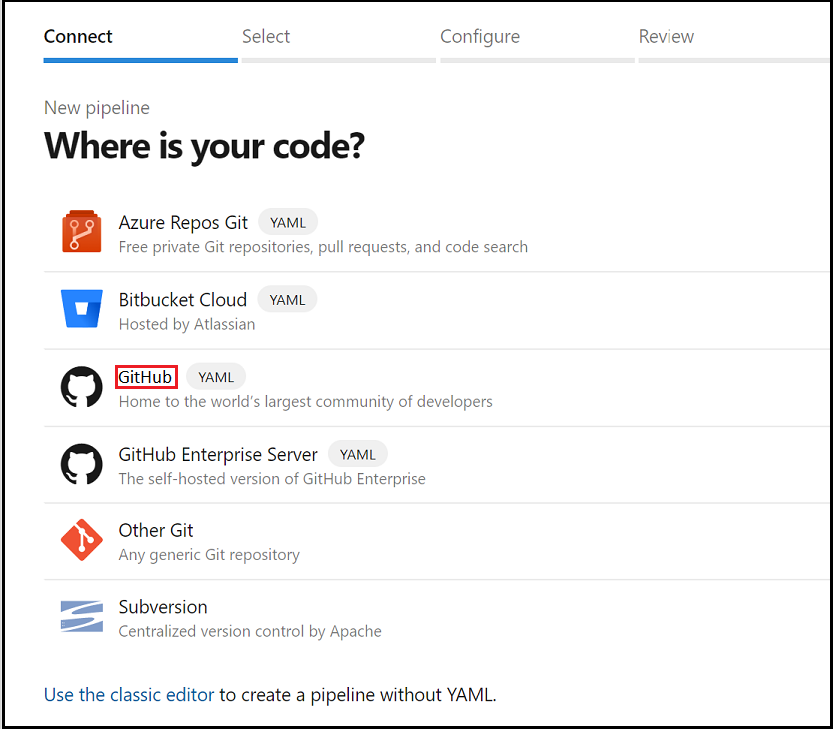
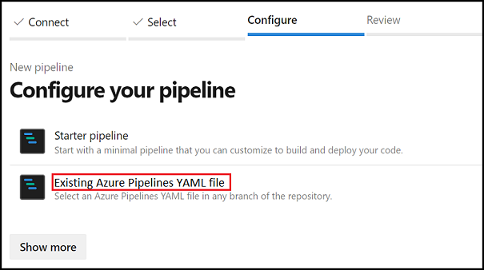
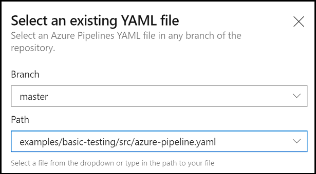
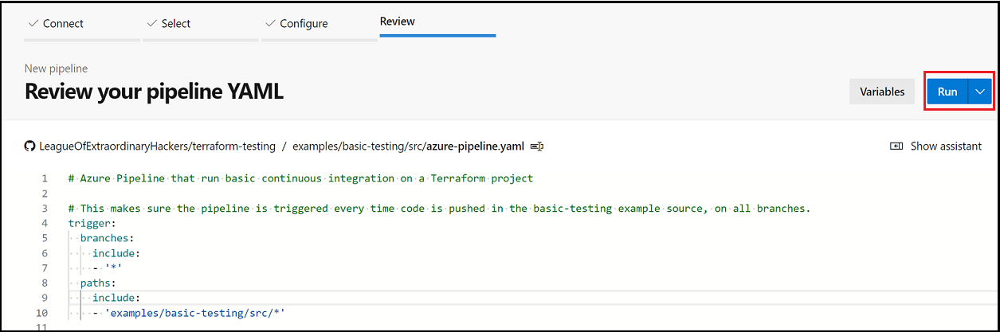
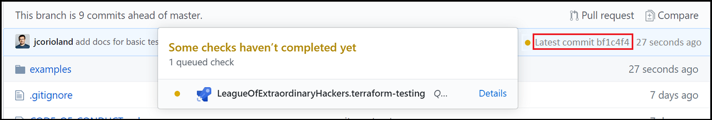
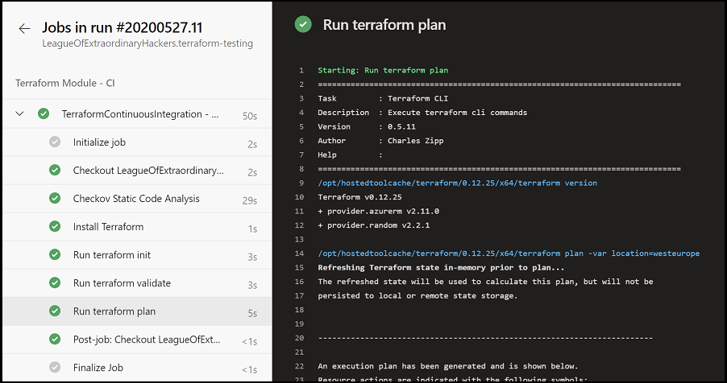

# Tutorial: Configure integration tests for Terraform projects in Azure

[!INCLUDE [terraform-intro.md](includes/terraform-intro.md)]

In this article, you learn how to do the following tasks:

> [!div class="checklist"]
> * Learn the basics of integration testing for Terraform projects.
> * Use Azure DevOps to configure a continuous integration pipeline.
> * Run static code analysis on Terraform code.
> * Run `terraform validate` to validate Terraform configuration files on the local machine.
> * Run `terraform plan` to validate that Terraform configuration files from a remote services perspective.
> * Use an Azure Pipeline to automate continuous integration.

[!INCLUDE [hashicorp-support.md](includes/hashicorp-support.md)]

## Prerequisites

[!INCLUDE [open-source-devops-prereqs-azure-subscription.md](../includes/open-source-devops-prereqs-azure-subscription.md)]
- **Azure DevOps organization and project**: If you don't have one, [create an Azure DevOps organization](/azure/devops/organizations/projects/create-project?tabs=preview-page&view=azure-devops).
- **Terraform Build & Release Tasks extension**: [Install the Terraform build/release tasks extension](https://marketplace.visualstudio.com/items?itemName=charleszipp.azure-pipelines-tasks-terraform) into your Azure DevOps organization.
- **Grant Azure DevOps access to your Azure Subscription**: Create an [Azure service connection](/azure/devops/pipelines/library/connect-to-azure?view=azure-devops) named `terraform-basic-testing-azure-connection` to allow Azure Pipelines to connect to your Azure subscriptions
- **Install Terraform**: Based on your environment, [download and install Terraform](https://www.terraform.io/downloads.html).
- **Fork the testing samples**: Fork the [Terraform sample project on GitHub](https://github.com/Azure/terraform) and clone it to your dev/test machine.

## Validate a local Terraform configuration

The [terraform validate](https://www.terraform.io/docs/commands/validate.html) command is run from the command line in the directory containing your Terraform files. This commands main goal is validating syntax.

1. Open the command-line environment of your choice. Many code editors - such as Visual Studio Code - provide a command-line interface.

1. Change directories to the local repo's `samples/integration-testing/src` directory. It contains a simple Terraform project.

1. Initialize the Terraform deployment with [terraform init](https://www.terraform.io/docs/commands/init.html). This step downloads the Azure modules required to create an Azure resource group.

    ```bash
    terraform init
    ```

1. Validate the test Terraform file with [terraform validate](https://www.terraform.io/docs/commands/validate.html).

    ```bash
    terraform validate
    ```

    You should see a message indicating that the configuration is valid.

1. In a code editor, open the `main.tf` file.

1. On line 5, insert a typo that invalidates the syntax. For example, replace `var.location` with `var.loaction`

1. Save the file.

1. Run validation again.

    ```bash
    terraform validate
    ```

    This time, you should see an error message indicating the offending line and a description of the error.

As you can see, Terraform has detected an issue in the syntax of the configuration code. This issue prevents the configuration from being deployed.

It-s a good practice to always run `terraform validate` against your Terraform files before pushing them to your version control system. Also, this level of validation should be a part of your continuous integration pipeline. Later in this tutorial, we'll explore how to [configure an Azure pipeline to automatically validate](#automate-integration-tests-using-azure-pipeline).

## Validate Terraform configuration can be deployed on Azure

In the previous section, you saw how to validate a Terraform configuration. That level of testing was specific to syntax. That test didn't take into consideration what might already be deployed on Azure.

Terraform is a *declarative language* meaning that you declare what you want as an end-result. For example, let's say you have 10 virtual machines in a resource group. Then, you create a Terraform file defining three virtual machines. Applying this plan doesn't increment the total count to 13. Instead, Terraform deletes seven of the virtual machines so that you end with three. Running `terraform plan` allows you to confirm the potential results of applying an execution plan to avoid surprises.

To generate the Terraform execution plan, you run [terraform plan](https://www.terraform.io/docs/commands/plan.html). This command connects to the target Azure subscription to check what part of the configuration is already deployed. Terraform then determines the necessary changes to meet the requirements stated in the Terraform file. At this stage, Terraform isn't deploying anything. It's telling you what will happen if you apply the plan.

If you're following along with the tutorial and you've done the steps in the previous section, run the `terraform plan` command:

```bash
terraform plan
```

After running `terraform plan`, Terraform displays the potential outcome of applying the execution plan. The output indicates the Azure resources that will be added, changed, and destroyed.

By default, Terraform stores state in the same local directory as the Terraform file. This pattern works well in single-user scenarios. However, when multiple people work on the same Azure resources, local state files can get out of sync. To remedy this issue, Terraform supports writing state files to a remote data store (such as Azure Storage). In this scenario, it might be problematic to run `terraform plan` on a local machine and target a remote machine. As a result, it might make sense to [automate this validation step as part of your continuous integration pipeline](#automate-integration-tests-using-azure-pipeline).

## Run static code analysis

Static code analysis can be done directly on the Terraform configuration code, without executing it. This analysis can be useful to detect issues such as security problems and compliance inconsistency.

The following tools provide static analysis for Terraform files:

- [Checkov](https://github.com/bridgecrewio/checkov/)
- [Terrascan](https://github.com/cesar-rodriguez/terrascan)
- [tfsec](https://github.com/liamg/tfsec) 
- [Deepsource](https://deepsource.io/blog/release-terraform-static-analysis/) 

Static analysis is often executed part of a continuous integration pipeline. These tests don't require the creation of an execution plan or deployment. As a result, they run faster than other tests and are generally run first in the continuous integration process.

## Automate integration tests using Azure Pipeline

Continuous integration involves testing an entire system when a change is introduced. In this section, you'll see an Azure Pipeline configuration used to implement continuous integration.

1. Using your editor of choice, browse to the local clone of the [Terraform sample project on GitHub](https://github.com/Azure/terraform).

1. Open the `samples/integration-testing/src/azure-pipeline.yaml` file.

1. Scroll down to the **steps** section where you'll see a standard set of steps used to run various installation and validation routines.

1. Review the line that reads, **Step 1: run the Checkov Static Code Analysis**. In this step, the `Checkov` project mentioned earlier runs a static code analysis on the sample Terraform configuration. 

    ```yaml
    - bash: $(terraformWorkingDirectory)/checkov.sh $(terraformWorkingDirectory)
      displayName: Checkov Static Code Analysis
    ```
    
    Note:
    
    - This script is responsible for running Checkov in the Terraform workspace mounted inside a Docker container. Microsoft-managed agents are Docker enabled. Running tools inside a Docker container is easier and removes the need to install Checkov on the Azure Pipeline agent.
    - The `$(terraformWorkingDirectory)` variable is defined in the `azure-pipeline.yaml` file.

1. Review the line that reads, **Step 2: install Terraform on the Azure Pipelines agent**. The [Terraform Build & Release Task extension](https://marketplace.visualstudio.com/items?itemName=charleszipp.azure-pipelines-tasks-terraform) that you installed earlier has a command to install Terraform on the agent running the Azure Pipeline. This task is what is being done in this step.

    ```yaml
    - task: charleszipp.azure-pipelines-tasks-terraform.azure-pipelines-tasks-terraform-installer.TerraformInstaller@0
      displayName: 'Install Terraform'
      inputs:
        terraformVersion: $(terraformVersion)
    ```
    
    Note:

    - The version of Terraform to install is specified via an Azure Pipeline variable named `terraformVersion` and defined in the `azure-pipeline.yaml` file.

1. Review the line that reads, **Step 3: run Terraform init to initialize the workspace**. Now that Terraform is installed on the agent, the Terraform directory can be initialized.

    ```yaml
    - task: charleszipp.azure-pipelines-tasks-terraform.azure-pipelines-tasks-terraform-cli.TerraformCLI@0
      displayName: 'Run terraform init'
      inputs:
        command: init
        workingDirectory: $(terraformWorkingDirectory)
    ```
    
    Notes:

    - The `command` input specifies which Terraform command to run.
    - The `workingDirectory` input indicates the path of the Terraform directory.
    - The `$(terraformWorkingDirectory)` variable is defined in the `azure-pipeline.yaml` file.

1. Review the line that reads, **Step 4: run Terraform validate to validate HCL syntax**. Once the project directory is initialized, `terraform validate` is run to validate the configuration on the server.

    ```yaml
    - task: charleszipp.azure-pipelines-tasks-terraform.azure-pipelines-tasks-terraform-cli.TerraformCLI@0
      displayName: 'Run terraform validate'
      inputs:
        command: validate
        workingDirectory: $(terraformWorkingDirectory)
    ```
    
1. Review the line that reads, **Step 5: run Terraform plan to validate HCL syntax**. As explained earlier, generating the execution plan is done to verify if the Terraform configuration is valid before deployment.

    ```yaml
    - task: charleszipp.azure-pipelines-tasks-terraform.azure-pipelines-tasks-terraform-cli.TerraformCLI@0
      displayName: 'Run terraform plan'
      inputs:
        command: plan
        workingDirectory: $(terraformWorkingDirectory)
        environmentServiceName: $(serviceConnection)
        commandOptions: -var location=$(azureLocation)
    ```
    
    Notes:

    - The `environmentServiceName` input refers to the name of the Azure service connection created in [Prerequisites](#prerequisites). The connection allows Terraform to access your Azure subscription.
    - The `commandOptions` input is used to pass arguments to the Terraform command. In this case, a location is being specified. The `$(azureLocation)` variable is defined earlier in the YAML file.

### Import the pipeline into Azure DevOps

1. Open your Azure DevOps project and go into the Azure Pipelines section.
 
1. Select **Create Pipeline** button.

1. For the **Where is your code?** option, select **GitHub (YAML)**.

    

1. At this point, you might have to authorize Azure DevOps to access your organization. For more information on this topic, see the article, [Build GitHub repositories](/azure/devops/pipelines/repos/github?view=azure-devops&tabs=yaml).

1. In the repositories list, select the fork of the repository you created in your GitHub organization.

1. In the **Configure your pipeline** step, choose to start from an existing YAML pipeline.

    

1. When the **Select existing YAML pipeline** page displays, specify the branch `master` and enter the path to the YAML pipeline: `samples/integration-testing/src/azure-pipeline.yaml`.

    

1. Select **Continue** to load the Azure YAML pipeline from GitHub.

1. When the **Review your pipeline YAML** page displays, select **Run** to create and manually trigger the pipeline for the first time.

    

### Run the pipeline

You can run the pipeline manually from the Azure DevOps UI. However, the point of the article is to show automated continuous integration. Test the process by committing a change to the `samples/integration-testing/src` folder of your forked repository. The change will automatically trigger a new pipeline on the branch on which you're pushing the code.



Once you've done that step, access the details in Azure DevOps to ensure that everything ran correctly.



## Next steps

> [!div class="nextstepaction"]
> [Create and run compliance tests in Terraform projects](best-practices-compliance-testing.md)