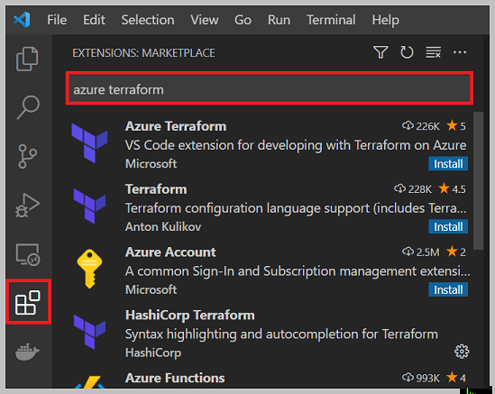

# Configure the Azure Terraform Visual Studio Code extension

The Azure Terraform Visual Studio Code extension enables you to work with Terraform from the editor. With this extension, you can author, test, and run Terraform configurations. The extension also supports resource graph visualization.

In this article, you learn how to:
> [!div class="checklist"]

> * Automate the provisioning of Azure services using Terraform
> * Install and use the Terraform Visual Studio Code extension for Azure services.
> * Use Visual Studio Code to write, plan, and execute Terraform plans.

## 1. Configure your environment

[!INCLUDE [open-source-devops-prereqs-azure-subscription.md](../includes/open-source-devops-prereqs-azure-subscription.md)]

[!INCLUDE [configure-terraform.md](includes/configure-terraform.md)]

- [Install Node.js](https://nodejs.org/).

- [Install GraphViz](https://graphviz.org/) to use the Terraform visualize function.

## 2. Exercise: Basic Terraform commands walk-through
In this exercise, you create and execute a basic Terraform configuration file that provisions a new Azure resource group.

### Install the Azure Terraform Visual Studio Code extension

1. Launch Visual Studio Code.

1. From the left menu, select **Extensions**, and enter `Azure Terraform` in the search text box.

	

1. Under the **Azure Terraform** Visual Studio extension, Select **Install**.

    **Key points:**
    - When you select **Install** for the Azure Terraform extension, Visual Studio Code automatically installs the Azure Account extension.
    - Azure Account is a dependency file for the Azure Terraform extension. This file is used to authenticate to Azure and Azure-related code extensions.

1. To confirm the installation of the extensions, enter `@installed` in the search text box. Both the Azure Terraform extension and the Azure Account extension will appear in the list of installed extensions.

    

You can now run all supported Terraform commands in your Cloud Shell environment from within Visual Studio Code.

### Prepare a test plan file

1. In Visual Studio Code, select **File > New File** from the menu bar.

1. In your browser, navigate to the [Terraform azurerm_resource_group page](https://www.terraform.io/docs/providers/azurerm/r/resource_group.html#) and copy the code in the **Example Usage** code block:

    

1. Insert the copied code into the new file you created in Visual Studio Code.

    

     **Key points:**
    - You may change the **name** value of the resource group, but it must be unique to your Azure subscription.

1. From the menu bar, select **File > Save As**.

1. In the **Save As** dialog, navigate to a location of your choice and then select **New folder**. (Change the name of the new folder to something more descriptive than *New folder*.)

    **Key points:**
    - The folder is named `TERRAFORM-TEST-PLAN` is used in this example.

1. Make sure your new folder is highlighted (selected) and then select **Open**.

1. In the **Save As** dialog, change the default name of the file to *main.tf*.

    

1. Select **Save**.

1. In the menu bar, select **File > Open Folder**. Navigate to and select the new folder you created.

### Run Terraform *init* command

1. Launch Visual Studio Code.

1. From the Visual Studio Code menu bar, select **File > Open Folder...** and locate and select your *main.tf* file.

    

1. From the menu bar, select **View > Command Palette... > Azure Terraform: Init**.

1. When the confirmation appears, select **OK**.

1. The first time you launch Cloud Shell from a new folder, you're prompted to create a web application. Select **Open**.

    

1. When the **Welcome to Azure Cloud Shell** displays, select **Bash** or **PowerShell**. 

    

    **Key points:**
    - The **Bash (Linux)** environment was selected for this article.

1. If you have not already set up an Azure storage account, the following screen appears. Select **Create storage**.

    

1. Azure Cloud Shell launches in the shell you previously selected and displays information for the cloud drive it just created for you.

    

1. You can now exit the Cloud Shell.

1. From the menu bar, select **View** > **Command Palette** > **Azure Terraform: init**.

    

### Visualize the plan

Earlier in this article, you installed GraphViz. Terraform can use GraphViz to generate a visual representation of either a configuration or execution plan. The Azure Terraform Visual Studio Code extension implements this feature via the *visualize* command.

From the menu bar, select **View > Command Palette > Azure Terraform: Visualize**.

### Create the Terraform execution plan from Visual Studio

The [terraform plan](https://www.terraform.io/docs/commands/plan.html) command is used to check whether the execution plan for a set of changes will do what you intended.

From the menu bar, select **View** > **Command Palette** > **Azure Terraform: plan**.

### Apply the Terraform execution plan from Visual Studio

Once you're ready to apply the execution plan to your cloud infrastructure, you run [terraform apply](https://www.terraform.io/docs/commands/apply.html).

1. From the menu bar, select **View** > **Command Palette** > **Azure Terraform: apply**.

    

1. Enter `yes`.

    

1. To see if your new Azure resource group was successfully created, open the Azure portal and select **Resource groups** in the left navigation pane.

    

### Destroy a Terraform execution plan from Visual Studio

1. From the menu bar, select **View** > **Command Palette** > **Azure Terraform: destroy**.

    

1. Enter *yes*.

    

1. To confirm that Terraform successfully destroyed your new resource group, select **Refresh** on the Azure portal **Resource groups** page. Your resource group will no longer be listed.

    

## 3. Exercise: Terraform compute module

In this exercise, you learn how to load the Terraform *compute* module into the Visual Studio Code environment.

### Clone the terraform-azurerm-compute module

1. Use [this link](https://github.com/Azure/terraform-azurerm-compute) to access the Terraform Azure Rm Compute module on GitHub.

1. Select **Clone or download**.

    

**Key points:**
- The folder name `terraform-azurerm-compute` was used in the example.

### Open the folder in Visual Studio Code

1. Launch Visual Studio Code.

1. From the menu bar, select **File > Open Folder** and navigate to and select the folder you created in the previous step.

    

### Initialize Terraform

Before you can begin using the Terraform commands from within Visual Studio Code, you download the plug-ins for two Azure providers: random and azurerm.

1. In the Terminal pane of the Visual Studio Code IDE, enter `terraform init`.

    

1. Enter `az login`, press **<Enter**, and follow the on-screen instructions.

### Module test: Using the lint test option

1. From the menu bar, select **View > Command Palette > Azure Terraform: Execute Test**.

1. From the list of test-type options, select **lint**.

    

1. When the confirmation appears, select **OK**, and follow the on-screen instructions.

    **Key points:**
    - When you execute either the **lint** or **end to end** test, Azure uses a container service to provision a test machine to do the actual test. For this reason, your test results may typically take several minutes to be returned.

After a few moments, you see a listing in the Terminal pane similar to this example:

### Test the module

1. From the menu bar, select **View > Command Palette > Azure Terraform: Execute Test**.

1. From the list of test type options, select **end to end**.

    

1. When the confirmation appears, select **OK**, and follow the on-screen instructions.

    **Key points:**
    - When you execute either the **lint** or **end to end** test, Azure uses a container service to provision a test machine to do the actual test. For this reason, your test results may typically take several minutes to be returned.

After a few moments, you see a listing in the Terminal pane similar to this example:

## Troubleshoot Terraform on Azure

[Troubleshoot common problems when using Terraform on Azure](troubleshoot.md)

## Next steps

> [!div class="nextstepaction"]
> [List of the Terraform modules available for Azure (and other supported providers)](https://registry.terraform.io/)