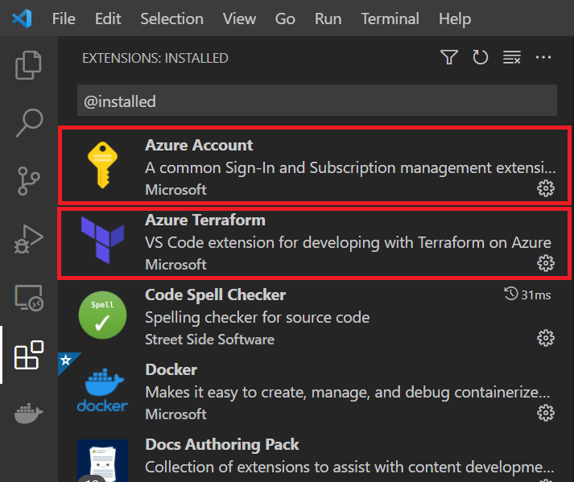

# Get Started: Install the Azure Terraform Visual Studio Code extension

The Visual Studio Code Terraform extension enables you to work with Terraform from the editor. With this extension, you can author, test, and run Terraform configurations. The extension also supports resource graph visualization.

In this article, you learn how to:
> [!div class="checklist"]

> * Automate the provisioning of Azure services using Terraform
> * Install and use the Terraform Visual Studio Code extension for Azure services.
> * Use Visual Studio Code to write, plan, and execute Terraform plans.

## 1. Configure your environment

[!INCLUDE [open-source-devops-prereqs-azure-subscription.md](../includes/open-source-devops-prereqs-azure-subscription.md)]

[!INCLUDE [configure-terraform.md](includes/configure-terraform.md)]

- [Install Node.js](https://nodejs.org/).

- [Install GraphViz](https://graphviz.org/) to use the Terraform visualize function.

## 2. Install the Azure Terraform Visual Studio Code extension

1. Launch Visual Studio Code.

1. From the left menu, select **Extensions**, and enter `Azure Terraform` in the search text box.

	

1. Under the **Azure Terraform** Visual Studio extension, Select **Install**.

    **Key points:**
    - When you select **Install** for the Azure Terraform extension, Visual Studio Code automatically installs the Azure Account extension.
    - Azure Account is a dependency file for the Azure Terraform extension. This file is used to authenticate to Azure and Azure-related code extensions.

1. To confirm the installation of the extensions, enter `@installed` in the search text box. Both the Azure Terraform extension and the Azure Account extension will appear in the list of installed extensions.

    

You can now run all supported Terraform commands in your Cloud Shell environment from within Visual Studio Code.

## 3. Implement the Terraform code

In this section, you'll create a simple Terraform configuration file to test with it. The Terraform code creates an Azure resource group named `myResourceGroup` in your default Azure subscription.

1. From the **File** menu, select **New File**.

1. Insert the following code into the new file:

    ```terraform
    terraform {
    
        required_version = ">=0.12"
        
        required_providers {
            azurerm = {
                source = "hashicorp/azurerm"
                version = "~>2.0"
            }
        }
    }
    
    provider "azurerm" {
        features {}
    }
    
    resource "azurerm_resource_group" "rg" {
        name = "myResourceGroup"
        location = "eastus"
    
        tags {
            environment = "Testing"

        }
    }    
    ```
    
    1. Insert the copied code into the new file you created in Visual Studio Code.

     **Key points:**

    - You can change the **name** and **location** values to values that are appropriate for your environment.

1. From the **File** menu, select **Save As...**.

1. In the **Save As** dialog, navigate to your **home directory** and then select **New folder**. (Change the name of the new folder to something more descriptive than *New folder*.)

    **Key points:**

    - The folder is named `terraform-test-plan` is used in this example.

1. Make sure your new folder is highlighted (selected) and then select **Open**.

1. In the **Save As** dialog, change the default name of the file to `main.tf`.

1. Select **Save**.

1. From the **File** menu, select **Open Folder**.

1. Navigate to the folder your saved the file into, and select **Select Folder**.

## 4. Initialize a Terraform project in Visual Studio Code

1. From the Explorer pane on the left, double-click the `main.tf` file to open it.

1. From the **View** menu, select **Command Palette...**.

1. In the Command Palette text box, start entering `Azure Terraform: Init` and select it when it displays.

1. Follow the prompts to install any dependencies - such as the latest supported version of nodejs.

1. If this is the first time you're using Cloud Shell with your default Azure subscription, follow the prompts to configure the environment.

## 5. Visualize a test plan

In the [Configure your environment](#configure-your-environment) section, you installed GraphViz. The Azure Terraform Visual Studio Code extension uses GraphWiz to display a visual representation of either a configuration or execution plan.

1. From the **View** menu, select **Command Palette**.

1. In the Command Palette text box, start entering `Azure Terraform: Visualize` and select it when it displays.


## 6. Create the Terraform execution plan from Visual Studio

The [terraform plan](https://www.terraform.io/docs/commands/plan.html) command is used to check whether the execution plan for a set of changes will do what you intended.

From the menu bar, select **View** > **Command Palette** > **Azure Terraform: plan**.


## 7. Apply the Terraform execution plan from Visual Studio

Once you're ready to apply the execution plan to your cloud infrastructure, you run [terraform apply](https://www.terraform.io/docs/commands/apply.html).

1. From the menu bar, select **View** > **Command Palette** > **Azure Terraform: apply**.

    

1. Enter `yes`.

    

1. To see if your new Azure resource group was successfully created, open the Azure portal and select **Resource groups** in the left navigation pane.

    

## 8. Destroy a Terraform execution plan from Visual Studio

1. From the menu bar, select **View** > **Command Palette** > **Azure Terraform: destroy**.

    

1. Enter *yes*.

    

1. To confirm that Terraform successfully destroyed your new resource group, select **Refresh** on the Azure portal **Resource groups** page. Your resource group will no longer be listed.

    

## Troubleshoot Terraform on Azure

[Troubleshoot common problems when using Terraform on Azure](troubleshoot.md)

## Next steps

> [!div class="nextstepaction"]
> [List of the Terraform modules available for Azure (and other supported providers)](https://registry.terraform.io/)