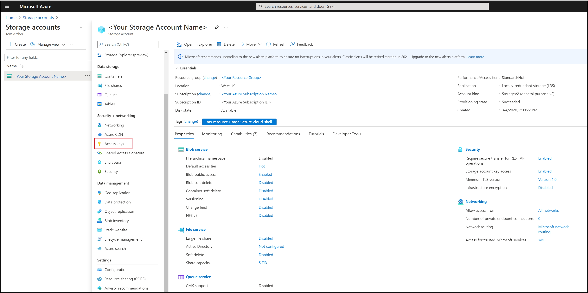
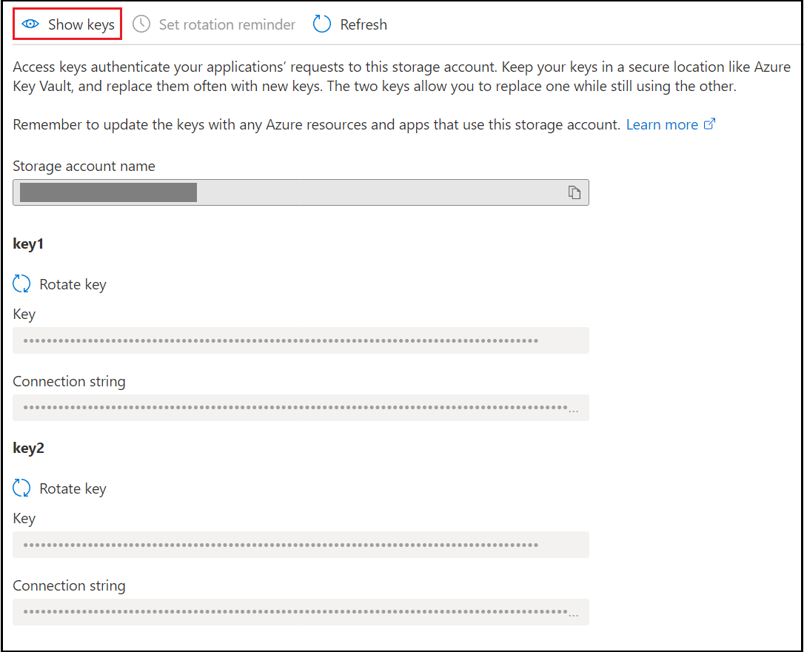
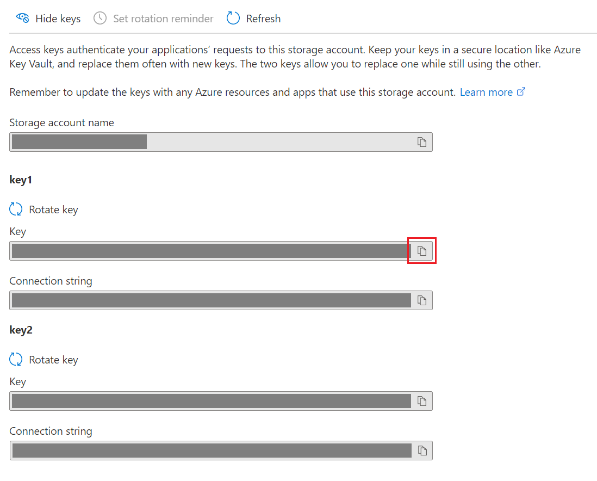
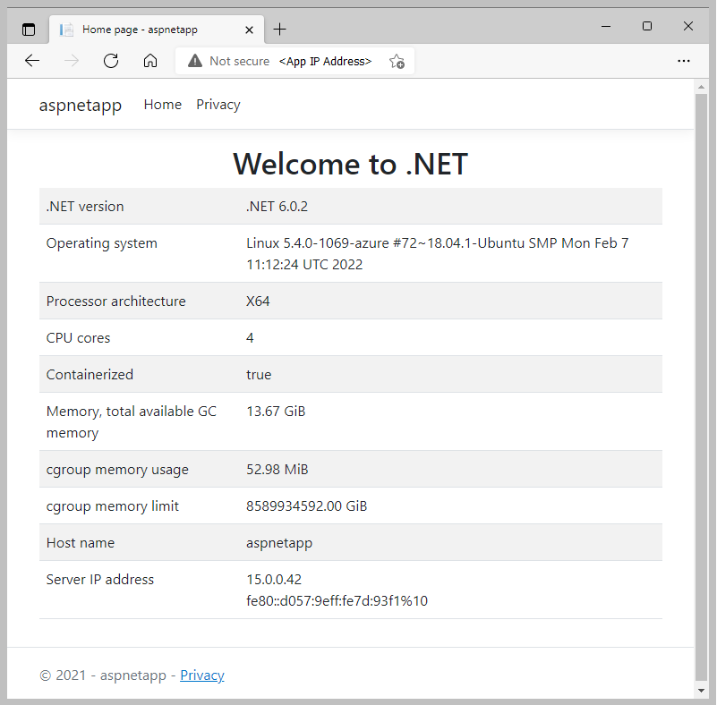

# Create an Application Gateway Ingress Controller in Azure Kubernetes Service using Terraform

Article tested with following software/versions:
- [Terraform v1.1.4](https://releases.hashicorp.com/terraform/)
- [AzureRM Provider v.2.94.0](https://registry.terraform.io/providers/hashicorp/azurerm/latest/docs)

[Azure Kubernetes Service (AKS)](/azure/aks/) manages your hosted Kubernetes environment. AKS makes it quick and easy to deploy and manage containerized applications without container orchestration expertise. AKS also eliminates the burden of taking applications offline for operational and maintenance tasks. Using AKS, you can do such tasks as provisioning, upgrading, and scaling resources on-demand.

An Application Gateway Ingress Controller (AGIC) provides various features for Kubernetes services. These features include reverse proxy, configurable traffic routing, and TLS termination. Kubernetes Ingress resources are used to configure the Ingress rules for individual Kubernetes services. An Ingress controller allows a single IP address to route traffic to multiple services in a Kubernetes cluster. All this functionality is provided by Azure [Application Gateway](/azure/Application-Gateway/), making it an ideal Ingress controller for Kubernetes on Azure.

In this article, you learn how:
> [!div class="checklist"]

> * Create a [Kubernetes](https://www.redhat.com/en/topics/containers/what-is-kubernetes) cluster using AKS with Application Gateway as Ingress controller
> * Define a Kubernetes cluster
> * Create Application Gateway resource
> * Create a Kubernetes cluster
> * Test the availability of a Kubernetes cluster

> [!NOTE]
> The example code in this article is located in the [Microsoft Terraform GitHub repo](https://github.com/Azure/terraform/tree/master/quickstart/201-k8s-cluster-with-aks-applicationgateway-ingress).

## 1. Configure your environment

[!INCLUDE [open-source-devops-prereqs-azure-subscription.md](../includes/open-source-devops-prereqs-azure-subscription.md)]

[!INCLUDE [configure-terraform.md](includes/configure-terraform.md)]

- **Azure service principal:** If you don't have a service principal, [create a service principal](authenticate-to-azure.md#create-a-service-principal). Make note of the `appId`, `display_name`, `password`, and `tenant`.

- **Service principal object ID**: Run the following command to get the object ID of the service principal: `az ad sp list --display-name "<display_name>" --query "[].{\"Object ID\":objectId}" --output table`

- **Install Helm**: [Helm](https://helm.sh/docs/intro/install/) is the Kubernetes package manager.

- **Install GNU wget**: Ensure you have access to wget by running `wget` at any command line without any parameters. You can install wget from the [official GNU wget website](http://www.gnu.org/software/wget/).

## 2. Configure Azure storage to store Terraform state

Terraform tracks state locally via the `terraform.tfstate` file. This pattern works well in a single-person environment. However, in a more practical multi-person environment, you need to track state on the server using [Azure storage](/azure/storage/). In this section, you learn to retrieve the necessary storage account information and create a storage container. The Terraform state information is then stored in that container.

1. Use one of the following options to create an Azure storage account:

    - [Create a storage account (via the Azure portal)](/azure/storage/common/storage-account-create?tabs=azure-portal)
    - [Create a storage account (via Azure CLI)](/azure/storage/common/storage-account-create?tabs=azure-cli)
    - [Create a storage account (via Azure PowerShell)](/azure/storage/common/storage-account-create?tabs=azure-powershell)

1. Browse to the [Azure portal](https://portal.azure.com).

1. Under **Azure services**, select **Storage accounts**. (If the **Storage accounts** option isn't visible on the main page, select **More services** to locate the option.)

1. On the **Storage accounts** page, On the Storage accounts page, select the storage account where Terraform will store the state information.

1. On the **Storage account** page, in the left menu, in the **Security + networking** section, select **Access keys**.

    

1. On the **Access keys** page, select **Show keys** to display the key values.

    

1. Locate the **key1** **key** on the page and select the icon to its right to copy the key value to the clipboard.

    

1. From a command line prompt, run [az storage container create](/cli/azure/storage/container#az_storage_container_create). This command creates a container in your Azure storage account. Replace the placeholders with the appropriate values for your Azure storage account.

    ```azurecli
    az storage container create -n tfstate \
       --account-name <storage_account_name> \
       --account-key <storage_account_key>
    ```

1. When the command successfully completes, it displays a JSON block with a key of **"created"** and a value of **true**. You can also run [az storage container list](/cli/azure/storage/container#az_storage_container_list) to verify the container was successfully created.

    ```azurecli
    az storage container list \
       --account-name <storage_account_name> \
       --account-key <storage_account_key>
    ```

## 3. Implement the Terraform code

1. Create a directory in which to test the sample Terraform code and make it the current directory.

1. Create a file named `providers.tf` and insert the following code.

    [!code-terraform[UserStory1871520-2](../../terraform_samples/quickstart/201-k8s-cluster-with-aks-applicationgateway-ingress/providers.tf)]

    **Key points:**

    - Set `resource_group_name` to the resource group of the storage account.
    - Set `storage_account_name` to the storage account name.

1. Create a file named `main.tf` and insert the following code:

    [!code-terraform[UserStory1871520-2](../../terraform_samples/quickstart/201-k8s-cluster-with-aks-applicationgateway-ingress/main.tf)]

1. Create a file named `variables.tf` and insert the following code:

    [!code-terraform[UserStory1871520-2](../../terraform_samples/quickstart/201-k8s-cluster-with-aks-applicationgateway-ingress/variables.tf)]

1. Create a file named `output.tf` and insert the following code.

    [!code-terraform[UserStory1871520-2](../../terraform_samples/quickstart/201-k8s-cluster-with-aks-applicationgateway-ingress/output.tf)]

1. Create a file named `terraform.tfvars` and insert the following code.

    [!code-terraform[UserStory1871520-2](../../terraform_samples/quickstart/201-k8s-cluster-with-aks-applicationgateway-ingress/terraform.tfvars)]

    **Key points:**

    - Set `aks_service_principal_app_id` to the service principal `appId` value.
    - Set `aks_service_principal_client_secret` to the service principal `password` value.
    - Set `aks_service_principal_object_id` to the service principal object ID. (The Azure CLI command for obtaining this value is in the [Configure your environment](#1-configure-your-environment) section.)

## 4. Initialize Terraform

[!INCLUDE [terraform-init.md](includes/terraform-init.md)]

## 5. Create a Terraform execution plan

[!INCLUDE [terraform-plan.md](includes/terraform-plan.md)]

## 6. Apply a Terraform execution plan

[!INCLUDE [terraform-apply-plan.md](includes/terraform-apply-plan.md)]

## 7. Verify the results: Test the Kubernetes cluster

The Kubernetes tools can be used to verify the newly created cluster.

1. Run [az aks get-credentials](/cli/azure/aks#az-aks-get-credentials) to get the Kubernetes configuration and access credentials from Azure.

    ```azcli
    az aks get-credentials --name <aks_cluster_name>  \
       --resource-group <resource_group_name> \
       --overwrite-existing
    ```

    **Key points:**

    - Replace the `<aks_cluster_name>` placeholder with the `aks_name` block's `default` value (from the `variables.tf` file).
    - Replace the `<resource_group_name>` placeholder with the randomly generated resource group name. Get the resource group name by running `echo "$(terraform output resource_group_name)"`.

1. Verify the health of the cluster.

    ```console
    kubectl get nodes
    ```

    **Key points:**

    - The details of your worker nodes are displayed with a status of **Ready**.

    

## 8. Install Azure AD Pod Identity

Azure Active Directory Pod Identity provides token-based access to [Azure Resource Manager](/azure/azure-resource-manager/resource-group-overview).

[Azure AD Pod Identity](https://github.com/Azure/aad-pod-identity) adds the following components to your Kubernetes cluster:

  - Kubernetes [CRDs](https://kubernetes.io/docs/tasks/access-kubernetes-api/custom-resources/custom-resource-definitions/): `AzureIdentity`, `AzureAssignedIdentity`, `AzureIdentityBinding`
  - [Managed Identity Controller (MIC)](https://github.com/Azure/aad-pod-identity#managed-identity-controllermic) component
  - [Node Managed Identity (NMI)](https://github.com/Azure/aad-pod-identity#node-managed-identitynmi) component

To install Azure AD Pod Identity to your cluster, you need to know if RBAC is enabled or disabled. RBAC is disabled by default for this demo. Enabling or disabling RBAC is done in the `variables.tf` file via the `aks_enable_rbac` block's `default` value.

- If RBAC is **enabled**, run the following command:

    ```console
    kubectl create -f https://raw.githubusercontent.com/Azure/aad-pod-identity/master/deploy/infra/deployment-rbac.yaml
    ```

- If RBAC is **disabled**, run the following command:

    ```console
    kubectl create -f https://raw.githubusercontent.com/Azure/aad-pod-identity/master/deploy/infra/deployment.yaml
    ```

## 9. Install Helm

Use Helm to install the `application-gateway-kubernetes-ingress` package:

1. Run the following helm commands to add the AGIC Helm repo.

    ```console
    helm repo add application-gateway-kubernetes-ingress https://appgwingress.blob.core.windows.net/ingress-azure-helm-package/
    ```
    
1. Update the AGIC Helm repo.

    ```console
    helm repo update
    ```
    
## 10. Install AGIC Helm Chart

1. Download `helm-config.yaml` to configure AGIC. (If you don't have access to `wget`, see the [Configure your environment](#1-configure-your-environment) section.)

    ```console
    wget https://raw.githubusercontent.com/Azure/application-gateway-kubernetes-ingress/master/docs/examples/sample-helm-config.yaml -O helm-config.yaml
    ```

1. Open the `helm-config.yaml` file in a text editor.

1. Enter values for the top level keys.

    - `verbosityLevel`: Specify the *verbosity level* of the AGIC logging infrastructure. For more information about logging levels, see [the Logging Levels section of the Application Gateway Kubernetes Ingress document](https://github.com/Azure/application-gateway-kubernetes-ingress/blob/463a87213bbc3106af6fce0f4023477216d2ad78/docs/troubleshooting.md).

1. Enter values for the `appgw` block.

    - `appgw.subscriptionId`: Specify the Azure subscription ID used to create the App Gateway.
    - `appgw.resourceGroup`: Specify the randomly generated resource group name. Get the resource group name by running `echo "$(terraform output resource_group_name)"`
    - `appgw.name`: Specify the name of the Application Gateway. This value is set in the `variables.tf` file via the `app_gateway_name` block's `default` value.
    - `appgw.shared`: This boolean flag defaults to `false`. Set it to `true` if you need a [Shared App Gateway](https://github.com/Azure/application-gateway-kubernetes-ingress/blob/072626cb4e37f7b7a1b0c4578c38d1eadc3e8701/docs/setup/install-existing.md#multi-cluster--shared-app-gateway).

1. Enter values for the `kubernetes` block.

    - `kubernetes.watchNamespace`: Specify the name space, which AGIC should watch. The namespace can be a single string value, or a comma-separated list of namespaces. Leaving this variable commented out, or setting it to a blank or an empty string results in the Ingress controller observing all accessible namespaces.

1. Enter values for the `armAuth` block.

    - If you specify `armAuth.type` as `aadPodIdentity`:
        - `armAuth.identityResourceID`: Get the identity resource ID by running `echo "$(terraform output identity_resource_id)"`.
        - `armAuth.identityClientId`: Get the identity client ID by running `echo "$(terraform output identity_client_id)"`.

    - If you specify `armAuth.type` as `servicePrincipal`, see [Using a service principal](/azure/application-gateway/ingress-controller-install-existing#using-a-service-principal).

1. Install the Application Gateway Ingress controller package:

    ```console
    helm install -f helm-config.yaml application-gateway-kubernetes-ingress/ingress-azure --generate-name
    ```

1. To get the key values from your identity, you can run [az identity show](/cli/azure/identity#az-identity-show) .

    ```azurecli
    az identity show -g <resource_group_name> -n <identity_name>
    ```

    **Key points:**

    - Replace the `<resource_group_name>` placeholder with the randomly generated resource group name. Get the resource group name by running `echo "$(terraform output resource_group_name)"`.
    - Replace the `<identity_name>` placeholder with the identity name for this demo. The identity name defaults to `identity1` in the `main.tf` file.
    - All identities for a given subscription can be by running `az identity list`.

## 11. Install a sample app

Once you have the App Gateway, AKS, and AGIC installed, install a sample app.

1. Use the curl command to download the YAML file:

    ```console
    curl https://raw.githubusercontent.com/Azure/application-gateway-kubernetes-ingress/master/docs/examples/aspnetapp.yaml -o aspnetapp.yaml
    ```

2. Apply the YAML file:

    ```console
    kubectl apply -f aspnetapp.yaml
    ```

## 12. Verify the results: Test the sample app

1. Run the following Terraform command to get the app's IP address.

    ```console
    echo "$(terraform output application_ip_address)"
    ```
    
2. Using a browser, go to the IP address indicated in the previous step.

    

## 13. Clean up resources

### Delete App Gateway, AKS, and AGIC resources

[!INCLUDE [terraform-plan-destroy.md](includes/terraform-plan-destroy.md)]

### Delete storage account

> [!CAUTION]
> Only delete the resource group containing storage account you used in this demo if you're not using either for anything else.

Run [az group delete](/cli/azure/group#az_group_delete) to delete the resource group (and its storage account you used in this demo).

```azurecli
az group delete --name <storage_resource_group_name> --yes
```

**Key points:**

- Replace the `storage_resource_group_name` placeholder with the `resource_group_name` value in the `providers.tf` file.

## Troubleshoot Terraform on Azure

[Troubleshoot common problems when using Terraform on Azure](troubleshoot.md)

## Next steps

> [!div class="nextstepaction"]
> [Application Gateway Ingress Controller](https://azure.github.io/application-gateway-kubernetes-ingress/)
