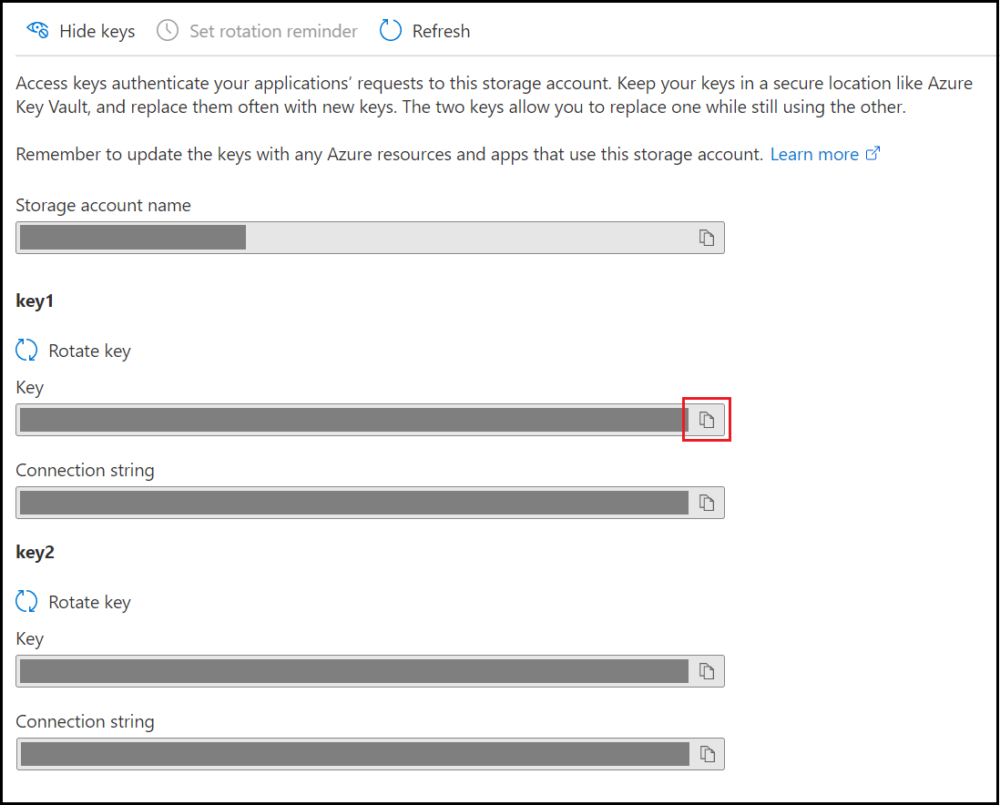

# Create a Kubernetes cluster with Azure Kubernetes Service using Terraform

Article tested with the following Terraform and Terraform provider versions:

- [Terraform v1.1.7](https://releases.hashicorp.com/terraform/)
- [AzureRM Provider v.2.99.0](https://registry.terraform.io/providers/hashicorp/azurerm/latest/docs)

[!INCLUDE [Terraform abstract](./includes/abstract.md)]

[Azure Kubernetes Service (AKS)](/azure/aks/) manages your hosted Kubernetes environment. AKS allows you to deploy and manage containerized applications without container orchestration expertise. AKS also enables you to do many common maintenance operations without taking your app offline. These operations include provisioning, upgrading, and scaling resources on demand.

In this article, you learn how to:
> [!div class="checklist"]

> * Use HCL (HashiCorp Language) to define a Kubernetes cluster
> * Use Terraform and AKS to create a Kubernetes cluster
> * Use the kubectl tool to test the availability of a Kubernetes cluster

## 1. Configure your environment

[!INCLUDE [open-source-devops-prereqs-azure-subscription.md](../includes/open-source-devops-prereqs-azure-subscription.md)]

[!INCLUDE [configure-terraform.md](includes/configure-terraform.md)]

- **Azure service principal:** If you don't have a service principal, [create a service principal](authenticate-to-azure.md#create-a-service-principal). Make note of the `appId`, `display_name`, `password`, and `tenant`.

- **Service principal object ID**: Run the following command to get the object ID of the service principal: `az ad sp list --display-name "<display_name>" --query "[].{\"Object ID\":objectId}" --output table`

- **SSH key pair**: Use one of the following articles:

    - [Portal](/azure/virtual-machines/ssh-keys-portal#generate-new-keys)
    - [Windows](/azure/virtual-machines/linux/ssh-from-windows#create-an-ssh-key-pair)
    - [Linux/MacOS](/azure/virtual-machines/linux/mac-create-ssh-keys#create-an-ssh-key-pair)
    
## 2. Configure Azure storage to store Terraform state

Terraform tracks state locally via the `terraform.tfstate` file. This pattern works well in a single-person environment. However, in a more practical multi-person environment, you need to track state on the server using [Azure storage](/azure/storage/). In this section, you learn to retrieve the necessary storage account information and create a storage container. The Terraform state information is then stored in that container.

1. Use one of the following options to create an Azure storage account:

    - [Create a storage account (via the Azure portal)](/azure/storage/common/storage-account-create?tabs=azure-portal)
    - [Create a storage account (via Azure CLI)](/azure/storage/common/storage-account-create?tabs=azure-cli)
    - [Create a storage account (via Azure PowerShell)](/azure/storage/common/storage-account-create?tabs=azure-powershell)

1. Browse to the [Azure portal](https://portal.azure.com).

1. Under **Azure services**, select **Storage accounts**. (If the **Storage accounts** option isn't visible on the main page, select **More services** to locate the option.)

1. On the **Storage accounts** page, On the Storage accounts page, select the storage account where Terraform will store the state information.

1. On the **Storage account** page, in the left menu, in the **Security + networking** section, select **Access keys**.

    

1. On the **Access keys** page, select **Show keys** to display the key values.

    

1. Locate the **key1** **key** on the page and select the icon to its right to copy the key value to the clipboard.

    

1. From a command line prompt, run [az storage container create](/cli/azure/storage/container#az_storage_container_create). This command creates a container in your Azure storage account. Replace the placeholders with the appropriate values for your Azure storage account.

    ```azurecli
    az storage container create -n tfstate \
       --account-name <storage_account_name> \
       --account-key <storage_account_key>
    ```

1. When the command successfully completes, it displays a JSON block with a key of **"created"** and a value of **true**. You can also run [az storage container list](/cli/azure/storage/container#az_storage_container_list) to verify the container was successfully created.

    ```azurecli
    az storage container list \
       --account-name <storage_account_name> \
       --account-key <storage_account_key>
    ```

## 3. Implement the Terraform code

1. Create a directory in which to test the sample Terraform code and make it the current directory.

1. Create a file named `providers.tf` and insert the following code.

    ```terraform
    terraform {
    
      required_version = ">=0.12"
    
      required_providers {
        azurerm = {
          source  = "hashicorp/azurerm"
          version = "~>2.0"
        }
      }
      backend "azurerm" {
        resource_group_name  = "<storage_account_resource_group>"
        storage_account_name = "<storage_account_name>"
        container_name       = "tfstate"
        key                  = "codelab.microsoft.tfstate"
      }
    }
    
    provider "azurerm" {
      features {}
    }
    ```

1. Create a file named `main.tf` and insert the following code:

    ```hcl
    # Generate random resource group name
    resource "random_pet" "rg-name" {
      prefix    = var.resource_group_name_prefix
    }
    
    resource "azurerm_resource_group" "rg" {
      name      = random_pet.rg-name.id
      location  = var.resource_group_location
    }
    
    resource "random_id" "log_analytics_workspace_name_suffix" {
        byte_length = 8
    }

    resource "azurerm_log_analytics_workspace" "test" {
        # The WorkSpace name has to be unique across the whole of azure, not just the current subscription/tenant.
        name                = "${var.log_analytics_workspace_name}-${random_id.log_analytics_workspace_name_suffix.dec}"
        location            = var.log_analytics_workspace_location
        resource_group_name = azurerm_resource_group.k8s.name
        sku                 = var.log_analytics_workspace_sku
    }

    resource "azurerm_log_analytics_solution" "test" {
        solution_name         = "ContainerInsights"
        location              = azurerm_log_analytics_workspace.test.location
        resource_group_name   = azurerm_resource_group.k8s.name
        workspace_resource_id = azurerm_log_analytics_workspace.test.id
        workspace_name        = azurerm_log_analytics_workspace.test.name

        plan {
            publisher = "Microsoft"
            product   = "OMSGallery/ContainerInsights"
        }
    }

    resource "azurerm_kubernetes_cluster" "k8s" {
        name                = var.cluster_name
        location            = azurerm_resource_group.k8s.location
        resource_group_name = azurerm_resource_group.k8s.name
        dns_prefix          = var.dns_prefix

        linux_profile {
            admin_username = "ubuntu"

            ssh_key {
                key_data = file(var.ssh_public_key)
            }
        }

        default_node_pool {
            name            = "agentpool"
            node_count      = var.agent_count
            vm_size         = "Standard_D2_v2"
        }

        service_principal {
            client_id     = var.aks_service_principal_app_id
            client_secret = var.aks_service_principal_client_secret
        }
        
        addon_profile {
            oms_agent {
            enabled                    = true
            log_analytics_workspace_id = azurerm_log_analytics_workspace.test.id
            }
        }
        
        network_profile {
            load_balancer_sku = "Standard"
            network_plugin = "kubenet"
        }

        tags = {
            Environment = "Development"
        }
    }
    ```

1. Create a file named `variables.tf` and insert the following code:

    ```hcl
    variable "resource_group_name_prefix" {
      default       = "rg"
      description   = "Prefix of the resource group name that's combined with a random ID so name is unique in your Azure subscription."
    }
    
    variable "resource_group_location" {
      default       = "eastus"
      description   = "Location of the resource group."
    }
    
    variable "agent_count" {
        default = 3
    }

    variable "ssh_public_key" {
        default = "~/.ssh/id_rsa.pub"
    }

    variable "dns_prefix" {
        default = "k8stest"
    }

    variable cluster_name {
        default = "k8stest"
    }

    variable resource_group_name {
        default = "azure-k8stest"
    }

    variable location {
        default = "Central US"
    }

    variable log_analytics_workspace_name {
        default = "testLogAnalyticsWorkspaceName"
    }

    # refer https://azure.microsoft.com/global-infrastructure/services/?products=monitor for log analytics available regions
    variable log_analytics_workspace_location {
        default = "eastus"
    }

   # refer https://azure.microsoft.com/pricing/details/monitor/ for log analytics pricing 
   variable log_analytics_workspace_sku {
        default = "PerGB2018"
   }
    ```

1. Create a file named `output.tf` and insert the following code.

    ```hcl
    output "resource_group_name" {
      value = azurerm_resource_group.rg.name
    }
    
    output "client_key" {
        value = azurerm_kubernetes_cluster.k8s.kube_config.0.client_key
    }

    output "client_certificate" {
        value = azurerm_kubernetes_cluster.k8s.kube_config.0.client_certificate
    }

    output "cluster_ca_certificate" {
        value = azurerm_kubernetes_cluster.k8s.kube_config.0.cluster_ca_certificate
    }

    output "cluster_username" {
        value = azurerm_kubernetes_cluster.k8s.kube_config.0.username
    }

    output "cluster_password" {
        value = azurerm_kubernetes_cluster.k8s.kube_config.0.password
    }

    output "kube_config" {
        value = azurerm_kubernetes_cluster.k8s.kube_config_raw
        sensitive = true
    }

    output "host" {
        value = azurerm_kubernetes_cluster.k8s.kube_config.0.host
    }
    ```

1. Create a file named `terraform.tfvars` and insert the following code.

    ```terraform
    aks_service_principal_app_id = "<service_principal_app_id>"
    
    aks_service_principal_client_secret = "<service_principal_password>"
    
    aks_service_principal_object_id = "<service_principal_object_id>"
    ```

    **Key points:**

    - Set `aks_service_principal_app_id` to the service principal `appId` value.
    - Set `aks_service_principal_client_secret` to the service principal `password` value.
    - Set `aks_service_principal_object_id` to the service principal object ID. (The Azure CLI command for obtaining this value is in the [Configure your environment](#1-configure-your-environment) section.)

## 4. Initialize Terraform

[!INCLUDE [terraform-init.md](includes/terraform-init.md)]

## 5. Create a Terraform execution plan

[!INCLUDE [terraform-plan.md](includes/terraform-plan.md)]

## 6. Apply a Terraform execution plan

[!INCLUDE [terraform-apply-plan.md](includes/terraform-apply-plan.md)]

## 7. Verify the results

1. Get the resource group name.

    ```console
    echo "$(terraform output resource_group_name)"
    ```

1. Browse to the [Azure portal](https://portal.azure.com).

1. Under **Azure services**, select **Resource groups** and locate your new resource group to see the following resources created in this demo:

    - **Log Analytics Solution:** By default, the demo names this solution **ContainerInsights**. The portal will show the solutions workspace in parenthesis.
    - **Log Analytics Workspace:** By default, the demo names this workspace with a prefix of **TestLogAnalyticsWorkspaceName-** followed by a random number.
    - **Kubernetes service:** By default, the demo names this service **k8stest**. (A Managed Kubernetes Cluster is also known as an AKS / Azure Kubernetes Service.)

1. Get the Kubernetes configuration from the Terraform state and store it in a file that kubectl can read.

    ```console
    echo "$(terraform output kube_config)" > ./azurek8s
    ```

1. Verify the previous command didn't add an ASCII EOT character.

    ```console
    cat ./azurek8s
    ```

   ***Key points:**

    - If you see `<< EOT` at the beginning and `EOT` at the end, edit the content of the file to remove these characters. Otherwise, you could receive the following error message: `error: error loading config file "./azurek8s": yaml: line 2: mapping values are not allowed in this context`

1. Set an environment variable so that kubectl picks up the correct config.

    ```console
    export KUBECONFIG=./azurek8s
    ```

1. Verify the health of the cluster.

    ```console
    kubectl get nodes
    ```

    

**Key points:**

- When the AKS cluster was created, monitoring was enabled to capture health metrics for both the cluster nodes and pods. These health metrics are available in the Azure portal. For more information on container health monitoring, see [Monitor Azure Kubernetes Service health](/azure/azure-monitor/insights/container-insights-overview).
- Several key values were output when you applied the Terraform execution plan. For example, the host address, AKS cluster user name, and AKS cluster password are output.
- To view all of the output values, run `terraform output`.
- To view a specific output value, run `echo "$(terraform output <output_value_name>)"`.

## 8. Clean up resources

### Delete AKS resources

[!INCLUDE [terraform-plan-destroy.md](includes/terraform-plan-destroy.md)]

### Delete storage account

> [!CAUTION]
> Only delete the resource group containing storage account you used in this demo if you're not using either for anything else.

Run [az group delete](/cli/azure/group#az_group_delete) to delete the resource group (and its storage account you used in this demo).

```azurecli
az group delete --name <storage_resource_group_name> --yes
```

**Key points:**

- Replace the `storage_resource_group_name` placeholder with the `resource_group_name` value in the `providers.tf` file.

### Delete service principal

> [!CAUTION]
> Only delete the service principal you used in this demo if you're not using it for anything else.

```azurecli
az ad sp delete --id <service_principal_object_id>
```

## Troubleshoot Terraform on Azure

[Troubleshoot common problems when using Terraform on Azure](troubleshoot.md)

## Next steps

> [!div class="nextstepaction"] 
> [Learn more about using Terraform in Azure](/azure/terraform)
