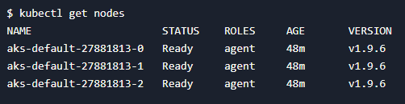

# Quickstart: Create a Kubernetes cluster with Azure Kubernetes Service using Terraform

[Azure Kubernetes Service (AKS)](/azure/aks/) manages your hosted Kubernetes environment. AKS allows you to deploy and manage containerized applications without container orchestration expertise. AKS also enables you to do many common maintenance operations without taking your app offline. These operations include provisioning, upgrading, and scaling resources on demand.

This article shows how to create a Kubernetes cluster with Azure Kubernetes Service (AKS) using Terraform. The sample code is fully encapsulated such that it automatically creates a service principal and SSH key pair (using the [AzAPI provider](overview-azapi-provider.md)).

In this article, you learn how to:

> [!div class="checklist"]
> * Create a random value for the Azure resource group name using [random_pet](https://registry.terraform.io/providers/hashicorp/random/latest/docs/resources/pet).
> * Create an Azure resource group using [azurerm_resource_group](https://registry.terraform.io/providers/hashicorp/azurerm/latest/docs/resources/resource_group).
> * Access the configuration of the AzureRM provider to get the Azure Object ID using [azurerm_client_config](https://registry.terraform.io/providers/hashicorp/azurerm/latest/docs/data-sources/client_config).
> * Create a Kubernetes cluster using [azurerm_kubernetes_cluster](https://registry.terraform.io/providers/hashicorp/azurerm/latest/docs/resources/kubernetes_cluster).
> * Create an AzAPI resource [azapi_resource](https://registry.terraform.io/providers/Azure/azapi/latest/docs/resources/azapi_resource).
> * Create an AzAPI resource to generate an SSH key pair using [azapi_resource_action](https://registry.terraform.io/providers/Azure/azapi/latest/docs/resources/azapi_resource_action).

[!INCLUDE [AI attribution](~/../azure-docs-pr/includes/ai-generated-attribution.md)]

## Prerequisites

[!INCLUDE [configure-terraform.md](includes/configure-terraform.md)]

- **Kubernetes command-line tool (kubectl):** [Download kubectl](https://kubernetes.io/releases/download/).

## Implement the Terraform code

> [!NOTE]
> The sample code for this article is located in the [Azure Terraform GitHub repo](https://github.com/Azure/terraform/tree/master/quickstart/201-k8s-cluster-with-tf-and-aks). You can view the log file containing the [test results from current and previous versions of Terraform](https://github.com/Azure/terraform/tree/master/quickstart/201-k8s-cluster-with-tf-and-aks/TestRecord.md).
>
> See more [articles and sample code showing how to use Terraform to manage Azure resources](/azure/terraform)

1. Create a directory in which to test the sample Terraform code and make it the current directory.

1. Create a file named `providers.tf` and insert the following code:

    [!code-terraform[master](~/../terraform_samples/quickstart/201-k8s-cluster-with-tf-and-aks/providers.tf)]

1. Create a file named `ssh.tf` and insert the following code:

    [!code-terraform[master](~/../terraform_samples/quickstart/201-k8s-cluster-with-tf-and-aks/ssh.tf)]

1. Create a file named `main.tf` and insert the following code:

    [!code-terraform[master](~/../terraform_samples/quickstart/201-k8s-cluster-with-tf-and-aks/main.tf)]

1. Create a file named `variables.tf` and insert the following code:

    [!code-terraform[master](~/../terraform_samples/quickstart/201-k8s-cluster-with-tf-and-aks/variables.tf)]

1. Create a file named `outputs.tf` and insert the following code:

    [!code-terraform[master](~/../terraform_samples/quickstart/201-k8s-cluster-with-tf-and-aks/outputs.tf)]

## Initialize Terraform

[!INCLUDE [terraform-init.md](includes/terraform-init.md)]

## Create a Terraform execution plan

[!INCLUDE [terraform-plan.md](includes/terraform-plan.md)]

## Apply a Terraform execution plan

[!INCLUDE [terraform-apply-plan.md](includes/terraform-apply-plan.md)]

## Verify the results

#### [Azure CLI](#tab/azure-cli)

1. Get the Azure resource group name.

    ```console
    resource_group_name=$(terraform output -raw resource_group_name)
    ```

1. Run [az aks list](/cli/azure/aks#az-aks-list) to display the name of the new Kubernetes cluster.

    ```azurecli
    az aks list \
      --resource-group $resource_group_name \
      --query "[].{\"K8s cluster name\":name}" \
      --output table
    ```

1. Get the Kubernetes configuration from the Terraform state and store it in a file that kubectl can read.

    ```console
    echo "$(terraform output kube_config)" > ./azurek8s
    ```

1. Verify the previous command didn't add an ASCII EOT character.

    ```console
    cat ./azurek8s
    ```

   **Key points:**

    - If you see `<< EOT` at the beginning and `EOT` at the end, remove these characters from the file. Otherwise, you could receive the following error message: `error: error loading config file "./azurek8s": yaml: line 2: mapping values are not allowed in this context`

1. Set an environment variable so that kubectl picks up the correct config.

    ```console
    export KUBECONFIG=./azurek8s
    ```

1. Verify the health of the cluster.

    ```console
    kubectl get nodes
    ```

    

**Key points:**

- When the AKS cluster was created, monitoring was enabled to capture health metrics for both the cluster nodes and pods. These health metrics are available in the Azure portal. For more information on container health monitoring, see [Monitor Azure Kubernetes Service health](/azure/azure-monitor/insights/container-insights-overview).
- Several key values were output when you applied the Terraform execution plan. For example, the host address, AKS cluster user name, and AKS cluster password are output.

## Clean up resources

### Delete AKS resources

[!INCLUDE [terraform-plan-destroy.md](includes/terraform-plan-destroy.md)]

### Delete service principal

1. Get the service principal ID.

    ```azurecli
    sp=$(terraform output -raw sp)
    ```
    
1. Run [az ad sp delete](/cli/azure/ad/sp#az-ad-sp-delete) to delete the service principal.

    ```azurecli
    az ad sp delete --id $sp
    ```
    
## Troubleshoot Terraform on Azure

[Troubleshoot common problems when using Terraform on Azure](troubleshoot.md)

## Next steps

> [!div class="nextstepaction"]
> [Learn more about using AKS](/azure/aks)
