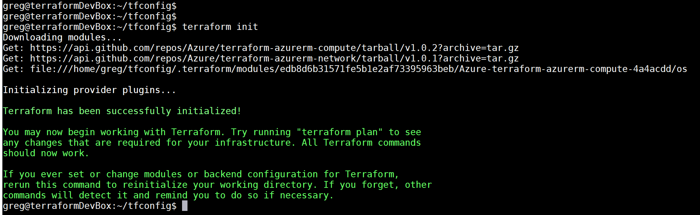
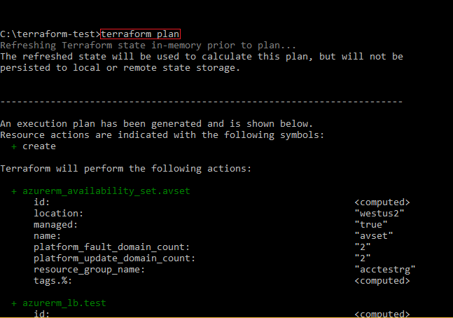
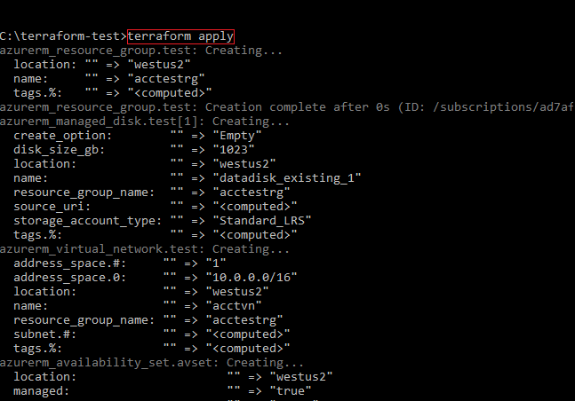

# Create an Azure VM cluster with Terraform using the Module Registry

This article walks you through creating a small VM cluster with the Terraform [Azure compute module](https://registry.terraform.io/modules/Azure/compute/azurerm/1.0.2). In this article you learn how to:

> [!div class="checklist"]
> * Set up authentication with Azure
> * Create the Terraform template
> * Visualize the changes with plan
> * Apply the configuration to create the VM cluster

[!INCLUDE [hashicorp-support.md](includes/hashicorp-support.md)]

## Prerequisites

[!INCLUDE [open-source-devops-prereqs-azure-subscription.md](../includes/open-source-devops-prereqs-azure-subscription.md)]

## Configure your environment

Based on your environment, install and configure Terraform:

- [Configure Terraform using Azure Cloud Shell and Azure CLI](get-started-cloud-shell.md)
- [Configure Terraform using Azure PowerShell](get-started-powershell.md)

## Terraform configuration file to create an Azure VM cluster

1. Copy the following code into a file named `create-vm-cluster-module.tf`:

```hcl
provider "azurerm" {
  version = "~>2.0"
  features {}
}

resource "azurerm_resource_group" "myResourceGroup" {
  name     = "create-vm-cluster-rg"
  location = "eastus"
}

module "windowsservers" {
  source              = "Azure/compute/azurerm"
  resource_group_name = azurerm_resource_group.myResourceGroup.name
  is_windows_image    = true
  vm_hostname         = "mywinvm" // line can be removed if only one VM module per resource group
  admin_password      = "ComplxP@ssw0rd!"
  vm_os_simple        = "WindowsServer"
  public_ip_dns       = ["winsimplevmips"] // change to a unique name per datacenter region
  vnet_subnet_id      = module.network.vnet_subnets[0]
    
  depends_on = [azurerm_resource_group.myResourceGroup]
}

module "network" {
  source              = "Azure/network/azurerm"
  resource_group_name = azurerm_resource_group.myResourceGroup.name
  subnet_prefixes     = ["10.0.1.0/24"]
  subnet_names        = ["subnet1"]

  depends_on = [azurerm_resource_group.myResourceGroup]
}

output "windows_vm_public_name" {
  value = module.windowsservers.public_ip_dns_name
}

output "vm_public_ip" {
  value = module.windowsservers.public_ip_address
}

output "vm_private_ips" {
  value = module.windowsservers.network_interface_private_ip
}
```


1. Run `terraform init` in your configuration directory. Using a Terraform version of at least 0.10.6 shows the following output:



## Visualize the changes with plan

Run `terraform plan` to preview the virtual machine infrastructure created by the template.




## Create the virtual machines with apply

Run `terraform apply` to provision the VMs on Azure.



## Next steps

> [!div class="nextstepaction"] 
> [Browse the list of Azure Terraform modules](https://registry.terraform.io/modules/Azure)