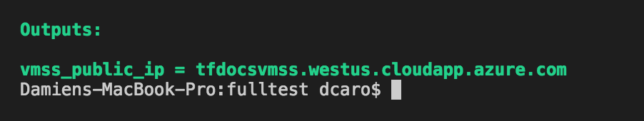
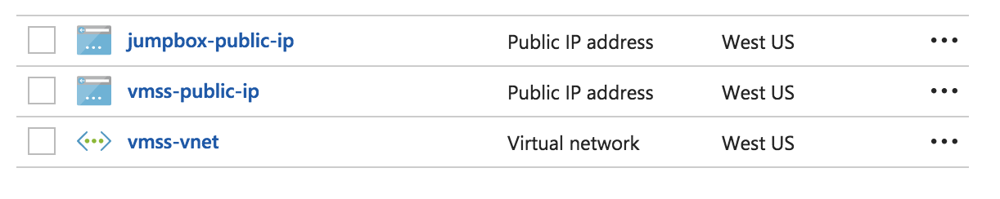
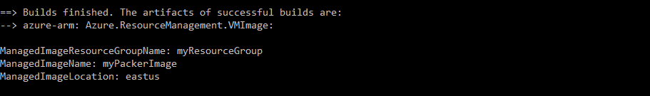

# Create an Azure virtual machine scale set from a Packer custom image by using Terraform

[Azure virtual machine scale sets](/azure/virtual-machine-scale-sets) allow you to configure identical VMs. The number of VM instances can adjust based on demand or a schedule. For more information, see [Automatically scale a virtual machine scale set in the Azure portal](/azure/virtual-machine-scale-sets/virtual-machine-scale-sets-autoscale-portal).

In this article, you learn how to:

> [!div class="checklist"]
> * Set up your Terraform deployment.
> * Use variables and outputs for Terraform deployment.
> * Create and deploy a network infrastructure.
> * Create a custom virtual machine image by using Packer.
> * Create and deploy a virtual machine scale set by using the custom image.
> * Create and deploy a jumpbox.

## 1. Configure your environment

[!INCLUDE [open-source-devops-prereqs-azure-subscription.md](../includes/open-source-devops-prereqs-azure-subscription.md)]

[!INCLUDE [configure-terraform.md](includes/configure-terraform.md)]

- **SSH key pair**: [Create an SSH key pair](/azure/virtual-machines/linux/mac-create-ssh-keys).

- **Packer**:  [Install Packer](https://learn.hashicorp.com/packer/getting-started/install).

## 2. Create the variables definitions file

1. Create a directory in which to test and run the sample Terraform code.

1. Create a variables file that will contain the values for Terraform. By convention, the name of this file is `variables.tf`. However, you can specify any valid name for your environment.

1. Insert the following code into the variables file.

    ```hcl
    variable "location" {
      description = "The location where resources are created"
      default     = "eastus"
    }
    
    variable "resource_group_name" {
      description = "The name of the resource group in which the resources are created"
      default     = "myResourceGroup"
    }
    
    ```

## 3. Create the output definitions file
    
1. Create a file named `output.tf`.

1. Paste the following code to display the fully qualified domain name (FQDN) of the virtual machine:

    ```hcl 
    output "vmss_public_ip" {
        value = azurerm_public_ip.vmss.fqdn
    }
    ```

## 4. Define the network infrastructure in a template

In this step, you create the following network infrastructure in a new Azure resource group:

- One virtual network with the address space of 10.0.0.0/16.
- One subnet with the address space of 10.0.2.0/24.
- Two public IP addresses. One is used by the virtual machine scale set load balancer. The other is used to connect to the SSH jumpbox.

You also need a resource group where all the resources are created.

1. Create a file named `vmss.tf`.

1. Paste the following code:

    ```hcl
    resource "azurerm_resource_group" "vmss" {
      name     = var.resource_group_name
      location = var.location
    
      tags = {
        environment = "codelab"
      }
    }
    
    resource "azurerm_virtual_network" "vmss" {
      name                = "vmss-vnet"
      address_space       = ["10.0.0.0/16"]
      location            = var.location
      resource_group_name = azurerm_resource_group.vmss.name
    
      tags = {
        environment = "codelab"
      }
    }
    
    resource "azurerm_subnet" "vmss" {
      name                 = "vmss-subnet"
      resource_group_name  = azurerm_resource_group.vmss.name
      virtual_network_name = azurerm_virtual_network.vmss.name
      address_prefix       = "10.0.2.0/24"
    }
    
    resource "azurerm_public_ip" "vmss" {
      name                         = "vmss-public-ip"
      location                     = var.location
      resource_group_name          = azurerm_resource_group.vmss.name
      allocation_method            = "Static"
      domain_name_label            = azurerm_resource_group.vmss.name
    
      tags = {
        environment = "codelab"
      }
    }
    
    ```
    
## 5. Initialize Terraform

[!INCLUDE [terraform-init.md](includes/terraform-init.md)]

## 6. Create a Terraform execution plan

[!INCLUDE [terraform-create-plan.md](includes/terraform-create-plan.md)]

## 7. Apply a Terraform execution plan

[!INCLUDE [terraform-apply-plan.md](includes/terraform-apply-plan.md)]

## 8. Verify the results

1. Verify that the fully qualified domain name of the public IP address corresponds to your configuration.

    

1. In the Azure portal menu, select **Resource groups** from the main menu.

1. On the **Resource groups** tab, select **myResourceGroup** to view the resources that were created by Terraform.

1. The resource group contains the following resources:

    

## 9. Create an Azure image by using Packer

Create a custom Linux image by following the steps in the article [How to use Packer to create Linux virtual machine images in Azure](/azure/virtual-machines/linux/build-image-with-packer).

After you create the Packer image, you have a deprovisioned Ubuntu image with Nginx installed.



## 10. Add the virtual machine scale set

In this step, you create the following resources on the network that was previously deployed:

- An Azure load balancer to serve the application. Attach it to the public IP address that was deployed earlier.
- One Azure load balancer and rules to serve the application. Attach it to the public IP address that was configured earlier.
- An Azure back-end address pool. Assign it to the load balancer.
- A health probe port used by the application and configured on the load balancer.
- A virtual machine scale set that sits behind the load balancer and runs on the virtual network that was deployed earlier.
- [Nginx](https://nginx.org/) on the nodes of the virtual machine scale installed from a custom image.


1. Paste the following code to the end of the `vmss.tf` file.

    ```hcl
    resource "azurerm_lb" "vmss" {
      name                = "vmss-lb"
      location            = var.location
      resource_group_name = azurerm_resource_group.vmss.name
    
      frontend_ip_configuration {
        name                 = "PublicIPAddress"
        public_ip_address_id = azurerm_public_ip.vmss.id
      }
    
      tags = {
        environment = "codelab"
      }
    }
    
    resource "azurerm_lb_backend_address_pool" "bpepool" {
      resource_group_name = azurerm_resource_group.vmss.name
      loadbalancer_id     = azurerm_lb.vmss.id
      name                = "BackEndAddressPool"
    }
    
    resource "azurerm_lb_probe" "vmss" {
      resource_group_name = azurerm_resource_group.vmss.name
      loadbalancer_id     = azurerm_lb.vmss.id
      name                = "ssh-running-probe"
      port                = var.application_port
    }
    
    resource "azurerm_lb_rule" "lbnatrule" {
      resource_group_name            = azurerm_resource_group.vmss.name
      loadbalancer_id                = azurerm_lb.vmss.id
      name                           = "http"
      protocol                       = "Tcp"
      frontend_port                  = var.application_port
      backend_port                   = var.application_port
      backend_address_pool_id        = azurerm_lb_backend_address_pool.bpepool.id
      frontend_ip_configuration_name = "PublicIPAddress"
      probe_id                       = azurerm_lb_probe.vmss.id
    }
    
    data "azurerm_resource_group" "image" {
      name = "myResourceGroup"
    }
    
    data "azurerm_image" "image" {
      name                = "myPackerImage"
      resource_group_name = data.azurerm_resource_group.image.name
    }
    
    resource "azurerm_virtual_machine_scale_set" "vmss" {
      name                = "vmscaleset"
      location            = var.location
      resource_group_name = azurerm_resource_group.vmss.name
      upgrade_policy_mode = "Manual"
    
      sku {
        name     = "Standard_DS1_v2"
        tier     = "Standard"
        capacity = 2
      }
    
      storage_profile_image_reference {
        id=data.azurerm_image.image.id
      }
    
      storage_profile_os_disk {
        name              = ""
        caching           = "ReadWrite"
        create_option     = "FromImage"
        managed_disk_type = "Standard_LRS"
      }
    
      storage_profile_data_disk {
        lun          = 0
        caching        = "ReadWrite"
        create_option  = "Empty"
        disk_size_gb   = 10
      }
    
      os_profile {
        computer_name_prefix = "vmlab"
        admin_username       = "azureuser"
        admin_password       = "Passwword1234"
      }
    
      os_profile_linux_config {
        disable_password_authentication = true
    
        ssh_keys {
          path     = "/home/azureuser/.ssh/authorized_keys"
          key_data = file("~/.ssh/id_rsa.pub")
        }
      }
    
      network_profile {
        name    = "terraformnetworkprofile"
        primary = true
    
        ip_configuration {
          name                                   = "IPConfiguration"
          subnet_id                              = azurerm_subnet.vmss.id
          load_balancer_backend_address_pool_ids = [azurerm_lb_backend_address_pool.bpepool.id]
          primary = true
        }
      }
      
      tags = {
        environment = "codelab"
      }
    }
    
    ```
    
1. Customize the deployment by adding the following code to `variables.tf`:

    ```hcl
    variable "application_port" {
        description = "The port that you want to expose to the external load balancer"
        default     = 80
    }
    
    variable "admin_password" {
        description = "Default password for admin"
        default = "Passwwoord11223344"
    }
    ``` 
    
## 11. Add a jumpbox to the existing network

This step enables SSH access to the instances of the virtual machine scale set by using a jumpbox.

Add the following resources to your existing deployment:

- A network interface connected to the same subnet as the virtual machine scale set
- A virtual machine with this network interface

1. Add the following code to the end of the `vmss.tf` file:

```hcl 
resource "azurerm_public_ip" "jumpbox" {
  name                         = "jumpbox-public-ip"
  location                     = var.location
  resource_group_name          = azurerm_resource_group.vmss.name
  allocation_method            = "Static"
  domain_name_label            = "${azurerm_resource_group.vmss.name}-ssh"

  tags = {
    environment = "codelab"
  }
}

resource "azurerm_network_interface" "jumpbox" {
  name                = "jumpbox-nic"
  location            = var.location
  resource_group_name = azurerm_resource_group.vmss.name

  ip_configuration {
    name                          = "IPConfiguration"
    subnet_id                     = azurerm_subnet.vmss.id
    private_ip_address_allocation = "dynamic"
    public_ip_address_id          = azurerm_public_ip.jumpbox.id
  }

  tags = {
    environment = "codelab"
  }
}

resource "azurerm_virtual_machine" "jumpbox" {
  name                  = "jumpbox"
  location              = var.location
  resource_group_name   = azurerm_resource_group.vmss.name
  network_interface_ids = [azurerm_network_interface.jumpbox.id]
  vm_size               = "Standard_DS1_v2"

  storage_image_reference {
    publisher = "Canonical"
    offer     = "UbuntuServer"
    sku       = "16.04-LTS"
    version   = "latest"
  }

  storage_os_disk {
    name              = "jumpbox-osdisk"
    caching           = "ReadWrite"
    create_option     = "FromImage"
    managed_disk_type = "Standard_LRS"
  }

  os_profile {
    computer_name  = "jumpbox"
    admin_username = "azureuser"
    admin_password = "Password1234!"
  }

  os_profile_linux_config {
    disable_password_authentication = true

    ssh_keys {
      path     = "/home/azureuser/.ssh/authorized_keys"
      key_data = file("~/.ssh/id_rsa.pub")
    }
  }

  tags = {
    environment = "codelab"
  }
}
```

1. Edit `outputs.tf` to add the following code that displays the hostname of the jumpbox when the deployment finishes:

    ```
    output "jumpbox_public_ip" {
        value = azurerm_public_ip.jumpbox.fqdn
    }
    ```
    
## 12. Initialize Terraform

[!INCLUDE [terraform-init.md](includes/terraform-init.md)]

## 13. Create a Terraform execution plan

[!INCLUDE [terraform-create-plan.md](includes/terraform-create-plan.md)]

## 14. Apply a Terraform execution plan

[!INCLUDE [terraform-apply-plan.md](includes/terraform-apply-plan.md)]

## 15 Verify the results

The ability to log in with a password is disabled on the jumpbox and the virtual machine scale set that you deployed.

To test what you've deployed, log in to the jumpbox with SSH to access the virtual machine(s).

## 16. Clean up resources

[!INCLUDE [terraform-destroy-plan.md](includes/terraform-destroy-plan.md)]

## Troubleshoot Terraform on Azure

[Troubleshoot common problems when using Terraform on Azure](troubleshoot.md)

## Next steps

> [!div class="nextstepaction"] 
> [Learn more about using Terraform in Azure](/azure/terraform)