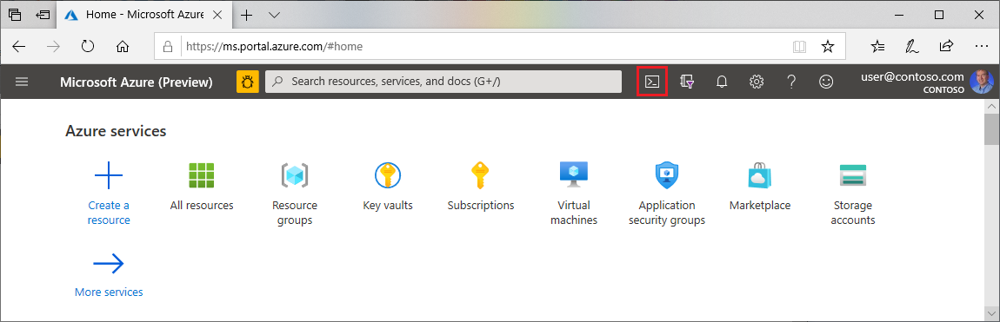

# Quickstart: Configure Terraform using Azure Cloud Shell
 
[!INCLUDE [terraform-intro.md](includes/terraform-intro.md)]

This article describes how to get started with [Terraform on Azure](https://www.terraform.io/docs/providers/azurerm/index.html).

In this article, you learn how to:
> [!div class="checklist"]
> * Authenticate to Azure
> * Create an Azure service principal using the Azure CLI
> * Authenticate to Azure using a service principal
> * Set the current Azure subscription - for use if you have multiple subscriptions
> * Create a base Terraform configuration file
> * Create and apply a Terraform execution plan
> * Reverse an execution plan

## Prerequisites

[!INCLUDE [open-source-devops-prereqs-azure-subscription.md](../includes/open-source-devops-prereqs-azure-subscription.md)]

## Configure your environment

1. Browse to the [Azure portal](https://portal.azure.com).

1. If you aren't already logged in, the Azure portal displays a list of available Microsoft accounts. Select a Microsoft account associated with one or more active Azure subscriptions and enter your credentials to continue.

1. Open Cloud Shell.

    

1. If you haven't previously used Cloud Shell, configure the environment and storage settings. This article uses the Bash environment.

**Notes**:
- Cloud Shell automatically has the latest version of Terraform installed. Also, Terraform automatically uses information from the current Azure subscription. As a result, there's no installation or configuration required.

## Authenticate to Azure

Cloud Shell is automatically authenticated under the Microsoft account you used to log into the Azure portal. If your account has multiple Azure subscriptions, you can [switch to one of your other subscriptions](#set-the-current-azure-subscription).

Terraform supports several options for authenticating to Azure. The following techniques are covered in this article:

- When using Terraform interactively, [authenticating via Microsoft account](#authenticate-via-microsoft-account) is recommended.
- When using Terraform from code, [authenticating via Azure service principal](#authenticate-via-azure-service-principal) is one recommended way.

### Authenticate via Microsoft account

Calling `az login` without any parameters displays a URL and a code. Browse to the URL, enter the code, and follow the instructions to log into Azure using your Microsoft account. Once you're logged in, return to the portal.

```azurecli
az login
```

**Notes**:

- Upon successful login, `az login` displays a list of the Azure subscriptions associated with the logged-in Microsoft account.
- A list of properties displays for each available Azure subscription. The `isDefault` property identifies which Azure subscription you're using. To learn how to switch to another Azure subscription, see the section, [Set the current Azure subscription](#set-the-current-azure-subscription).

### Authenticate via Azure service principal

**Create an Azure service principal**: To log into an Azure subscription using a service principal, you first need access to a service principal. If you already have a service principal, you can skip this part of the section.

Automated tools that deploy or use Azure services - such as Terraform - should always have restricted permissions. Instead of having applications log in as a fully privileged user, Azure offers service principals. But, what if you don't have a service principal with which to log in? In that scenario, you can log in using your user credentials and then create a service principal. Once the service principal is created, you can use its information for future login attempts.

There are many options when [creating a service principal with the Azure CLI](/cli/azure/create-an-azure-service-principal-azure-cli?). For this article, we'll create use [az ad sp create-for-rbac](/cli/azure/ad/sp?#az-ad-sp-create-for-rbac) to create a service principal with a **Contributor** role. The **Contributor** role (the default) has full permissions to read and write to an Azure account. For more information about Role-Based Access Control (RBAC) and roles, see [RBAC: Built-in roles](/azure/active-directory/role-based-access-built-in-roles).

Enter the following command, replacing `<subscription_id>` with the ID of the subscription account you want to use.

```azurecli
az ad sp create-for-rbac --role="Contributor" --scopes="/subscriptions/<subscription_id>"
```

**Notes**:

- Upon successful completion, `az ad sp create-for-rbac` displays several values. The `name`, `password`, and `tenant` values are used in the next step.
- The password can't be retrieved if lost. As such, you should store your password in a safe place. If you forget your password, you'll need to [reset the service principal credentials](/cli/azure/create-an-azure-service-principal-azure-cli#reset-credentials).

**Log in using an Azure service principal**: In the following call to `az login`, replace the placeholders with the information from your service principal.

```azurecli
az login --service-principal -u <service_principal_name> -p "<service_principal_password>" --tenant "<service_principal_tenant>"
```

## Set the current Azure subscription

A Microsoft account can be associated with multiple Azure subscriptions. The following steps outline how you can switch between your subscriptions:

1. To view the current Azure subscription, use [az account show](/cli/azure/account#az-account-show).

    ```azurecli
    az account show
    ```

1. If you have access to multiple available Azure subscriptions, use [az account list](/cli/azure/account#az-account-list) to display a list of subscription name ID values:

    ```azurecli
    az account list --query "[].{name:name, subscriptionId:id}"
    ```

1. To use a specific Azure subscription for the current Cloud Shell session, use [az account set](/cli/azure/account#az-account-set). Replace the `<subscription_id>` placeholder with the ID (or name) of the subscription you want to use:

    ```azurecli
    az account set --subscription="<subscription_id>"
    ```

    **Notes**:

    - Calling `az account set` doesn't display the results of switching to the specified Azure subscription. However, you can use `az account show` to confirm that the current Azure subscription has changed.

[!INCLUDE [terraform-create-base-config-file.md](includes/terraform-create-base-config-file.md)]

[!INCLUDE [terraform-create-and-apply-execution-plan.md](includes/terraform-create-and-apply-execution-plan.md)]

[!INCLUDE [terraform-reverse-execution-plan.md](includes/terraform-reverse-execution-plan.md)]

[!INCLUDE [terraform-troubleshooting.md](includes/terraform-troubleshooting.md)]

## Next steps

> [!div class="nextstepaction"]
> [Create a Linux VM using Terraform](create-linux-virtual-machine-with-infrastructure.md)
