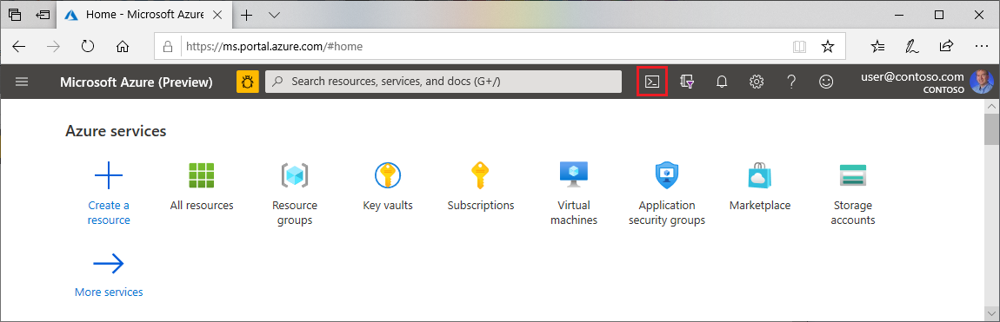

# Quickstart: Getting started with Terraform using Azure Cloud Shell
 
[!INCLUDE [terraform-intro.md](includes/terraform-intro.md)]

This article describes getting started with [Terraform on Azure](https://www.terraform.io/docs/providers/azurerm/index.html) from the [Azure Cloud Shell](/azure/cloud-shell/overview) environment.

[!INCLUDE [hashicorp-support.md](includes/hashicorp-support.md)]

## Prerequisites

[!INCLUDE [open-source-devops-prereqs-azure-subscription.md](../includes/open-source-devops-prereqs-azure-subscription.md)]

## Open Cloud Shell

1. Browse to the [Azure portal](https://portal.azure.com).

1. If you aren't already logged in, the Azure portal displays a list of available Microsoft accounts. Select a Microsoft account associated with one or more active Azure subscriptions and enter your credentials to continue.

1. Open Cloud Shell.

    

1. If you haven't previously used Cloud Shell, configure the environment and storage settings. This article uses the Bash environment.

## Log into your Microsoft account

Cloud Shell is automatically authenticated under the Microsoft account with which you logged into the Azure portal. However, if you have multiple Microsoft accounts with Azure subscriptions, you can log into one of those accounts by using [az login](/cli/azure/reference-index?#az-login).

Based on your scenario, choose one of the following paths:
    
- **You want to log in as a user**: Running `az login` without any parameters displays a URL and a code. Browse to the URL, enter the code, and follow the instructions to log into Azure using your Microsoft account. Once the command logs you in, return to the portal.

    ```azurecli-interactive
    az login
    ```

    **Notes**:
    - Upon successful login, `az login` displays a list of the Azure subscriptions associated with the logged-in Microsoft account.
    - A list of properties displays for each available Azure subscription. The `isDefault` property identifies which Azure subscription you're using. To learn how to switch to another Azure subscription, see the section, [Specify the current Azure subscription](#specify-the-current-azure-subscription).

- **You want to use a service principal, but don't have one yet**: Automated tools that deploy or use Azure services - such as Terraform - should always have restricted permissions. Instead of having applications log in as a fully privileged user, Azure offers service principals. But, what if you don't have a service principal with which to log in? In that scenario, you can log in using your user credentials and then create a service principal. Once the service principal is created, you can use its information for future login attempts.

    There are many options when [creating a service principal with the Azure CLI](/cli/azure/create-an-azure-service-principal-azure-cli?). For this article, we'll create a service principal with a **Contributor** role (the default role). The **Contributor** role has full permissions to read and write to an Azure account. For more information about Role-Based Access Control (RBAC) and roles, see [RBAC: Built-in roles](/azure/active-directory/role-based-access-built-in-roles). 
    
    Using [az ad sp create-for-rbac](/cli/azure/ad/sp?#az-ad-sp-create-for-rbac), replace `<subscription_id>` with the ID of the subscription account you want to use.
    
    ```azurecli-interactive
    az ad sp create-for-rbac --role="Contributor" --scopes="/subscriptions/<subscription_id>"
    ```

    **Notes**:
    - Upon successful completion, the `az ad sp create-for-rbac` command displays several values, including the autogenerated password. The password can't be retrieved if lost. As such, you should store your password in a safe place. If you forget your password, you'll need to [reset the service principal credentials](/cli/azure/create-an-azure-service-principal-azure-cli#reset-credentials).
    
- **Log in using an Azure service principal**: Replace the placeholders in the following `az login` command with information from your service principal.

    ```azurecli-interactive
    az login --service-principal -u <service_principal_name> -p "<service_principal_password>" --tenant "<service_principal_tenant>"
    ```

    **Notes**:
    - Upon successful login, the `az login` command displays various properties for the Azure subscription - such as `id` and `name`.

## Specify the current Azure subscription

As explained in the previous section, two of the ways to log into Azure are the following scenarios:

- **Log in using a Microsoft account**: A Microsoft account can be associated with multiple Azure subscriptions - one of which is the default subscription. The default subscription is the one you use if you log in and don't switch to another.
- **Log in using an Azure service principal**: A service principal is specific to an Azure subscription. Remember that the subscription information displays when you log in.

The following steps address the first scenario where you do the following tasks:

- Verify the current Azure subscription
- List all available Azure subscriptions for the current Microsoft account
- Switch to another Azure subscription

1. To verify the current Azure subscription, use the [az account show](/cli/azure/account#az-account-show) command.

    ```azurecli-interactive
    az account show
    ```
    
1. If you have access to multiple available Azure subscriptions, use [az account list](/cli/azure/account#az-account-list) to display a list of subscription name ID values:

    ```azurecli-interactive
    az account list --query "[].{name:name, subscriptionId:id}"
    ```

1. To use a specific Azure subscription for the current Cloud Shell session, use the [az account set](/cli/azure/account#az-account-set) command. Replace the `<subscription_id>` placeholder with the ID (or name) of the subscription you want to use:

    ```azurecli-interactive
    az account set --subscription="<subscription_id>"
    ```

    **Notes**:
    - The `az account set` command doesn't display the results of switching to the specified Azure subscription. However, you can use the `az account show` command to confirm that the current Azure subscription has changed.

## Create a Terraform configuration file

In this section, you learn how to create a Terraform configuration file that creates an Azure resource group.

1. Change directories to the mounted file share where your work in Cloud Shell is persisted. For more information about how Cloud Shell persists your files, see [Connect your Microsoft Azure Files storage](/azure/cloud-shell/overview#connect-your-microsoft-azure-files-storage)
    
    ```bash
    cd clouddrive
    ```

1. Create a directory to hold the Terraform files for this demo.

    ```bash
    mkdir QuickstartTerraformTest
    ```

1. Change directories to the demo directory.

    ```bash
    cd QuickstartTerraformTest
    ```

1. Using your favorite editor, create a Terraform configuration file. This article uses the built-in [Cloud Shell editor](/azure/cloud-shell/using-cloud-shell-editor).

    ```bash
    code QuickstartTerraformTest.tf
    ```
 
1. Paste the following HCL into the new file.

    ```hcl
    provider "azurerm" {
      # The "feature" block is required for AzureRM provider 2.x.
      # If you are using version 1.x, the "features" block is not allowed.
      version = "~>2.0"
      features {}
    }
    resource "azurerm_resource_group" "rg" {
            name = "QuickstartTerraformTest-rg"
            location = "eastus"
    }
    ```

    **Notes**:
    - The `provider` block specifies that the [Azure provider (`azurerm`)](https://www.terraform.io/docs/providers/azurerm/index.html) is used.
    - Within the `azurerm` provider block, `version` and `features` attributes are set. As the comment states, their usage is version-specific. For more information about how to set these attributes for your environment, see [v2.0 of the AzureRM Provider](https://www.terraform.io/docs/providers/azurerm/guides/2.0-upgrade-guide.html).
    - The only [resource declaration](https://www.terraform.io/docs/configuration/resources.html) is for a resource type of [azurerm_resource_group](https://www.terraform.io/docs/providers/azurerm/r/resource_group.html). The two required arguments for `azure_resource_group` are `name` and `location`.

1. Save the file (**&lt;Ctrl>S**).

1. Exit the editor (**&lt;Ctrl>Q**).

## Create and apply a Terraform execution plan

Cloud Shell automatically has the latest version of Terraform installed. Also, Terraform automatically uses information from the current Azure subscription. As a result, there's no installation or configuration required. Once you create your configuration files, you need only run a couple of Terraform commands to create an execution play. Once you create the execution plan, you can verify it and deploy it.

1. Initialize the Terraform deployment with [terraform init](https://www.terraform.io/docs/commands/init.html). This step downloads the Azure modules required to create an Azure resource group.

    ```bash
    terraform init
    ```
    
1. Terraform allows you to preview the actions to be completed with [terraform plan](https://www.terraform.io/docs/commands/plan.html).

    ```bash
    terraform plan
    ```

    **Notes:**
    - The `terraform plan` command creates an execution plan, but doesn't execute it. Instead, it determines what actions are necessary to create the configuration specified in your configuration files.
    - The `terraform plan` command enables you to verify whether the execution plan matches your expectations before making any changes to actual resources.
    - The optional `-out` parameter allows you to specify an output file for the plan. For more information on using the `-out` parameter, see the section [Persisting execution plans for later deployment](#persist-an-execution-plan-for-later-deployment).

1. Apply the execution plan with [terraform apply](https://www.terraform.io/docs/commands/apply.html).

    ```bash
    terraform apply
    ```
    
1. Terraform shows you what will happen if you apply the execution plan and requires you to confirm running it. Confirm the command by entering `yes` and pressing the **Enter** key.

1. Once you confirm the execution of the play, test that the resource group was successfully created using [az group show](/cli/azure/group?#az-group-show).

    ```azurecli-interactive
    az group show -n "QuickstartTerraformTest-rg"
    ```

    If successful, the command displays various properties of the newly created resource group.

## Persist an execution plan for later deployment

In the previous section, you saw how to run [terraform plan](https://www.terraform.io/docs/commands/plan.html) to create an execution plan. You then saw that using [terraform apply](https://www.terraform.io/docs/commands/apply.html) applies that plan. This pattern works well when the steps are interactive and sequential.

For more complex scenarios, you can persist the execution plan to a file. Later - or even from a different machine - you can apply that execution plan.

If you use this feature, it'ss recommended that you read the article [Running Terraform in automation](https://learn.hashicorp.com/terraform/development/running-terraform-in-automation).

The following steps illustrate the basic pattern for using this feature:

1. Run [terraform init](https://www.terraform.io/docs/commands/init.html).

    ```bash
    terraform init
    ```

1. Run `terraform plan` with the `-out` parameter.

    ```bash
    terraform plan -out QuickstartTerraformTest.tfplan
    ```

1. Run `terraform apply`, specifying the name of the file from the previous step.

    ```bash
    terraform apply QuickstartTerraformTest.tfplan
    ```

**Notes**:
- To enable use with automation, running `terraform apply <filename>` doesn't require confirmation.
- If you decide to use this feature, read the [security warning section](https://www.terraform.io/docs/commands/plan.html#security-warning).

## Clean up resources

When no longer needed, delete the resources created in this article.

1. Run the [terraform destroy](https://www.terraform.io/docs/commands/destroy.html) that will reverse the current execution plan.

    ```bash
    terraform destroy
    ```

1. Terraform shows you what will happen if you reverse the execution plan and requires you to confirm. Confirm the command by entering `yes` and pressing the **Enter** key.

1. Once you confirm the execution of the play, the output is similar to the following example, verify that the resource group was deleted by using [az group show](/cli/azure/group?#az-group-show).

    ```azurecli-interactive
    az group show -n "QuickstartTerraformTest-rg"
    ```

    **Notes**:
    - If successful, the `az group show` command displays the fact that the resource group doesn't exist.

1. Change directories to the parent directory and remove the demo directory. The `-r` parameter removes the directory contents before removing the directory. The directory contents include the configuration file you created earlier and the Terraform state files.

    ```bash
    cd .. && rm -r QuickstartTerraformTest
    ```

## Next steps

> [!div class="nextstepaction"]
> [Create an Azure VM with Terraform](create-linux-virtual-machine-with-infrastructure.md)