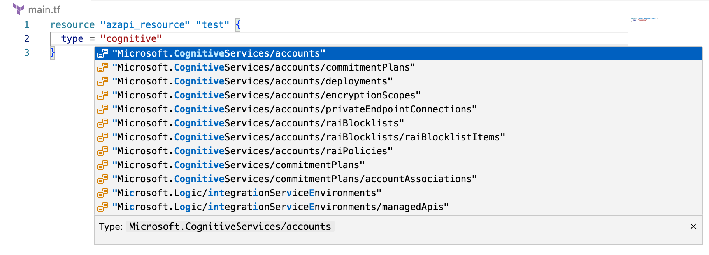
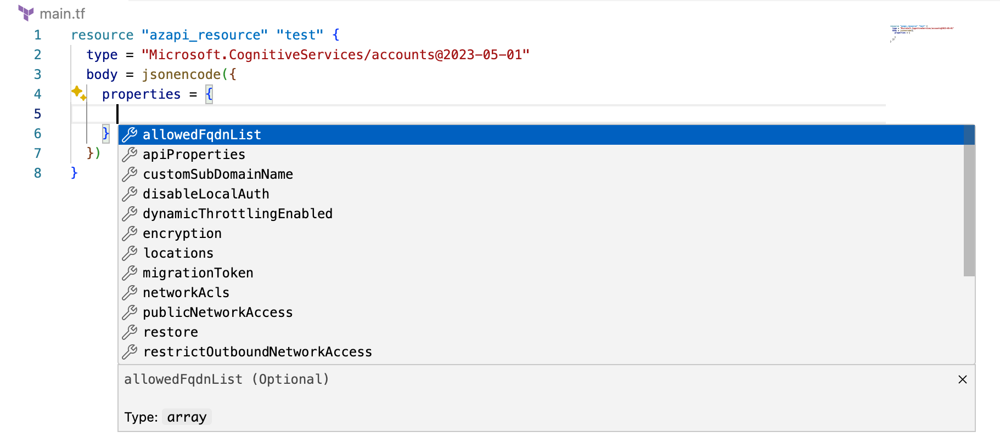
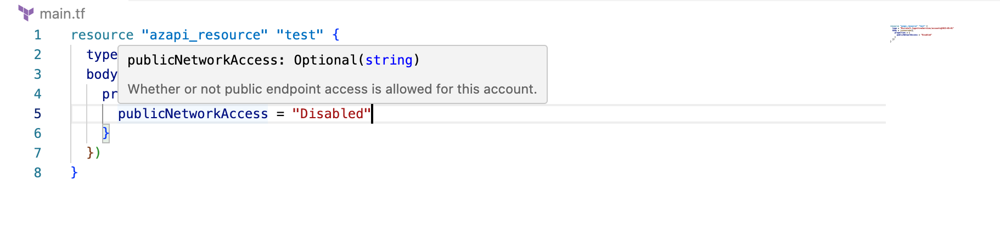
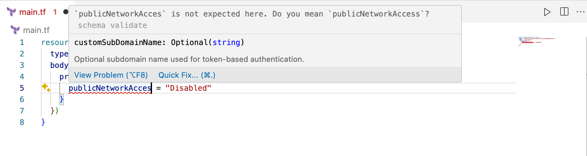
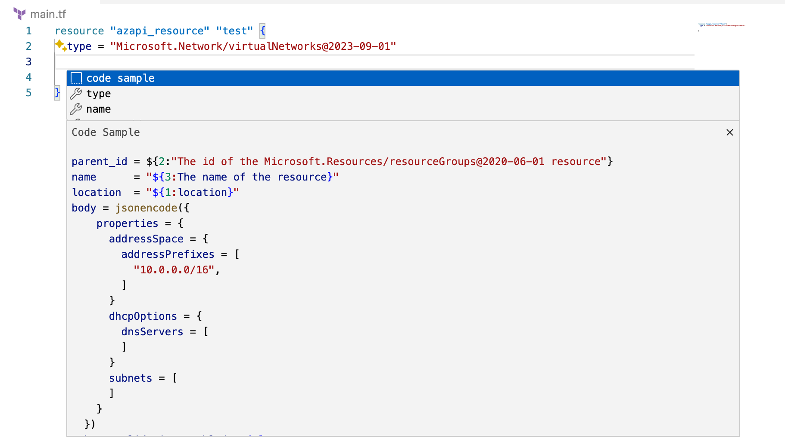

# Overview of the Terraform AzAPI provider

The AzAPI provider is a thin layer on top of the [Azure ARM REST APIs](/rest/api/resources/). It enables you to manage any Azure resource type using any API version, enabling you to use the latest functionality within Azure. AzAPI is a first-class provider designed to be used on its own or in tandem with the AzureRM provider.

## Benefits of using the AzAPI provider

The AzAPI provider features the following benefits:

- Supports all Azure control plane services:
  - Preview services and features
  - All API versions
- Full Terraform state file fidelity
  - Properties and values are saved to state
- No dependency on Swagger
- Common and consistent Azure authentication
- Built-in preflight validation
- Granular control over infrastructure development
- [Microsoft Terraform Visual Studio Code extension](how-to-use-terraform-vscode-extension.md)

## Resources

To allow you to manage all Azure resources and features without requiring updates, the AzAPI provider includes the following generic resources:

| Resource Name | Description |
| ------------- | ----------- |
| [`azapi_resource`](https://registry.terraform.io/providers/Azure/azapi/latest/docs/resources/resource) | Used to fully manage any Azure (control plane) resource (API) with full CRUD. <br> &nbsp;&nbsp;&nbsp;Example Use Cases: <br> &nbsp;&nbsp;&nbsp;&nbsp;&nbsp;&nbsp;New preview service <br>&nbsp;&nbsp;&nbsp;&nbsp;&nbsp;&nbsp;New feature added to existing service <br> &nbsp;&nbsp;&nbsp;&nbsp;&nbsp;&nbsp;Existing feature / service not currently covered |
| [`azapi_update_resource`](https://registry.terraform.io/providers/Azure/azapi/latest/docs/resources/update_resource) | Used to manage resources or parts of resources that don't have full CRUD <br> &nbsp;&nbsp;&nbsp;Example Use Cases: <br> &nbsp;&nbsp;&nbsp;&nbsp;&nbsp;&nbsp;Update new properties on an existing service <br> &nbsp;&nbsp;&nbsp;&nbsp;&nbsp;&nbsp;Update precreated child resource - such as DNS SOA record. |
| [`azapi_resource_action`](https://registry.terraform.io/providers/Azure/azapi/latest/docs/resources/resource_action) | Used to perform a single operation on a resource without managing the lifecycle of it <br> &nbsp;&nbsp;&nbsp;Example Use Cases: <br> &nbsp;&nbsp;&nbsp;&nbsp;&nbsp;&nbsp;Shut down a Virtual Machine <br> &nbsp;&nbsp;&nbsp;&nbsp;&nbsp;&nbsp;Add a secret to a Key Vault|
| [`azapi_data_plane_resource`](https://registry.terraform.io/providers/Azure/azapi/latest/docs/resources/data_plane_resource) | Used to manage a [specific subset](https://registry.terraform.io/providers/Azure/azapi/latest/docs/resources/data_plane_resource#available-resources) of Azure data plane resources <br> &nbsp;&nbsp;&nbsp;Example Use Cases: <br> &nbsp;&nbsp;&nbsp;&nbsp;&nbsp;&nbsp;KeyVault Certificate Contacts<br> &nbsp;&nbsp;&nbsp;&nbsp;&nbsp;&nbsp;Synapse Workspace Libraries|

For a detailed explanation of how the data plane framework works and how `parent_id` differs from control plane resources, see [Understand the AzAPI data plane framework](concept-azapi-data-plane-framework.md).

### Usage hierarchy

Overall, usage should follow these steps:
1. Start with performing as many operations as possible within `azapi_resource`.
2. If the resource type doesn't exist within `azapi_resource` but does fall under one of the types supported by `azapi_data_plane_resource`, use that instead.
3. If the resource already exists in AzureRM or has a property that can't be accessed within `azapi_resource`, use `azapi_update_resource` to access these specific properties. Resources that `azapi_resource` or `azapi_data_plane_resource` don't support can't be updated through this resource.
4. If you're trying to perform an action that isn't based on an Azure CRUD-friendly resource, `azapi_resource_action` is less straightforward than `azapi_update_resource` but more flexible.

## Resource configuration examples

The following code snippet configures a resource that doesn't currently exist in the AzureRM provider:

```terraform
resource "azapi_resource" "publicip" {
  type      = "Microsoft.Network/Customipprefixes@2021-03-01"
  name      = "exfullrange"
  parent_id = azurerm_resource_group.example.id
  location  = "westus2"

  body = {
    properties = {
      cidr          = "10.0.0.0/24"
      signedMessage = "Sample Message for WAN"
    }
  }
}
```

The following code snippet configures a preview property for an existing resource from AzureRM:

```terraform
resource "azapi_update_resource" "test" {
  type        = "Microsoft.ContainerRegistry/registries@2020-11-01-preview"
  resource_id = azurerm_container_registry.acr.id

  body = {
    properties = {
      anonymousPullEnabled = var.bool_anonymous_pull
    }
  }
}
```

The following code snippet configures a resource action on an existing AzureRM resource:

```terraform
resource "azapi_resource_action" "vm_shutdown" {
  type = "Microsoft.Compute/virtualMachines@2023-07-01"
  resource_id = azurerm_linux_virtual_machine.example.id
  action = "powerOff”
}
```

The following code snippet configures a resource that doesn't currently exist in the AzureRM provider due to being provisioned on the data plane:

```terraform
resource "azapi_data_plane_resource" "dataset" {
  type      = "Microsoft.Synapse/workspaces/datasets@2020-12-01"
  parent_id = trimprefix(data.azurerm_synapse_workspace.example.connectivity_endpoints.dev, "https://")
  name      = "example-dataset"
  body = {
    properties = {
      type = "AzureBlob",
      typeProperties = {
        folderPath = {
          value = "@dataset().MyFolderPath"
          type  = "Expression"
        }
        fileName = {
          value = "@dataset().MyFileName"
          type  = "Expression"
        }
        format = {
          type = "TextFormat"
        }
      }
      parameters = {
        MyFolderPath = {
          type = "String"
        }
        MyFileName = {
          type = "String"
        }
      }
    }
  }
}
```

### Preflight usage example

The following code snippet errors during `terraform plan` due to AzAPI's built-in preflight validation:

```terraform
provider "azapi" {
  enable_preflight = true
}
resource "azapi_resource" "vnet" {
  type      = "Microsoft.Network/virtualNetworks@2024-01-01"
  parent_id = azapi_resource.resourceGroup.id
  name      = "example-vnet"
  location  = "westus"
  body = {
    properties = {
      addressSpace = {
        addressPrefixes = [
          "10.0.0.0/160", # preflight will throw an error here
        ]
      }
    }
  }
}
```

When enabled, preflight surfaces configuration errors during `terraform plan` rather than at apply time.

## Data Sources

The AzAPI provider supports various useful data sources:

| Data Source Name | Description |
| ------------- | ----------- |
| [`azapi_resource`](https://registry.terraform.io/providers/Azure/azapi/latest/docs/data-sources/resource) | Used to read information from any Azure (control plane) resource (API). <br> &nbsp;&nbsp;&nbsp;Example Use Cases: <br> &nbsp;&nbsp;&nbsp;&nbsp;&nbsp;&nbsp;New preview service <br>&nbsp;&nbsp;&nbsp;&nbsp;&nbsp;&nbsp;New feature added to existing service <br> &nbsp;&nbsp;&nbsp;&nbsp;&nbsp;&nbsp;Existing feature / service not currently covered |
| [`azapi_client_config`](https://registry.terraform.io/providers/Azure/azapi/latest/docs/data-sources/client_config) | Access client information such as subscription ID and tenant ID. |
| [`azapi_resource_action`](https://registry.terraform.io/providers/Azure/azapi/latest/docs/data-sources/resource_action) | Used to perform a single read operation on a resource without managing the lifecycle of it <br> &nbsp;&nbsp;&nbsp;Example Use Cases: <br> &nbsp;&nbsp;&nbsp;&nbsp;&nbsp;&nbsp;List Keys <br> &nbsp;&nbsp;&nbsp;&nbsp;&nbsp;&nbsp;Read status of VM |
| [`azapi_data_plane_resource`](https://registry.terraform.io/providers/Azure/azapi/latest/docs/data-sources/data_plane_resource) | Used to access a [specific subset](https://registry.terraform.io/providers/Azure/azapi/latest/docs/resources/data_plane_resource#available-resources) of Azure data plane resources <br> &nbsp;&nbsp;&nbsp;Example Use Cases: <br> &nbsp;&nbsp;&nbsp;&nbsp;&nbsp;&nbsp;KeyVault Certificate Contacts<br> &nbsp;&nbsp;&nbsp;&nbsp;&nbsp;&nbsp;Synapse Workspace Libraries | 
| [`azapi_resource_id`](https://registry.terraform.io/providers/Azure/azapi/latest/docs/data-sources/resource_id) | Access a resource's resource ID, with the ability to output information such as subscription ID, parent ID, resource group name, and resource name. |
| [`azapi_resource_list`](https://registry.terraform.io/providers/Azure/azapi/latest/docs/data-sources/resource_list) | List all resources under a given parent resource ID. <br> &nbsp;&nbsp;&nbsp;Example Use Cases: <br> &nbsp;&nbsp;&nbsp;&nbsp;&nbsp;&nbsp;Resources under a subscription / resource group <br> &nbsp;&nbsp;&nbsp;&nbsp;&nbsp;&nbsp;Subnets under a virtual network|

For a hands-on example using `azapi_resource_list` with JMESPath filtering, see [List Azure resources with the AzAPI Terraform provider](get-started-azapi-resource-list.md).

### Read an existing resource with `azapi_resource` data source

The `azapi_resource` data source reads the current state of any Azure resource and exposes its properties through the `output` attribute. Use it when you need a property that the AzureRM provider doesn't expose:

```terraform
data "azapi_resource" "aks" {
  type      = "Microsoft.ContainerService/managedClusters@2024-02-01"
  resource_id = azurerm_kubernetes_cluster.example.id

  # Extract the OIDC issuer URL, not exposed by azurerm_kubernetes_cluster
  response_export_values = ["properties.oidcIssuerProfile.issuerURL"]
}

output "oidc_issuer_url" {
  value = data.azapi_resource.aks.output.properties.oidcIssuerProfile.issuerURL
}
```

### Use `response_export_values` and JMESPath

`response_export_values` controls which properties are extracted from the raw ARM API response and made available in the `output` attribute. It accepts a list or a map:

- **List**: Specify JSON property paths to extract. Use `["*"]` to export the full response body.
- **Map**: Use [JMESPath](https://jmespath.org/) expressions to filter and reshape the response. The key is the output field name; the value is the JMESPath query.

The map form is preferred for list responses and cases where you need to transform the output:

```terraform
data "azapi_resource_list" "storage_accounts" {
  type      = "Microsoft.Storage/storageAccounts@2023-01-01"
  parent_id = azurerm_resource_group.example.id

  response_export_values = {
    "names"     = "value[].name"
    "locations" = "value[].location"
  }
}
```

For a full walkthrough, see [List Azure resources with the AzAPI Terraform provider](get-started-azapi-resource-list.md).

## Authentication using the AzAPI provider

The AzAPI provider enables the same authentication methods as the AzureRM provider. For more information on authentication options, see [Authenticate Terraform to Azure](./authenticate-to-azure.md?tabs=bash).


## Experience and lifecycle of the AzAPI provider

This section describes some tools to help you use the AzAPI provider.

### VS Code extension and Language Server

The [Microsoft Terraform VS Code extension](https://marketplace.visualstudio.com/items?itemName=ms-azuretools.vscode-azureterraform) provides a rich authoring experience for both the AzureRM and AzAPI providers, including:

- List all available resource types and API versions.

- Autocompletion of the allowed properties and values for any resource.

- Show hints when hovering over a property.

- Syntax validation

- Autocompletion with code samples.


The extension also supports paste-as-AzAPI (converts ARM JSON to `azapi_resource` blocks), Azure resource export via `aztfexport`, AzureRM-to-AzAPI migration, and preflight validation. For a full guide, see [Use the Microsoft Terraform VS Code extension](how-to-use-terraform-vscode-extension.md).

### `aztfmigrate` migration tool

The [`aztfmigrate` tool](https://github.com/Azure/aztfmigrate/releases) is designed to help migrate existing resources between the AzAPI and AzureRM providers.

`aztfmigrate` has two modes: plan and migrate:

- Plan displays the AzAPI resources that can be migrated.
- Migrate migrates the AzAPI resources to AzureRM resources in both the HCL files and the state.

`aztfmigrate` ensures after migration that your Terraform configuration and state are aligned with your actual state. You can validate the update to state by running `terraform plan` after completing the migration to confirm no changes occurred.

For a step-by-step walkthrough, see [Migrate resources from AzAPI to AzureRM](how-to-migrate-between-azurerm-and-azapi.md).

## Import existing Azure resources

To bring an existing Azure resource under AzAPI management without re-creating it, use the `import` block (Terraform 1.5 and later) or the `terraform import` command. The resource ID must include the API version as a query parameter:

```terraform
import {
  to = azapi_resource.example
  id = "/subscriptions/00000000-0000-0000-0000-000000000000/resourceGroups/example-rg/providers/Microsoft.Network/virtualNetworks/example-vnet?api-version=2023-11-01"
}

resource "azapi_resource" "example" {
  type      = "Microsoft.Network/virtualNetworks@2023-11-01"
  name      = "example-vnet"
  parent_id = "/subscriptions/00000000-0000-0000-0000-000000000000/resourceGroups/example-rg"
  location  = "westus"
  body = {
    properties = {
      addressSpace = {
        addressPrefixes = ["10.0.0.0/16"]
      }
    }
  }
}
```

To import multiple resources at once from existing Azure infrastructure, use [Azure Export for Terraform (`aztfexport`)](./azure-export-for-terraform/export-terraform-overview.md), which generates both the HCL configuration and the import blocks automatically.

## Granular controls over infrastructure

One major benefit of AzAPI is through its ability to fine-tune your configuration to match the right design patterns. There are several ways to do this:

### Provider configuration options

The AzAPI provider block accepts several settings that apply globally across all resources in the configuration:

| Option | Description |
|---|---|
| `enable_preflight` | Enables preflight validation at plan time. Defaults to `false`. Can also be set with the `ARM_ENABLE_PREFLIGHT` environment variable. |
| `ignore_no_op_changes` | Suppresses plan-time noise from no-op differences between the configuration and normalized API responses. Defaults to `true`. |
| `disable_default_output` | When set to `true`, disables automatic output of read-only properties when `response_export_values` isn't specified. Defaults to `false`. |
| `default_location` | Sets a default `location` for all resources that don't specify one explicitly. |
| `default_tags` | Sets default tags applied to all resources. Resource-level `tags` override these defaults. |
| `skip_provider_registration` | Skips automatic resource provider registration. Set to `true` in restricted environments. |

For a full list of provider configuration options, see the [AzAPI provider schema](https://registry.terraform.io/providers/Azure/azapi/latest/docs).

For a walkthrough of enabling preflight, see [Enable preflight validation in the AzAPI Terraform provider](how-to-use-azapi-preflight-validation.md).

### Provider functions

AzAPI v2.0 and later includes several [provider functions](https://developer.hashicorp.com/terraform/plugin/framework/functions/concepts?product_intent=terraform):

| Function Name | Description |
| ------------- | ----------- |
| [`build_resource_id`](https://registry.terraform.io/providers/Azure/azapi/latest/docs/functions/build_resource_id) | Constructs an Azure resource ID given the parent ID, resource type, and resource name. <br> Useful for creating resource IDs for top-level and nested resources within a specific scope. |
| [`extension_resource_id`](https://registry.terraform.io/providers/Azure/azapi/latest/docs/functions/extension_resource_id) | Constructs an Azure extension resource ID given the base resource ID, resource type, and more resource names. |
| [`management_group_resource_id`](https://registry.terraform.io/providers/Azure/azapi/latest/docs/functions/management_group_resource_id) | Constructs an Azure management group scope resource ID given the management group name, resource type, and resource names.|
| [`parse_resource_id`](https://registry.terraform.io/providers/Azure/azapi/latest/docs/functions/parse_resource_id) |This function takes an Azure resource ID and a resource type and parses the ID into its individual components such as subscription ID, resource group name, provider namespace, and other parts.|
| [`resource_group_resource_id`](https://registry.terraform.io/providers/Azure/azapi/latest/docs/functions/resource_group_resource_id) | Constructs an Azure resource group scope resource ID given the subscription ID, resource group name, resource type, and resource names. |
| [`subscription_resource_id`](https://registry.terraform.io/providers/Azure/azapi/latest/docs/functions/subscription_resource_id) | Constructs an Azure subscription scope resource ID given the subscription ID, resource type, and resource names.|
| [`tenant_resource_id`](https://registry.terraform.io/providers/Azure/azapi/latest/docs/functions/tenant_resource_id) |Constructs an Azure tenant scope resource ID given the resource type and resource names.|

### User-defined retryable errors with the `retry` block
The AzAPI provider handles expected errors through the `retry` block. For example, use the following configuration to retry when a resource encounters a create timeout:
```terraform
resource "azapi_resource" "example" {
    # usual properties
    retry {
        interval_seconds     = 5
        randomization_factor = 0.5 # adds randomization to retry pattern
        multiplier           = 2 # if try fails, multiplies time between next try by this much
        error_message_regex  = ["ResourceNotFound"]
    }
    timeouts {
        create = "10m"
}
```

The `retry` block accepts these attributes:

| Attribute | Description |
|---|---|
| `error_message_regex` | Required. A list of regular expressions matched against error messages. The request is retried when any expression matches. |
| `interval_seconds` | Base wait time between retries. Defaults to `10`. |
| `max_interval_seconds` | Maximum wait time between retries. Defaults to `180`. |
| `multiplier` | Multiplier applied to the interval after each failed attempt. Defaults to `1.5`. |
| `randomization_factor` | Adds jitter to the retry interval to avoid thundering-herd patterns. Defaults to `0.5`. |

Combine `retry` with the `timeouts` block to set an upper bound on total retry duration:

```terraform
timeouts {
  create = "10m"
}
```

### Ephemeral resources and write-only properties

AzAPI v2.x supports write-only arguments (Terraform 1.11 and later) through the `sensitive_body` attribute on `azapi_resource`. Write-only properties are sent to the ARM API but aren't stored in Terraform state, which is useful for secrets and credentials:

```terraform
resource "azapi_resource" "example" {
  type      = "Microsoft.SomeService/resources@2024-01-01"
  name      = "example"
  parent_id = azurerm_resource_group.example.id

  body = {
    properties = {
      name = "example"
    }
  }

  # Write-only — not stored in state
  sensitive_body = {
    properties = {
      adminPassword = var.admin_password
    }
  }
}
```

Use `sensitive_body_version` to control when write-only properties are resent to the API (for example, when rotating credentials).

### Triggers for resource replacement

The `AzAPI` provider allows you to configure parameters for resource replacement:

#### `replace_triggers_external_values`

Replaces the resource if a value changes. For example, if the SKU or zones variables were to be modified, this resource would be re-created:
```terraform
resource "azapi_resource" "example" {
  name      = var.name
  type      = "Microsoft.Network/publicIPAddresses@2023-11-01"
  parent_id = "/subscriptions/00000000-0000-0000-0000-000000000000/resourceGroups/example"
  body      = properties = {
    sku   = var.sku
    zones = var.zones
  }
  replace_triggers_external_values = [
    var.sku,
    var.zones,
  ]
}
```
This trigger works across a broad set of resources—for example, a policy assignment when properties of the definition change.

#### `replace_triggers_refs`

Replaces the resource if the referenced value changes. For example, if the SKU name or tier was modified, this resource would be re-created:
```terraform
resource "azapi_resource" "example" {
  type      = "Microsoft.Relay/namespaces@2021-11-01"
  parent_id = azurerm_resource_group.example.id
  name      = "xxx"
  location  = "westus"
  body = {
    properties = {
    }
    sku = {
      name = "Standard"
      tier = "Standard"
    }
  }

  replace_triggers_refs = ["sku"]
}
```
This wouldn't trigger a replace if a different resource's SKU changes.

## Next steps

- [Choose between AzureRM and AzAPI Terraform providers](provider-selection-azurerm-vs-azapi.md)
- [Understand the AzAPI data plane framework](concept-azapi-data-plane-framework.md)
- [Deploy your first resource with the AzAPI provider](get-started-azapi-resource.md)
- [Deploy your first Update Resource with the AzAPI provider](get-started-azapi-update-resource.md)
- [Deploy your first resource action with the AzAPI provider](get-started-azapi-resource-action.md)
- [Perform resource actions with the AzAPI provider](get-started-azapi-resource-action-mutation.md)
- [Manage Azure data plane resources with AzAPI](get-started-azapi-data-plane-resource.md)
- [List Azure resources with the AzAPI provider](get-started-azapi-resource-list.md)
- [Enable preflight validation](how-to-use-azapi-preflight-validation.md)
- [Use AzAPI provider functions](how-to-use-azapi-provider-functions.md)
- [Migration paths between Azure, AzureRM, and AzAPI](how-to-migrate-between-azurerm-and-azapi.md)
- [Visit the provider registry](https://registry.terraform.io/providers/Azure/azapi/latest/docs)
