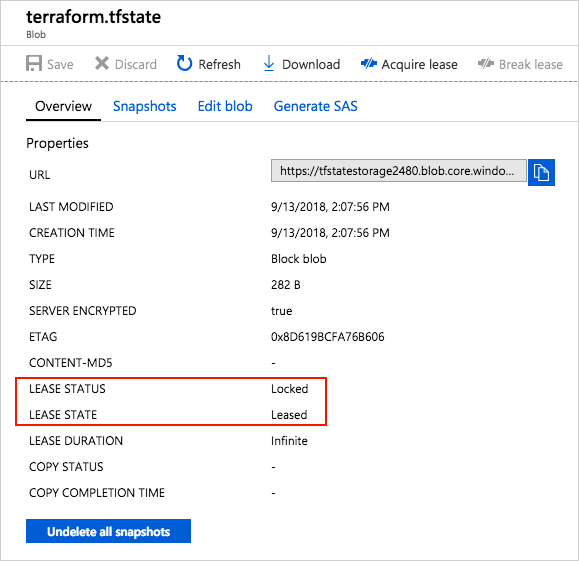

# Tutorial: Store Terraform state in Azure Storage

Terraform state is used to reconcile deployed resources with Terraform configurations. State allows Terraform to know what Azure resources to add, update, or delete. By default, Terraform state is stored locally when you run the `terraform apply` command. This configuration isn't ideal for the following reasons:

- Local state doesn't work well in a team or collaborative environment.
- Terraform state can include sensitive information.
- Storing state locally increases the chance of inadvertent deletion.

Terraform supports the persisting of state in remote storage. One such supported back end is Azure Storage. This document shows how to configure and use Azure Storage for this purpose.

## Prerequisites

[!INCLUDE [open-source-devops-prereqs-azure-subscription.md](../includes/open-source-devops-prereqs-azure-subscription.md)]

## Configure storage account

Before you use Azure Storage as a back end, you must create a storage account. The storage account can be created with the Azure portal, PowerShell, the Azure CLI, or Terraform itself. Use the following sample to configure the storage account with the Azure CLI.

```azurecli
#!/bin/bash

RESOURCE_GROUP_NAME=tstate
STORAGE_ACCOUNT_NAME=tstate$RANDOM
CONTAINER_NAME=tstate

# Create resource group
az group create --name $RESOURCE_GROUP_NAME --location eastus

# Create storage account
az storage account create --resource-group $RESOURCE_GROUP_NAME --name $STORAGE_ACCOUNT_NAME --sku Standard_LRS --encryption-services blob

# Get storage account key
ACCOUNT_KEY=$(az storage account keys list --resource-group $RESOURCE_GROUP_NAME --account-name $STORAGE_ACCOUNT_NAME --query '[0].value' -o tsv)

# Create blob container
az storage container create --name $CONTAINER_NAME --account-name $STORAGE_ACCOUNT_NAME --account-key $ACCOUNT_KEY

echo "storage_account_name: $STORAGE_ACCOUNT_NAME"
echo "container_name: $CONTAINER_NAME"
echo "access_key: $ACCOUNT_KEY"
```

Take note of the storage account name, container name, and storage access key. These values are needed when you configure the remote state.

## Configure state back end

The Terraform state back end is configured when you run the `terraform init` command. The following data is needed to configure the state back end:

- **storage_account_name**: The name of the Azure Storage account.
- **container_name**: The name of the blob container.
- **key**: The name of the state store file to be created.
- **access_key**: The storage access key.

Each of these values can be specified in the Terraform configuration file or on the command line. We recommend that you use an environment variable for the `access_key` value. Using an environment variable prevents the key from being written to disk.

Create an environment variable named `ARM_ACCESS_KEY` with the value of the Azure Storage access key.

```bash
export ARM_ACCESS_KEY=<storage access key>
```

To further protect the Azure Storage account access key, store it in Azure Key Vault. The environment variable can then be set by using a command similar to the following. For more information on Azure Key Vault, see the [Azure Key Vault documentation](/azure/key-vault/secrets/quick-create-cli).

```bash
export ARM_ACCESS_KEY=$(az keyvault secret show --name terraform-backend-key --vault-name myKeyVault --query value -o tsv)
```

To configure Terraform to use the back end, the following steps need to be done:
- Include a `backend` configuration block with a type of `azurerm`.
- Add a `storage_account_name` value to the configuration block.
- Add a `container_name` value to the configuration block.
- Add a `key` value to the configuration block.

The following example configures a Terraform back end and creates an Azure resource group.

```hcl
terraform {
  backend "azurerm" {
    resource_group_name   = "tstate"
    storage_account_name  = "tstate09762"
    container_name        = "tstate"
    key                   = "terraform.tfstate"
  }
}

# Configure the Azure provider
provider "azurerm" { 
  # The "feature" block is required for AzureRM provider 2.x. 
  # If you are using version 1.x, the "features" block is not allowed.
  version = "~>2.0"
  features {}
}

resource "azurerm_resource_group" "state-demo-secure" {
  name     = "state-demo"
  location = "eastus"
}
```

Initialize the configuration by doing the following steps:

1. Run the `terraform init` command.
1. Run the `terraform apply` command.

You can now find the state file in the Azure Storage blob.

## State locking

Azure Storage blobs are automatically locked before any operation that writes state. This pattern prevents concurrent state operations, which can cause corruption. 

For more information, see [State locking](https://www.terraform.io/docs/state/locking.html) in the Terraform documentation.

You can see the lock when you examine the blob through the Azure portal or other Azure management tooling.



## Encryption at rest

Data stored in an Azure blob is encrypted before being persisted. When needed, Terraform retrieves the state from the back end and stores it in local memory. Using this pattern, state is never written to your local disk.

For more information on Azure Storage encryption, see [Azure Storage service encryption for data at rest](/azure/storage/common/storage-service-encryption).

[!INCLUDE [terraform-troubleshooting.md](includes/terraform-troubleshooting.md)]

## Next steps

> [!div class="nextstepaction"] 
> [Learn more about using Terraform in Azure](/azure/terraform)
