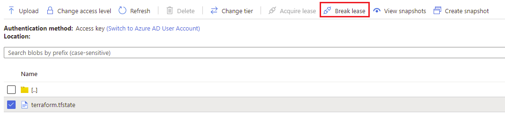

# Troubleshoot common problems when using Terraform on Azure

This article lists common problems and possible solutions when using Terraform on Azure. 

If you encounter a problem that is specific to Terraform, use one of [HashiCorp's community support channels](#hashicorp-terraform-specific-support-channels).

- [Unable to list provider registration status](#unable-to-list-provider-registration-status)
- [VPN errors](#vpn-errors)

## HashiCorp Terraform specific support channels

* Questions, use-cases, and useful patterns: [Terraform section of the HashiCorp community portal](https://discuss.hashicorp.com/c/terraform-core)
* Provider-related questions: [Terraform Providers section of the HashiCorp community portal](https://discuss.hashicorp.com/c/terraform-providers)

## Unable to list provider registration status

**Error message:**

*Error: Unable to list provider registration status, it is possible that this is due to invalid credentials or the service principal does not have permission to use the Resource Manager API, Azure error: resources.ProvidersClient#List: Failure responding to request: StatusCode=403 -- Original Error: autorest/azure: Service returned an error. Status=403 Code="AuthorizationFailed" Message="The client '00000000-0000-0000-0000-000000000000' with object id '00000000-0000-0000-0000-000000000000' does not have authorization to perform action 'Microsoft.Resources/subscriptions/providers/read' over scope '/subscriptions/00000000-0000-0000-0000-000000000000' or the scope is invalid. If access was recently granted, please refresh your credentials."*

**Background:** If you're running Terraform commands from the Cloud Shell and you've defined certain [Terraform/Azure environment variables](https://registry.terraform.io/providers/hashicorp/azurerm/2.35.0/docs/guides/service_principal_client_secret#configuring-the-service-principal-in-terraform), you can sometimes see conflicts. The environment variables and the Azure value they represent are listed in the following table:

| Environment variable | Azure value |
|---------------|--------------------------|
| ARM_SUBSCRIPTION_ID | Azure subscription ID |
| ARM_TENANT_ID | Microsoft account tenant ID |
| ARM_CLIENT_ID | Azure service principal app ID |
| ARM_CLIENT_SECRET | Azure service principal password |

**Cause**: As of this writing, the Terraform script that runs in Cloud Shell overwrites the `ARM_SUBSCRIPTION_ID` and `ARM_TENANT_ID` environment variables using values from the current Azure subscription. As a result, if the service principal referenced by the environment variables doesn't have rights to the current Azure subscription, any Terraform operations will fail.

## Error acquring the state lock

**Error message:**

*Error: Error acquiring the state lock; Error message: 2 errors occurred:
       * state blob is already locked
       * blob metadata "terraformlockid" was empty
Terraform acquires a state lock to protect the state from being written by multiple users at the same time. Please resolve the issue above and try again. For most commands, you can disable locking with the "-lock=false" flag, but this is not recommended.

**Background:** If you're running Terraform commands against a Terraform state file and the above is the only message that appears. Applies to local and remote state files.

**Cause:** There are two potential causes for this error. The first would be a Terraform command is already running against the state file and has forced a lock on the file so it doesn't break anything. The second would be a connection interuption between the state file and the CLI while running commands, this is mostly common when using remote state files.

**Resolution:** First make sure you are not already running any commands against the state file. If you are working with a local state file, check if you have terminals running any commands. Alternatively, check your deployment pipelines to see if you have something running that could be using the state file. If this doesn't resolve the issue then it's possible you are seeing the second cause listed above. For a remote state file stored in an Azure Storage Account Container you can locate the file and use the [Break Lease] button.

If you are using other backends to store your state file, then refer to the providers documentation on [HashiCorp's site](https://www.terraform.io/docs/cli/index.html) for recommendations.

## VPN errors

For information about resolving VPN errors, see the article, [Troubleshoot a hybrid VPN connection](/azure/architecture/reference-architectures/hybrid-networking/troubleshoot-vpn).
