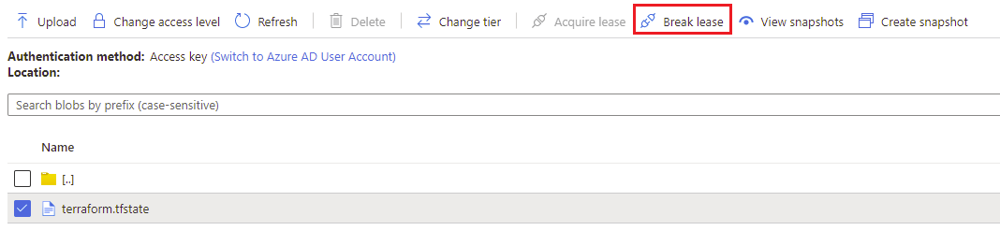

# Troubleshoot common problems when using Terraform on Azure

This article lists common problems and possible solutions when using Terraform on Azure. 

If you encounter a problem that's specific to Terraform, use one of [HashiCorp's community support channels](#hashicorp-terraform-specific-support-channels).

- [Unable to list provider registration status](#unable-to-list-provider-registration-status)
- [VPN errors](#vpn-errors)

## HashiCorp Terraform specific support channels

* Questions, use cases, and useful patterns: [Terraform section of the HashiCorp community portal](https://discuss.hashicorp.com/c/terraform-core)
* Questions, use cases, and useful patterns: [Terraform section of the HashiCorp community portal](https://discuss.hashicorp.com/c/terraform-core)

## Unable to list provider registration status

**Error message:**

*Error: Unable to list provider registration status. This error might occur because of invalid credentials or because the service principal doesn't have permission to use the Resource Manager API. Azure error: resources.ProvidersClient#List: Failure responding to request: StatusCode=403 -- Original Error: autorest/azure: Service returned an error. Status=403 Code="AuthorizationFailed" Message="The client '00000000-0000-0000-0000-000000000000' with object id '00000000-0000-0000-0000-000000000000' doesn't have authorization to perform action 'Microsoft.Resources/subscriptions/providers/read' over scope '/subscriptions/00000000-0000-0000-0000-000000000000' or the scope is invalid. If access was recently granted, refresh your credentials."*

**Background:** If you run Terraform commands from the Cloud Shell and define certain [Terraform/Azure environment variables](https://registry.terraform.io/providers/hashicorp/azurerm/2.35.0/docs/guides/service_principal_client_secret#configuring-the-service-principal-in-terraform), you might see conflicts. The following table lists the environment variables and the Azure values they represent:

| Environment variable | Azure value |
|---------------|--------------------------|
| ARM_SUBSCRIPTION_ID | Azure subscription ID |
| ARM_TENANT_ID | Microsoft account tenant ID |
| ARM_CLIENT_ID | Azure service principal app ID |
| ARM_CLIENT_SECRET | Azure service principal password |

**Cause**: As of this writing, the Terraform script that runs in Cloud Shell overwrites the `ARM_SUBSCRIPTION_ID` and `ARM_TENANT_ID` environment variables by using values from the current Azure subscription. As a result, if the service principal that the environment variables reference doesn't have rights to the current Azure subscription, Terraform operations fail.

## Error acquiring the state lock

**Error message:**

*Error: Error acquiring the state lock; Error message: 2 errors occurred:  
\* state blob is already locked  
\* blob metadata "terraformlockid" was empty  
Terraform acquires a state lock to protect the state from being written by multiple users at the same time. Please resolve the issue above and try again. For most commands, you can disable locking with the "-lock=false" flag, but this is not recommended.*

**Background:** If you're running Terraform commands against a Terraform state file and this error is the only message that appears, the following causes might apply. This error applies to local and remote state files.

**Cause:** There are two potential causes for this error. The first cause is that a Terraform command is already running against the state file and it forced a lock on the file, so nothing breaks. The second potential cause is that a connection interruption occurred between the state file and the CLI when commands were running. This interruption most commonly occurs when you're using remote state files.

**Resolution:** First, make sure that you aren't already running any commands against the state file. If you're working with a local state file, check to see whether you have terminals running any commands. Alternatively, check your deployment pipelines to see whether something running might be using the state file. If this condition doesn't resolve the issue, it's possible that the second cause triggered the error. For a remote state file stored in an Azure Storage account container, you can locate the file and use the **Break lease** button.

If you're using other back ends to store your state file, for recommendations, see the [HashiCorp documentation](https://www.terraform.io/docs/cli/index.html).

## VPN errors

For information about resolving VPN errors, see the article, [Troubleshoot a hybrid VPN connection](/azure/architecture/reference-architectures/hybrid-networking/troubleshoot-vpn).

## Terraform plans to delete and recreate a storage account

Terraform might plan to delete and recreate an Azure storage account after Azure changes the storage account outside of Terraform. This behavior can occur during a supported Azure Storage account redundancy conversion where `account_replication_type` crosses the boundary between the non-zonal set (LRS, GRS, RA-GRS) and the zonal set (ZRS, GZRS, RA-GZRS).

Before applying the plan, review the proposed changes and confirm why Terraform considers the storage account replacement necessary. Recreating a storage account can cause application downtime or data loss.

To reduce this risk:

- Disable automatic approval for deployments that manage storage accounts, and review every `terraform plan`.
- Configure `prevent_destroy = true` in the storage account resource's `lifecycle` block.
- Before starting the conversion, temporarily add `account_replication_type` to `ignore_changes`.
- After the conversion, run `terraform apply -refresh-only` to update Terraform state, then update your Terraform configuration to match the deployed storage account.
- Remove `ignore_changes` only after running `terraform plan` and confirming it reports no unexpected changes.

For detailed conversion guidance, see [Prevent Terraform drift for stateful Azure resources](prevent-terraform-drift-stateful-resources.md).
