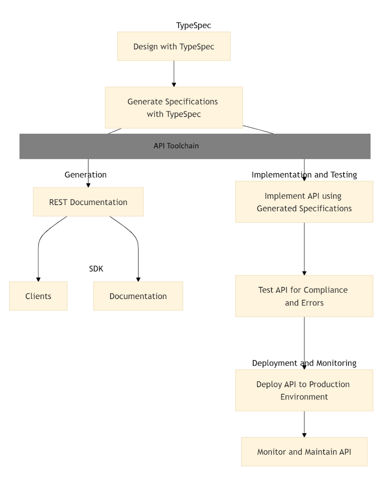

# What is TypeSpec?

[TypeSpec](https://typespec.io/) is a concise, human-readable **API-first** language designed to define and design APIs at scale. **API-first** means that the API is designed before any code is written, ensuring that the API meets the needs of its consumers. TypeSpec provides a structured approach to describe the shape and behavior of data and services, ensuring consistency and reducing errors in API development. For example, with TypeSpec, you can define an API for a pet store, generate OpenAPI specifications, API service code, reference documentation, and other artifacts from your API definitions, making it easier to build, maintain, and evolve your services.



Key benefits of TypeSpec:

- **Simple**: Easy to understand and author, making API design accessible to all team members.
- **Scalable**: Extensible to support teams working in parallel, ensuring efficient collaboration.
- **Intuitive**: Enables nonengineers to understand, review, and participate in API design.
- **Collaborative**: Facilitates cross-functional team involvement in the API design phase.
- **Consistent**: Reusable building blocks implement standards for all teams, ensuring uniformity.
- **Tooling**: Easy to install and get started. Integrates seamlessly with IDEs, informing downstream tooling such as autogenerated SDKs and reference documentation.
- **Faster**: Accelerates the API design review process, ensuring API correctness.
- **Focused**: Shifts work from API details to the overall API surface, enhancing productivity.

By adopting TypeSpec, you can streamline your API development process, improve collaboration across teams, and ensure high-quality, consistent APIs that integrate seamlessly with existing toolchains.

## API design is challenging

TypeSpec addresses common challenges in API design, governance, and implementation:

- **Complex Specifications**: Writing, reviewing, and maintaining API specifications can be cumbersome. Even a simple API can result in hundreds of lines of specification code.
- **Protocol Diversity**: Each protocol has its own specification format, with no shared design language across protocols. This fragmentation complicates the development process.
- **Governance Issues**: Without a unified design language, governing APIs becomes difficult, leading to inconsistencies in implementation and quality.
- **Scalability Concerns**: As the number of APIs or API versions increases, more engineering teams are required, which can lead to coordination challenges and inefficiencies.

By addressing these challenges, TypeSpec simplifies the API design process, ensures consistency across different protocols, and enhances overall governance and scalability.

## TypeSpec is an API design language 

TypeSpec is an API design language. Design your API with TypeSpec, then generate the protocol specification with the TypeSpec CLI. 

:::row:::
    :::column:::
        ```typespec
        @resource("pets")
        model Pet {
          @key("petId")
          id: int32;
        
          name: string;
          tag?: string;
        
          @minValue(0)
          @maxValue(20)
          age: int32;
        
          ownerId: int64;
        }
        ```
    :::column-end:::
    :::column:::
        ```
        /pets:
            post:
                ...
            get:
                ...
        /pets/{petId}:
            get:
                ...
            patch:
                ...
            delete:
                ...
        ```
    :::column-end:::
:::row-end:::

Write TypeSpec once, emit to multiple specification formats such as OpenAPI, JSON, or Protobuf. Separating the design language from the API specification allows TypeSpec to provide a single design to snap into the existing downstream protocols and tool chains. Downstream tools include REST service generation, SDK generation per programming language, reference documentation, and testing.

## Enforces governance with reuse and modular design 

TypeSpec allows you to transform API patterns into reusable elements, enhancing both the quality and uniformity of your API interface. By using reusable elements, you eliminate the need for multiple teams to define the same functionality, reducing duplication and ensuring consistency across your APIs.

Examples of reusable elements include:

- **Parameters**: Define common types, requirements, and validation rules to ensure consistent parameter usage across APIs.
- **Authentication**: Specify allowed authentication methods to standardize security practices.
- **Versioning**: Implement a common versioning paradigm to manage API versions effectively.
- **Responses**: Ensure consistent response shapes and requirements to provide a uniform experience for API consumers.
- **Error Handling**: Standardize error handling to consistently return information that helps resolve issues without exposing security or internal details.

For example, you can create a reusable library of common TypeSpec elements, such as types, decorators, emitters, and linters. This library can be shared across teams to maintain consistency and streamline the development process.

## Interoperability with industry toolchain

TypeSpec seamlessly integrates with existing industry toolchains, ensuring interoperability, and enhancing productivity. By generating OpenAPI specifications from TypeSpec definitions, developers can use a vast ecosystem of tools designed for OpenAPI, such as Swagger for API documentation, Postman for API testing, and AWS API Gateway for deploying APIs. This includes configuring API gateways, generating client and server code, and validating API data. This compatibility allows teams to maintain their current workflows while benefiting from the structured and consistent API design that TypeSpec provides.

## Great developer experience

Developer integrations include a [Visual Studio Code extension](https://marketplace.visualstudio.com/items?itemName=typespec.typespec-vscode) and [Visual Studio](https://marketplace.visualstudio.com/items?itemName=typespec.typespecvs). These integrations provide efficient and error-free coding with features like autocompletion, syntax highlighting, build-time error identification, symbol renaming, and document formatting. For example, when writing TypeSpec definitions in Visual Studio Code, the extension provides real-time autocompletion and syntax highlighting, making it easier to write correct and consistent API definitions.

Additionally, the [TypeSpec Playground](https://typespec.io/playground/) offers an interactive environment where developers can experiment with TypeSpec syntax and features in real-time. This web-based tool provides immediate feedback and validation, making it easier to learn and adopt TypeSpec. By offering a hands-on experience, the TypeSpec Playground enhances the developer's understanding and proficiency, ultimately leading to more consistent and high-quality API designs. These tools collectively improve the developer experience by streamlining the development process, reducing the likelihood of errors, and accelerating the learning curve for new team members.

## Real-World Use Cases

TypeSpec has been successfully used in various industries to streamline API design and development. Here are a few examples:

- **E-commerce**: An online retail platform used TypeSpec to design and document their API, enabling seamless integration with third-party services and improving the overall developer experience.
- **Finance**: A financial services company adopted TypeSpec to ensure consistency and compliance across their APIs, reducing the time and effort required for API governance.
- **Healthcare**: A healthcare provider leveraged TypeSpec to design APIs for patient data management, ensuring data consistency and security across their systems.

## Learn more

Enjoy these YouTube videos for a deeper dive on TypeSpec:

- [APIs at scale with TypeSpec](https://youtu.be/yfCYrKaojDo)
- [Schema-first API design using TypeSpec](https://www.youtube.com/watch?v=xDbC7Mhi9wM)
- [TypeSpec 101](https://www.youtube.com/playlist?list=PLYWCCsom5Txglkl_I1XvwzrzM5G3SuVsR)
- [Using TypeSpec for Open Finance Standards](https://www.youtube.com/watch?v=xDbC7Mhi9wM)

## Related content

- [TypeSpec.io](https://typespec.io/)
- [TypeSpec playground](https://typespec.io/playground/)
- [TypeSpec community](https://typespec.io/community/)