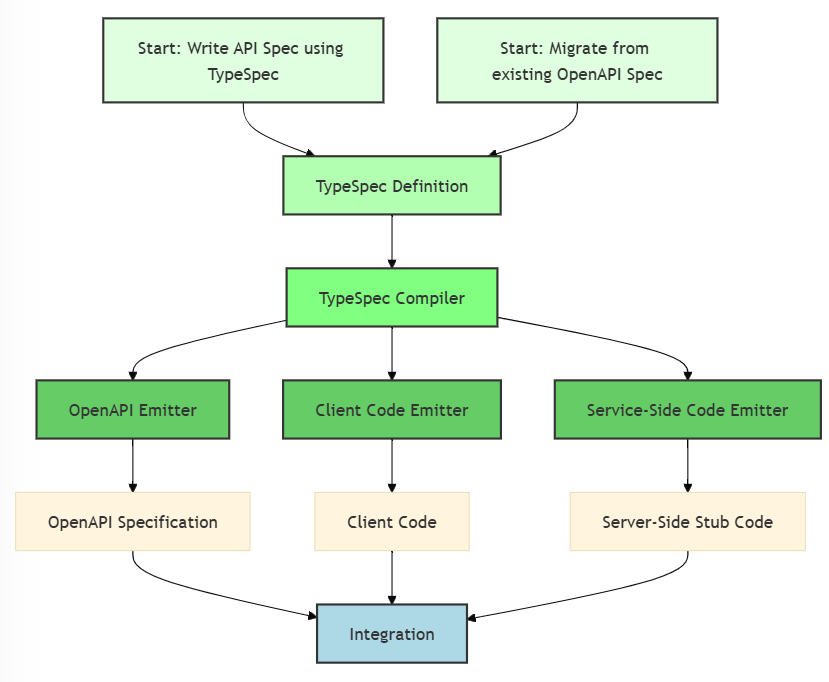

# What is TypeSpec?

[TypeSpec](https://typespec.io/) is a powerful and flexible language from Microsoft for describing APIs. It allows developers to define APIs in an extensible and easy-to-understand way. With TypeSpec, you can generate API specifications, client code, and server-side code directly from your API definition using a robust system of emitters.

A key strength of TypeSpec is that it enables the creation of modular, reusable components. This makes TypeSpec code more concise and ensures compliance with API guidelines. The standard TypeSpec library includes an OpenAPI emitter, ensuring compatibility with existing tools and workflows.

As an open source language, TypeSpec can describe any API, not just Azure APIs. This versatility makes it a valuable tool for API developers, architects, and managers who need to deliver high-quality APIs in a complex and evolving environment.

## Benefits of TypeSpec

* **Simplifies API Development**: Provides a clear and concise way to define APIs, allowing developers to focus on logic and functionality.
* **Ensures Compliance**: Uses reusable components to adhere to established guidelines and standards, reducing errors and inconsistencies.
* **Enhances Compatibility**: Includes an OpenAPI emitter for compatibility with existing tools and workflows, making integration easier.
* **Supports Extensibility**: Flexible and extensible, allowing customization and extension of API definitions for various scenarios.
* **Accelerates Migration**: [OpenApiMigration tool](https://typespec.io/docs/emitters/openapi3/cli/#converting-openapi-3-into-typespec) eases transition to TypeSpec for faster adoption.

As an [open-source project](https://github.com/microsoft/typespec/), TypeSpec benefits from community contributions and feedback, ensuring continuous improvement based on real-world use cases.

## API design is challenging

TypeSpec addresses common challenges in API design, governance, and implementation:

- **Complex Specifications**: Writing, reviewing, and maintaining API specifications can be cumbersome. Even a simple API can result in hundreds of lines of specification code.
- **Protocol Diversity**: Each protocol has its own specification format, with no shared design language across protocols. This fragmentation complicates the development process.
- **Governance Issues**: Without a unified design language, governing APIs becomes difficult, leading to inconsistencies in implementation and quality.
- **Scalability Concerns**: As the number of APIs or API versions increases, more engineering teams are required, which can lead to coordination challenges and inefficiencies.

By addressing these challenges, TypeSpec simplifies the API design process, ensures consistency across different protocols, and enhances overall governance and scalability.

## TypeSpec API development workflow

The following diagram illustrates the key stages involved in developing APIs with TypeSpec. The process starts with two options: creating a new API specification from scratch or migrating from an existing OpenAPI spec. Once you begin, the API is defined using TypeSpec, using its modular and reusable components. The TypeSpec compiler then processes these definitions, using a robust set of emitters to automatically generate API specifications, client code, and server-side stub code. Finally, the generated artifacts are integrated with existing toolchains, ensuring a smooth and consistent workflow.

**Workflow Steps**

| Step                     | Description                                                                                             |
|--------------------------|---------------------------------------------------------------------------------------------------------|
| **Start**                | Begin by writing a new API specification using TypeSpec or migrating from an existing OpenAPI spec.      |
| **TypeSpec Definition**  | Define the API using TypeSpec. Reusable components make the API concise and ensure compliance with guidelines. |
| **TypeSpec Compiler**    | The compiler processes the TypeSpec definitions to prepare them for code generation.                    |
| **Generation**           | Dedicated emitters automatically generate the API specification, client code, and server-side stub code. |
| **Integration**          | The generated outputs are seamlessly integrated into existing API toolchains.                           |

**Paths from the TypeSpec Compiler:**  
The TypeSpec compiler can generate outputs for OpenAPI specifications, client code, and server-side stub code concurrently if needed, while still allowing you to trigger each output independently based on your project requirements.

1. **Generate OpenAPI Specifications**  
   *The OpenAPI emitter produces a standardized API description format.*

2. **Generate Client-Side Code**  
   *The client code emitter creates code for consuming the API.*

3. **Generate Server-Side Stub Code**  
   *The service-side emitter generates server stub code to kickstart API implementation.*

## Service-Side code generation with TypeSpec

TypeSpec supports generating server-side stub code directly from TypeSpec definitions. This streamlines the development process and ensures consistency across client and server implementations.

Key capabilities:

* **Model Generation**: TypeSpec acts as the source of truth for APIs, making model generation from TypeSpec emitters straightforward. The C# prototype emitter uses a canonical service model, generating mapping code between versioned and canonical models.
* **Standard Runtime Interfaces**: The standard emitter focuses on generating runtime interfaces initially, ensuring flexibility and easy integration with various runtime stacks.
* **Custom Code Extensibility**: TypeSpec emitters offer custom code extensibility, allowing developers to tailor the generated code to specific needs, making it adaptable to different environments.
* **Comprehensive Code Generation**: TypeSpec supports code generation across the entire development stack, from clients to servers, including different protocols and asset types, ensuring a unified development approach.

By using TypeSpec’s service-side code generation capabilities, developers can reduce manual coding, improve consistency, and enhance overall productivity.

## Interoperability with industry toolchain

TypeSpec seamlessly integrates with existing industry toolchains, ensuring interoperability, and enhancing productivity. By generating OpenAPI specifications from TypeSpec definitions, developers can use a vast ecosystem of tools designed for OpenAPI, such as Swagger for API documentation, Postman for API testing, and Azure API Management for deploying APIs. This includes configuring API gateways, generating client and server code, and validating API data. This compatibility allows teams to maintain their current workflows while benefiting from the structured and consistent API design that TypeSpec provides.

## Great developer experience

Developer integrations include a [Visual Studio Code extension](https://marketplace.visualstudio.com/items?itemName=typespec.typespec-vscode) and [Visual Studio](https://marketplace.visualstudio.com/items?itemName=typespec.typespecvs). These integrations provide efficient and error-free coding with features like autocompletion, syntax highlighting, build-time error identification, symbol renaming, and document formatting. For example, when writing TypeSpec definitions in Visual Studio Code, the extension provides real-time autocompletion and syntax highlighting, making it easier to write correct and consistent API definitions.

:::image type="content" source="visual-studio-code-extension.gif" alt-text="Screenshot animation of Visual Studio Code extension for TypeSpec providing autocompletion and syntax highlighting.":::

Additionally, the [TypeSpec Playground](https://typespec.io/playground/) offers an interactive environment where developers can experiment with TypeSpec syntax and features in real-time. This web-based tool provides immediate feedback and validation, making it easier to learn and adopt TypeSpec. The interactive, hands-on experience provided by the TypeSpec Playground deepens developers' understanding and proficiency, ultimately resulting in more consistent, higher-quality API designs. These tools collectively improve the developer experience by streamlining the development process, reducing the likelihood of errors, and accelerating the learning curve for new team members.

:::image type="content" source="media/typespec-playground.png" alt-text="Screenshot of TypeSpec playground with sample HTTP service emitting to the Swagger UI.":::

To further support developers transitioning from existing APIs, the [OpenApiMigration tool](https://typespec.io/docs/emitters/openapi3/cli/#converting-openapi-3-into-typespec) provides an efficient way to convert OpenAPI specifications into TypeSpec definitions. This migration tool simplifies and accelerates the adoption of TypeSpec while preserving the integrity of your existing API documentation. Three migration examples include:

* [Convert component schemas into models](https://typespec.io/docs/emitters/openapi3/cli/#1-convert-component-schemas-into-models)
* [Convert component parameters into models or fields](https://typespec.io/docs/emitters/openapi3/cli/#2-convert-component-parameters-into-models-or-fields)
* [Convert path routes to operations](https://typespec.io/docs/emitters/openapi3/cli/#3-convert-path-routes-to-operations)

## Real-World uses

TypeSpec has been successfully used in various industries to streamline API design and development. Here are a few examples:

- **E-commerce**: An online retail platform used TypeSpec to design and document their API, enabling seamless integration with third-party services and improving the overall developer experience.
- **Finance**: A financial services company adopted TypeSpec to ensure consistency and compliance across their APIs, reducing the time and effort required for API governance.
- **Healthcare**: A healthcare provider used TypeSpec to design APIs for patient data management, ensuring data consistency and security across their systems.

## Learn more

Enjoy these YouTube videos for a deeper dive on TypeSpec:

- [APIs at scale with TypeSpec](https://youtu.be/yfCYrKaojDo)
- [Schema-first API design using TypeSpec](https://www.youtube.com/watch?v=xDbC7Mhi9wM)
- [TypeSpec 101](https://www.youtube.com/playlist?list=PLYWCCsom5Txglkl_I1XvwzrzM5G3SuVsR)
- [Using TypeSpec for Open Finance Standards](https://www.youtube.com/watch?v=xDbC7Mhi9wM)

## Related content

- [TypeSpec.io](https://typespec.io/)
- [TypeSpec Playground](https://typespec.io/playground/)
- [TypeSpec Community](https://typespec.io/community/)