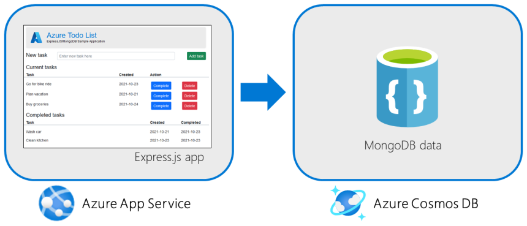

# Deploy a Node.js + MongoDB web app to Azure

In this tutorial, you'll learn how to deploy a basic **Express.js** app using a **MongoDB** database to Azure.  The Express.js app will be hosted in Azure App Service and the MongoDB database in Azure Cosmos DB, a cloud native database offering a [100% MongoDB compatible API](/azure/cosmos-db/mongodb/mongodb-introduction). Azure supports hosting Node.js apps on both Linux (Node versions 10, 12, and 14) and Windows (versions 10 and 12) server environments.



This article assumes you already are familiar with the [Node.js development workflow](/learn/paths/build-javascript-applications-nodejs/) and have Node and MongoDB installed locally.  You will also need an Azure account with an active subscription.  If you do not have an Azure account, you [can create one for free](https://azure.microsoft.com/free/nodejs/).

## Sample application

To follow along with this tutorial, clone or download the sample application from the repository [https://github.com/Azure-Samples/msdocs-nodejs-mongodb-azure-sample-app](https://github.com/Azure-Samples/msdocs-nodejs-mongodb-azure-sample-app).

```bash
git clone https://github.com/Azure-Samples/msdocs-nodejs-mongodb-azure-sample-app.git
```

To run the application locally:

* Run `npm install` to install the package dependencies.
* Run `npm start` to start the application.
* Browse to `http://localhost:3000` to view the app.

The application uses the [dotenv package](https://www.npmjs.com/package/dotenv) to read the connection string  from the `.env` file for local development. By default, the connection string is set to use the local MongoDB instance as a database.

## 1 - Create the Azure App Service

Azure App Service is used to host the Express.js web application code. Azure App service supports hosting JavaScript apps in both Linux and Windows server environments. When setting up the App Service for the application, you will configure two individual components:

* An **App Service plan** which defines the operating system and compute resources (CPU, memory) available for the application.
* An **App Service web app** which defines the application name and runtime used by the application.

All Azure resources must belong to a *resource group*, a logical container for grouping Azure resources. A standard practice is to create a resource group per application to hold all of the Azure resources needed for the app. When creating the App Service, you will also create a resource group for the app.

Azure resources can be created using the [Azure portal](https://portal.azure.com/), VS Code using the [Azure Tools extension pack](https://marketplace.visualstudio.com/items?itemName=ms-vscode.vscode-node-azure-pack), or the Azure CLI.

### [Azure portal](#tab/azure-portal)

Sign in to the [Azure portal](https://portal.azure.com/) and follow these steps to create your Azure App Service resources.

| Instructions    | Screenshot |
|:----------------|-----------:|
| [!INCLUDE [Create app service step 1](<./includes/create-app-service-azportal-1.md>)] | :::image type="content" source="./media/azportal-create-app-service-1-240px.png" alt-text="A screenshot showing how to use the search box in the top tool bar to find App Services in Azure." lightbox="./media/azportal-create-app-service-1.png"::: |
| [!INCLUDE [Create app service account step 2](<./includes/create-app-service-azportal-2.md>)] | :::image type="content" source="./media/azportal-create-app-service-2-240px.png" alt-text="A screenshot showing the create button on the App Services page used to create a new web app." lightbox="./media/azportal-create-app-service-2.png"::: |
| [!INCLUDE [Create app service account step 3](<./includes/create-app-service-azportal-3.md>)] | :::image type="content" source="./media/azportal-create-app-service-3-240px.png" alt-text="A screenshot showing the form to fill out to create a web app in Azure." lightbox="./media/azportal-create-app-service-3.png"::: |
| [!INCLUDE [Create app service step 4](<./includes/create-app-service-azportal-4.md>)] | :::image type="content" source="./media/azportal-create-app-service-4-240px.png" alt-text="A screenshot of the Spec Picker dialog that allows you to select the App Service plan to use for your web app." lightbox="./media/azportal-create-app-service-4.png"::: |
| [!INCLUDE [Create app service step 4](<./includes/create-app-service-azportal-5.md>)] | :::image type="content" source="./media/azportal-create-app-service-5-240px.png" alt-text="A screenshot of the main web app create page showing the button to select on to create your web app in Azure." lightbox="./media/azportal-create-app-service-5.png"::: |

### [VS Code](#tab/vscode-aztools)

To create Azure resources in VS Code, you must have the [Azure Tools extension pack](https://marketplace.visualstudio.com/items?itemName=ms-vscode.vscode-node-azure-pack) installed and be signed into Azure from VS Code.

| Instructions    | Screenshot |
|:----------------|-----------:|
| [!INCLUDE [Create app service step 1](<./includes/create-app-service-vscode-1.md>)] | :::image type="content" source="./media/vscode-create-app-service-1-240px.png" alt-text="A screenshot showing the location of the Azure Tools icon in the left toolbar." lightbox="./media/vscode-create-app-service-1.png"::: |
| [!INCLUDE [Create app service step 2](<./includes/create-app-service-vscode-2.md>)] | :::image type="content" source="./media/vscode-create-app-service-2-240px.png" alt-text="A screenshot showing the App Service section of Azure Tools and the icon to select on to create a new web app." lightbox="./media/vscode-create-app-service-2.png"::: |
| [!INCLUDE [Create app service step 3](<./includes/create-app-service-vscode-3.md>)] | :::image type="content" source="./media/vscode-create-app-service-3-240px.png" alt-text="A screenshot showing the dialog box used to select the subscription for the new App Service in Azure." lightbox="./media/vscode-create-app-service-3.png"::: |
| [!INCLUDE [Create app service step 4](<./includes/create-app-service-vscode-4.md>)] | :::image type="content" source="./media/vscode-create-app-service-4-240px.png" alt-text="A screenshot of dialog box used to enter the name of the new web app in Visual Studio Code." lightbox="./media/vscode-create-app-service-4.png"::: |
| [!INCLUDE [Create app service step 5](<./includes/create-app-service-vscode-5.md>)] | :::image type="content" source="./media/vscode-create-app-service-5-240px.png" alt-text="A screenshot of the dialog box in VS Code used to select the runtime for the new web app." lightbox="./media/vscode-create-app-service-5.png"::: |
| [!INCLUDE [Create app service step 6](<./includes/create-app-service-vscode-6.md>)] | :::image type="content" source="./media/vscode-create-app-service-6-240px.png" alt-text="A screenshot of the dialog in VS Code used to select the App Service plan for the new web app." lightbox="./media/vscode-create-app-service-5.png"::: |

### [Azure CLI](#tab/azure-cli)

Azure CLI commands can be run in the [Azure Cloud Shell](https://shell.azure.com) or on a workstation with the [Azure CLI installed](/cli/azure/install-azure-cli). You can view or the [complete Azure CLI script for creating Azure resources](https://github.com/Azure-Samples/msdocs-nodejs-mongodb-azure-sample-app/blob/main/scripts/create-nodejs-mongodb-resources.sh) in the GitHub repository for this tutorial.

First, create a resource group to act as a container for all of the Azure resources related to this application.

```azurecli
LOCATION='eastus'                          # Use 'az account list-locations --output table' to list locations
RESOURCE_GROUP_NAME='msdocs-expressjs-mondgodb-quickstart'

# Create a resource group
az group create \
    --location $LOCATION \
    --name $RESOURCE_GROUP_NAME
```

Next, create an App Service plan using the [az appservice plan create](/cli/azure/appservice/plan#az_appservice_plan_create) command.

* The `--sku` parameter defines the size (CPU, memory) and cost of the app service plan.  This example uses the F1 (Free) service plan.  For a full list of App Service plans, view the [App Service pricing](https://azure.microsoft.com/pricing/details/app-service/windows/) page.
* The `--is-linux` flag selects the Linux as the host operating system.  To use Windows, remove this flag from the command.

```azurecli
APP_SERVICE_PLAN_NAME='msdocs-expressjs-mongodb-plan-123'    

az appservice plan create \
    --name $APP_SERVICE_PLAN_NAME \
    --resource-group $RESOURCE_GROUP_NAME \
    --sku B1 \
    --is-linux
```

Finally, create the App Service web app using the [az webapp create]() command.  

* The *app service name* is used as both the name of the resource in Azure and to form the fully qualified domain name for your app in the form of `https://<app service name>.azurewebsites.com`.
* The runtime specifies what version of Node your app is running. This example uses Node 12 LTS. To list all available runtimes, use the command `az webapp list-runtimes --linux --output table` for Linux and `az webapp list-runtimes --output table` for Windows.

```azurecli
APP_SERVICE_NAME='msdocs-expressjs-mongodb-123'     # Change 123 to any three characters to form a unique name across Azure

az webapp create \
    --name $APP_SERVICE_NAME \
    --runtime 'NODE|14-lts'
    --plan $APP_SERVICE_PLAN_NAME
    --resource-group $RESOURCE_GROUP_NAME 
```

---

## 2 - Create an Azure Cosmos DB in MongoDB compatibility mode

Azure Cosmos DB is a fully managed NoSQL database for modern app development. Among its features is a 100% MongoDB compatible API allowing you to use your existing MongoDB tools, packages, and applications with Cosmos DB.

### [Azure portal](#tab/azure-portal)

You must be signed in to the [Azure portal](https://portal.azure.com/) to complete these steps to create a Cosmos DB.

| Instructions    | Screenshot |
|:----------------|-----------:|
| [!INCLUDE [Create Cosmos DB step 1](<./includes/create-cosmos-db-azportal-1.md>)] | :::image type="content" source="./media/azportal-create-cosmosdb-1-240px.png" alt-text="A screenshot showing how to use the search box in the top tool bar to find Cosmos DB in Azure." lightbox="./media/azportal-create-cosmosdb-1.png"::: |
| [!INCLUDE [Create Cosmos DB step 2](<./includes/create-cosmos-db-azportal-2.md>)] | :::image type="content" source="./media/azportal-create-cosmosdb-2-240px.png" alt-text="A screenshot showing the create button on the Cosmos DB page used to create a database." lightbox="./media/azportal-create-cosmosdb-2.png"::: |
| [!INCLUDE [Create Cosmos DB step 3](<./includes/create-cosmos-db-azportal-3.md>)] | :::image type="content" source="./media/azportal-create-cosmosdb-3-240px.png" alt-text="A screenshot showing the page where you select the MongoDB API for your Cosmos DB." lightbox="./media/azportal-create-cosmosdb-3.png"::: |
| [!INCLUDE [Create Cosmos DB step 4](<./includes/create-cosmos-db-azportal-4.md>)] | :::image type="content" source="./media/azportal-create-cosmosdb-4-240px.png" alt-text="A screenshot showing how to fill out the page to create a new Cosmos DB." lightbox="./media/azportal-create-cosmosdb-4.png"::: |

### [VS Code](#tab/vscode-aztools)

| Instructions    | Screenshot |
|:----------------|-----------:|
| [!INCLUDE [Create Cosmos DB step 1](<./includes/create-cosmos-db-vscode-1.md>)] | :::image type="content" source="./media/vscode-create-cosmos-db-1-240px.png" alt-text="A screenshot showing the databases component of the Azure Tools VS Code extension and the location of the button to create a new database." lightbox="./media/vscode-create-cosmos-db-1.png"::: |
| [!INCLUDE [Create Cosmos DB step 2](<./includes/create-cosmos-db-vscode-2.md>)] | :::image type="content" source="./media/vscode-create-cosmos-db-2-240px.png" alt-text="A screenshot showing the dialog box used to select the subscription for the new database in Azure." lightbox="./media/vscode-create-cosmos-db-2.png"::: |
| [!INCLUDE [Create Cosmos DB step 3](<./includes/create-cosmos-db-vscode-3.md>)] | :::image type="content" source="./media/vscode-create-cosmos-db-3-240px.png" alt-text="A screenshot showing the dialog box used to select the type of database you want to create in Azure." lightbox="./media/vscode-create-cosmos-db-3.png"::: |
| [!INCLUDE [Create Cosmos DB step 4](<./includes/create-cosmos-db-vscode-4.md>)] | :::image type="content" source="./media/vscode-create-cosmos-db-4-240px.png" alt-text="A screenshot of dialog box used to enter the name of the new database in Visual Studio Code." lightbox="./media/vscode-create-cosmos-db-4.png"::: |
| [!INCLUDE [Create Cosmos DB step 5](<./includes/create-cosmos-db-vscode-5.md>)] | :::image type="content" source="./media/vscode-create-cosmos-db-5-240px.png" alt-text="A screenshot of the dialog to select the throughput mode of the database." lightbox="./media/vscode-create-cosmos-db-5.png"::: |
| [!INCLUDE [Create Cosmos DB step 6](<./includes/create-cosmos-db-vscode-6.md>)] | :::image type="content" source="./media/vscode-create-cosmos-db-6-240px.png" alt-text="A screenshot of the dialog in VS Code used to select resource group to put the new database in." lightbox="./media/vscode-create-cosmos-db-6.png"::: |
| [!INCLUDE [Create Cosmos DB step 7](<./includes/create-cosmos-db-vscode-7.md>)] | :::image type="content" source="./media/vscode-create-cosmos-db-7-240px.png" alt-text="A screenshot of the dialog in VS Code used to select location for the new database." lightbox="./media/vscode-create-cosmos-db-7.png"::: |

### [Azure CLI](#tab/azure-cli)

A new Azure Cosmos DB account is created by using the [az cosmosdb create](/cli/azure/cosmosdbaz_cosmosdb_create) command.

* The name of the Cosmos DB account must be unique across Azure. The name can only contain lowercase letters, numbers, and the hyphen (-) character and must be between 3 and 50 characters long.
* The `--kind MongoDB` flag tells Azure to create a Cosmos DB that is compatible with the MongoDB API.  This flag must be included for your Cosmos DB to work as a MongoDB database.

```azurecli
COSMOS_DB_NAME='msdocs-expressjs-mongodb-database-123'   # Replace 123 with any three characters to form a unique name

az cosmosdb create \
    --name $COSMOS_DB_NAME \
    --resource-group $RESOURCE_GROUP_NAME \
    --kind MongoDB
```

Creating a new Azure Cosmos DB typically takes about 5 minutes.

---

## 3 - Connect your App Service to your Cosmos DB

To connect to your Cosmos DB database, you need to provide the connection string for the database to your application. This is done in the sample application by reading the `DATABASE_URL` environment variable. When running locally, the sample application uses the [dotenv package](https://www.npmjs.com/package/dotenv) to read the connection string value from the `.env` file.

When running in Azure, configuration values like connection strings can be stored in the *application settings* for an App Service. These values are then made available to your application as environment variables. In this way, the application accesses the connection string from `process.env` the same way whether being run locally or in Azure. Further, this eliminates the need to manage and deploy environment specific config files with your application.

### [Azure portal](#tab/azure-portal)

| Instructions    | Screenshot |
|:----------------|-----------:|
| [!INCLUDE [Connection string step 1](<./includes/connection-string-azportal-1.md>)] | :::image type="content" source="./media/azportal-connection-string-1-240px.png" alt-text="A screenshot showing the location of the Cosmos DB connection string on the Cosmos DB quick start page." lightbox="./media/azportal-connection-string-1.png"::: |
| [!INCLUDE [Connection string step 2](<./includes/connection-string-azportal-2.md>)] | :::image type="content" source="./media/azportal-connection-string-2-240px.png" alt-text="A screenshot showing how to search for and navigate to the App Service where the connection string needs to store the connection string." lightbox="./media/azportal-connection-string-2.png"::: |
| [!INCLUDE [Connection string step 3](<./includes/connection-string-azportal-3.md>)] | :::image type="content" source="./media/azportal-connection-string-3-240px.png" alt-text="A screenshot showing how to access the Application settings within an App Service." lightbox="./media/azportal-connection-string-3.png"::: |
| [!INCLUDE [Connection string step 4](<./includes/connection-string-azportal-4.md>)] | :::image type="content" source="./media/azportal-connection-string-4-240px.png" alt-text="A screenshot showing the dialog used to set an application setting in Azure App Service." lightbox="./media/azportal-connection-string-4.png"::: |

### [VS Code](#tab/vscode-aztools)

| Instructions    | Screenshot |
|:----------------|-----------:|
| [!INCLUDE [Connection string step 1](<./includes/connection-string-vscode-1.md>)] | :::image type="content" source="./media/vscode-connection-string-1-240px.png" alt-text="A screenshot showing how to copy the connection string for a Cosmos database to your clipboard in VS Code." lightbox="./media/vscode-connection-string-1.png"::: |
| [!INCLUDE [Connection string step 2](<./includes/connection-string-vscode-2.md>)] | :::image type="content" source="./media/vscode-connection-string-2-240px.png" alt-text="A screenshot showing how add a config setting to an App Service in VS Code." lightbox="./media/vscode-connection-string-2.png"::: |
| [!INCLUDE [Connection string step 3](<./includes/connection-string-vscode-3.md>)] | :::image type="content" source="./media/vscode-connection-string-3-240px.png" alt-text="A screenshot showing the dialog box used to give a name to an app setting in VS Code." lightbox="./media/vscode-connection-string-3.png"::: |
| [!INCLUDE [Connection string step 4](<./includes/connection-string-vscode-4.md>)] | :::image type="content" source="./media/vscode-connection-string-4-240px.png" alt-text="A screenshot showing the dialog used to set the value of an app setting in VS Code." lightbox="./media/vscode-connection-string-4.png"::: |
| [!INCLUDE [Connection string step 4](<./includes/connection-string-vscode-5.md>)] | :::image type="content" source="./media/vscode-connection-string-5-240px.png" alt-text="A screenshot showing how to view an app setting for an App Service in VS Code." lightbox="./media/vscode-connection-string-5.png"::: |

### [Azure CLI](#tab/azure-cli)

To get the connection string for a Cosmos DB database, use the [az cosmos keys list](/cli/azure/cosmosdb/keys) command.

```azurecli
az cosmosdb keys list \
    --type connection-strings \
    --resource-group $RESOURCE_GROUP_NAME \
    --name $COSMOS_DB_NAME \
    --query "connectionStrings[?description=='Primary MongoDB Connection String'].connectionString" \
    --output tsv
```

Rather then copying and pasting the value, the connection string can be stored in a variable to make subsequent steps easier.

```azurecli
COSMOS_DB_CONNECTION_STRING=`az cosmosdb keys list \
    --type connection-strings \
    --resource-group $RESOURCE_GROUP_NAME \
    --name $COSMOS_DB_NAME \
    --query "connectionStrings[?description=='Primary MongoDB Connection String'].connectionString" \
    --output tsv`
```

The [az webapp config appsettings](/cli/azure/webapp/config/appsettings) command is used to set application setting values for an App Service web app.  One or more key-value pairs are set using the `--settings` parameter. To set the `DATABASE_URL` value to the connection string for your web app, use the following command.

```azurecli
az webapp config appsettings set \
    --name $APP_SERVICE_NAME \
    --resource-group $RESOURCE_GROUP_NAME \
    --settings DATABASE_URL=$COSMOS_DB_CONNECTION_STRING
```

---

## 4 - Deploy application code to Azure

Azure App service supports multiple different methods to deploy your application code to Azure including support for GitHub Actions and all major CI/CD tools. This article focuses on how to deploy your code from your local workstation to Azure.

### [Deploy using VS Code](#tab/vscode-deploy)

To deploy your application code directly from VS Code, you must have the [Azure Tools extension pack](https://marketplace.visualstudio.com/items?itemName=ms-vscode.vscode-node-azure-pack) installed and be signed into Azure from VS Code.

| Instructions    | Screenshot |
|:----------------|-----------:|
| [!INCLUDE [Deploy from VS Code 1](<./includes/deploy-from-vscode-1.md>)] | :::image type="content" source="./media/deploy-from-vscode-1-240px.png" alt-text="A screenshot showing the location of the Azure Tool icon in Visual Studio Code." lightbox="./media/deploy-from-vscode-1.png"::: |
| [!INCLUDE [Deploy from VS Code 2](<./includes/deploy-from-vscode-2.md>)] | :::image type="content" source="./media/deploy-from-vscode-2-240px.png" alt-text="A screenshot showing how you deploy an application to Azure by right-clicking on a web app in VS Code and selecting deploy from the context menu." lightbox="./media/deploy-from-vscode-2.png"::: |
| [!INCLUDE [Deploy from VS Code 3](<./includes/deploy-from-vscode-3.md>)] | :::image type="content" source="./media/deploy-from-vscode-3-240px.png" alt-text="A screenshot showing the Output window of VS Code while deploying an application to Azure." lightbox="./media/deploy-from-vscode-3.png"::: |

### [Deploy using Local Git](#tab/local-git-deploy)

[!INCLUDE [Deploy using Local Git](<./includes/deploy-local-git.md>)]

### [Deploy using FTPS](#tab/ftps-deploy)

[!INCLUDE [Deploy FTPS](<./includes/deploy-ftps.md>)]

### [Deploy using a ZIP file](#tab/azure-cli-deploy)

[!INCLUDE [Deploy ZIP](<./includes/deploy-zip-file.md>)]

---

## 5 - Browse to the application

The application will have a url of the form `https://<app name>.azurewebsites.net`. Browse the this URL to view the application.

Use the form elements in the application to add and complete tasks.


## 6 - Configure and view application logs

Azure App Service captures all messages logged to the console to assist you in diagnosing issues with your application. The sample app outputs console log messages in each of its endpoints to demonstrate this capability.  For example, the `get` endpoint outputs a message about the number of tasks retrieved from the database and an error message if something goes wrong.

:::code language="javascript" source="~/../msdocs-nodejs-mongodb-azure-sample-app/src/routes/index.js" range="7-21" highlight="8,12":::

The contents of the App Service diagnostic logs can be reviewed in the Azure portal, VS Code or using the Azure CLI.

### [Azure portal](#tab/azure-portal)

| Instructions    | Screenshot |
|:----------------|-----------:|
| [!INCLUDE [Stream logs from Azure Portal 1](<./includes/azportal-stream-logs-1.md>)] | :::image type="content" source="./media/azportal-stream-logs-1-240px.png" alt-text="A screenshot showing the location of the Azure Tool icon in Visual Studio Code." lightbox="./media/azportal-stream-logs-1.png"::: |
| [!INCLUDE [Stream logs from Azure Portal 2](<./includes/azportal-stream-logs-2.md>)] | :::image type="content" source="./media/azportal-stream-logs-2-240px.png" alt-text="A screenshot showing how you deploy an application to Azure by right-clicking on a web app in VS Code and selecting deploy from the context menu." lightbox="./media/azportal-stream-logs-2.png"::: |

### [VS Code](#tab/vscode-aztools)

| Instructions    | Screenshot |
|:----------------|-----------:|
| [!INCLUDE [Stream logs from VS Code 1](<./includes/vscode-stream-logs-1.md>)] | :::image type="content" source="./media/vscode-stream-logs-1-240px.png" alt-text="A screenshot showing the location of the Azure Tool icon in Visual Studio Code." lightbox="./media/vscode-stream-logs-1.png"::: |
| [!INCLUDE [Stream logs from VS Code 2](<./includes/vscode-stream-logs-2.md>)] | :::image type="content" source="./media/vscode-stream-logs-2-240px.png" alt-text="A screenshot showing how you deploy an application to Azure by right-clicking on a web app in VS Code and selecting deploy from the context menu." lightbox="./media/vscode-stream-logs-2.png"::: |

### [Azure CLI](#tab/azure-cli)

First, you need to configure Azure App Serivce to output logs to the App Service filesystem using the [az webapp log config](/cli/azure/webapp/log#az_webapp_log_config) command.

```azurecli
az webapp log config \
    --web-server-logging 'filesystem' \
    --name $APP_SERVICE_NAME \
    --resource-group $RESOURCE_GROUP_NAME
```

The, to stream logs, use the [az webapp log tail](/cli/azure/webapp/log#az_webapp_log_tail) command.

```azurecli
az webapp log tail \
    --name $APP_SERVICE_NAME \
    --resource-group $RESOURCE_GROUP_NAME
```

Refresh the home page in the app or attempt other requests to generate some log messages. The output should look similar to the following.

```Console
2021-10-26T20:12:01.825485319Z npm start
2021-10-26T20:12:04.478474807Z npm info it worked if it ends with ok
2021-10-26T20:12:04.496736134Z npm info using npm@6.14.10
2021-10-26T20:12:04.497958909Z npm info using node@v14.15.1
2021-10-26T20:12:05.874225522Z npm info lifecycle todolist@0.0.0~prestart: todolist@0.0.0
2021-10-26T20:12:05.891572192Z npm info lifecycle todolist@0.0.0~start: todolist@0.0.0
2021-10-26T20:12:05.941127150Z
2021-10-26T20:12:05.941161452Z > todolist@0.0.0 start /home/site/wwwroot
2021-10-26T20:12:05.941168852Z > node ./bin/www
2021-10-26T20:12:05.941173652Z
2021-10-26T20:12:16.234642191Z Mongoose connection open to database
2021-10-26T20:12:19.360371481Z GET /robots933456.txt 404 2144.146 ms - 1497

2021-10-26T20:12:38.419182028Z Total tasks: 6   Current tasks: 3    Completed tasks:  3
2021-10-26T20:12:38.799957538Z GET / 304 500.485 ms - -
2021-10-26T20:12:38.900597945Z GET /stylesheets/style.css 304 2.574 ms - -
2021-10-26T20:12:38.900637447Z GET /css/bootstrap.css 304 12.300 ms - -
2021-10-26T20:12:38.903103684Z GET /images/Azure-A-48px-product.svg 304 8.896 ms - -
2021-10-26T20:12:38.904441659Z GET /js/bootstrap.min.js 304 9.372 ms - -
```

---

## 7 - Inspect deployed files using Kudu

[Kudu](/azure/app-service/resources-kudu) is the engine behind many of the automated deployment features in App Service. In addition, it provides a useful web-based console to view your deployed application in Azure.

To access Kudu, navigate to one of the following URLs. You will need to sign into the Kudu site with your Azure credentials.

* For apps deployed in Free, Shared, Basic, Standard and Premium App Service plans - `https://<app-name>.scm.azurewebsites.net`
* For apps deployed in Isolated service plans - `https://<app-name>.scm.<ase-name>.p.azurewebsites.net`

From the main page in Kudu, you can access information about the application hosting environment, app settings, deployments and browse the files in the wwwroot directory.


Selecting the *Deployments* link under the REST API header will show you a history of deployments of your web app.


Selecting the *Site wwwroot* link under the Browse Directory heading allows you to browse and view the files on the web server. This is useful when troubleshooting deployment problems and you need to see exactly what files are deployed on the server.


## Clean up resources

### [Azure portal](#tab/azure-portal)

### [VS Code](#tab/vscode-aztools)

### [Azure CLI](#tab/azure-cli)

---

## Next steps

* Managed identity
* Performance monitoring
* User authentication
* CI/CD Setup
