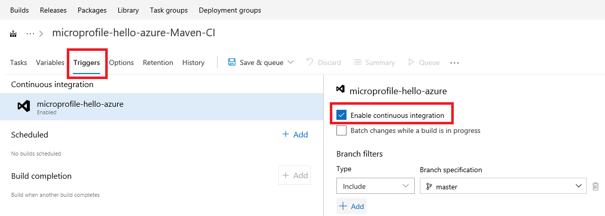
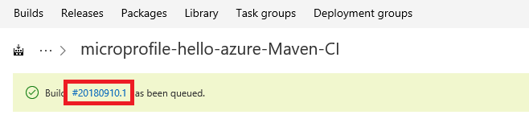
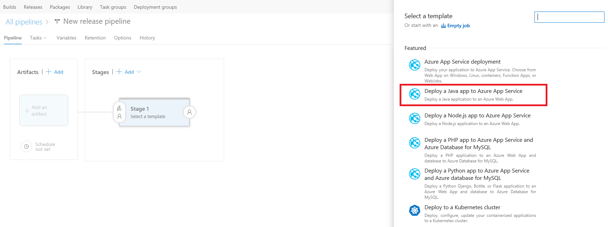
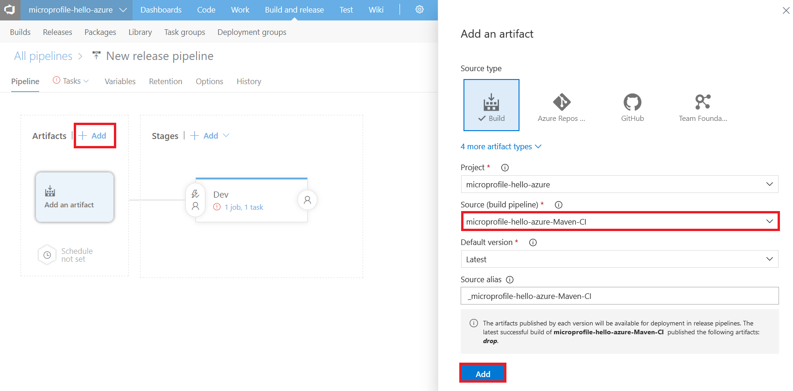
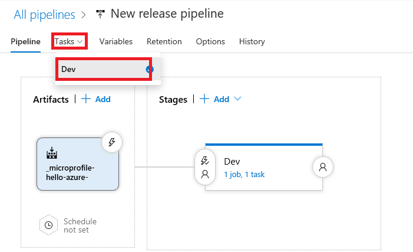

# CI/CD for MicroProfile applications using Azure DevOps

This tutorial will show how Java EE developers can easily setup a CI/CD release cycle to deploy their [MicroProfile](http://microprofile.io) applications to an Azure Web App for Containers using Azure DevOps (formally known as VSTS).  In this example, we’ll be using a MicroProfile application that uses a [Payara Micro](https://www.payara.fish/payara_micro) as a base image.   

```Dockerfile
FROM payara/micro:5.182
COPY target/*.war $DEPLOY_DIR/ROOT.war
EXPOSE 8080
```
We will start the Azure DevOps containerize process by building a Docker image and pushing the container image to an Azure Container Register.  Then complete with a Azure DevOps release pipeline to deploy the container image to a Web App.

## Prerequisites
- Copy and save the Git url from [Github](https://github.com/Azure-Samples/microprofile-hello-azure)
- Register or Log into your [Azure DevOps](https://dev.azure.com) account
- Create a new [Azure DevOps project](https://docs.microsoft.com/en-us/vsts/organizations/projects/create-project?view=vsts&tabs=new-nav) and use the above Git url to **import a repository**
- Create an [Azure Container Registry](https://azure.microsoft.com/en-us/services/container-registry) (ACR)
- Create an Azure Web App for Container
  > [!NOTE]
  >
  > Select "Quickstart" in the Container Settings when provisioning the Web App instance


## Create a Build definition

The build definition in Azure DevOps automatically executes all the tasks in the build each time there’s a commit in Java EE application source application.  In this example, Azure DevOps will use Maven to build the Java MicroProfile project.

1. Click on the "Build and Release" tab on top your Azure DevOps project page.  Then, select the **Builds** link 


2. Click on the **New Pipeline** button, and then **Continue** to start defining your build tasks
3. Select "Maven" from the list of templates, then click on the **Apply** button to build your Java project
4. Use the drop-down menu for the Agent pool field to select **Hosted Linux Preview** option.
   > [!NOTE]
   >
   > This informs Azure DevOps which build server to use.  You can use your private customized build server

5. To configure your build for continuous integration, select the **Triggers** tab and check the **Enable continuous integration** checkbox.  

 

6. Select the <strong>Tasks</strong> tab to return back to the main build pipeline page
7. Use the <strong>Save &amp; queue</strong> drop-down menu to select the <strong>Save</strong> option


## Create a Docker Build Image

In this task, Azure DevOps uses a Dockerfile with a base image from Payara Micro to create a Docker image.  

1. Select the **Tasks** tab to return back to the main build pipeline page
2. Click on the **+** icon to add new task to the build definition


3. Select &quot;Docker&quot; from the list of templates, then click on the <strong>Add</strong> button
4. Enter a description name for the <strong>Display name</strong> field
5. Verify that <strong>Azure Container Registry</strong> is selected in the drop-down menu for <strong>Container registry type</strong>.
&gt; [!NOTE]
&gt;
&gt;  If you are using Docker Hub or another registry, select &quot;Container Registry&quot; instead.  Then click on the &quot;+ New&quot; button to provide the credentials and connection information for it. Then skip to the Commands section to continue.

6. Use the **Azure subscription** drop-down menu to select your azure subscription ID.  Then click on the **Authorize** button
7. In the **Azure container registry** drop-down menu, select registry name you created in Azure.
8. Verify that **build** option is selected in the **Command** drop-down menu.
9. For the **Dockerfile**, click on the path navigation icon next to the textbox to select the Dockerfile from the github project.  Then click the **OK** button.


10. Under the **Image name**, check the **Include latest tag** checkbox. 
11. Use the **Save & queue** drop-down menu to select the **Save** option.

## Push Docker Image to ACR

In this task, Azure DevOps will push the docker image to your Azure Container Registry.  This will be used to run the MicroProfile API application as a containerized Java web app.

1. Since we are using Docker in Azure DevOps, create a new Docker template by repeating steps 1 - 7 above in the **Create a Docker Build Image** section.
2. Select **push** in the **Command** drop-down menu.
3. Click on the **Save & queue** tab, then select **Save & queue** option.
4. Verify that the **Hosted Linux Preview** is select for the Agent pool on the pop-up window.  Then click on the **Save & queue** button.
5. Click on the build number to verify that the build pipeline for the Java project completed successfully.




## Create a release definition for a Java app

The release pipeline in Azure DevOps automatically triggers the deployment of build artifacts to a target environment like Azure as soon as the Build process completes successfully.   The release pipeline can be created for dev, test, staging or production environments.

1. Click on the "Build and release" tab on top your Azure DevOps project page.  Then, select the **Releases** link.


2. Click on the &quot;New pipeline** button
3. Select the <strong>Deploy a Java app to Azure App Service</strong> in the list of templates, then click on the <strong>Apply</strong> button.



4. Set a <strong>Stage name</strong> (e.g Dev, Test, Staging or Production).  Then click on the <strong>X</strong> button to close the pop-up window
5. Click on the <strong>+ Add</strong> button in the Artifacts section.  This will link artifacts from the build definition to this release definition.<br/>6. Use the drop-down menu for the <strong>Source (build pipeline)</strong> to select your build definition. Then click the <strong>Add</strong> button to continue.



7. Click on the <strong>Tasks</strong> tab on the pipeline.  Then, select your stage name.



8. Use the **Azure subscription** drop-down menu to select your azure subscription ID.
9. Select **Linux App** from the **App type** drop-down menu
10. Select the name of the Web App for Container instance you created above in the **App service name** drop-down menu
11. Enter the name of your azure container registry in the **Registry or Namespaces** field.  E.g **myregistry.azure.io**
12. Enter the registry name in the **Repository** field
13. Click on **Deploy Azure App Service**.  Enter the tag for the container image in the **Tag** textbox 
14. Click on **Run on agent**.  Select **Hosted Linux Preview** in the Agent pool drop-down menu 

## Setup Environment Variables

1. Click on the **Variables** tab.  Then click on the **+ Add** button to define your environment variables
2. Add the variable name and values for your container registry url, username and password.   For security, click on the lock icon to keep the password value hidden.

For example:
- registry.password
- registry.url
- registry.username


3. Click on the **Tasks** tab to return to the main release pipeline definition page
4. Click on **Deploy Azure App Service**. 
5. Expand the **Application and Configuration Settings** section, then click on the navigation path for the **App Settings** field to add environments variable to connect to the container registry during deployment.
6. Click on the ** + Add** button to define the following app settings and assign the environment variables
7. DOCKER_REGISTRY_SERVER_PASSWORD = $(registry.password)
8. DOCKER_REGISTRY_SERVER_URL = $(registry.url)
9. DOCKER_REGISTRY_SERVER_USERNAME = $(registry.username)


7. Click on the <strong>OK</strong> button to continue

## Setup Continious Deployment & Deploy Java Application

1. To enable continuous deployment, click the **Pipelines** tab
2. In the Artifacts section, click on the lightening icon.  Then set the **Continuous deployment trigger** to Enabled.


3. Click on the <strong>Save</strong> button, then the <strong>OK</strong> button 
4. Click on the <strong>+ Release</strong> drop-down menu, then select <strong>Create a release</strong> link
5. Use the <strong>Stages for a trigger change from automated to manual</strong> drop-down menu to select the checkbox for your stage name
6. Click the <strong>Create</strong> button to continue
7. Click on the release number.  Then hover your mouse cursor over the stage name and click on the <strong>Deploy</strong> button
8. The click on the <strong>Deploy</strong> button on the pop-up window to start the deployment process to Azure


## Test the Java Web Application
1. Run the web app url in web browser:  
   https://{your-app-service-name}.azurewebsites.net/api/hello


2. The web page should say **Hello Azure!**


