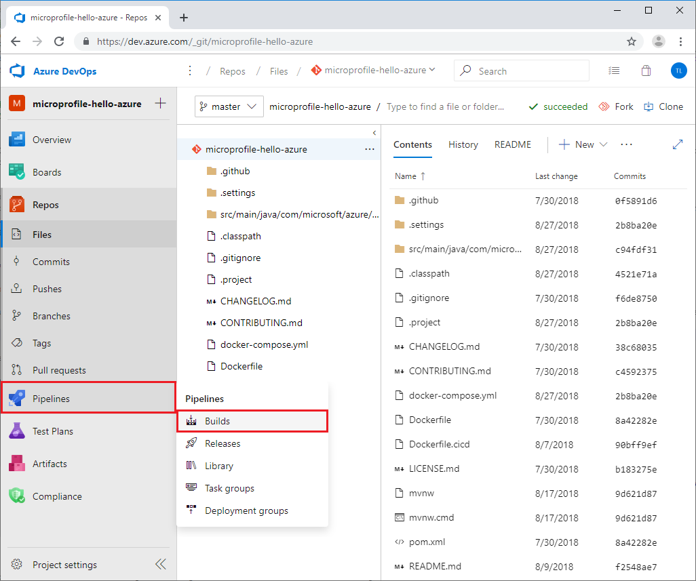
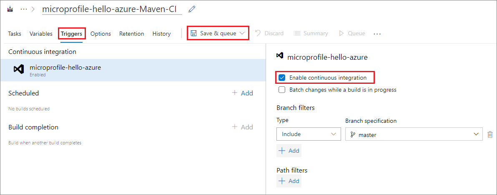
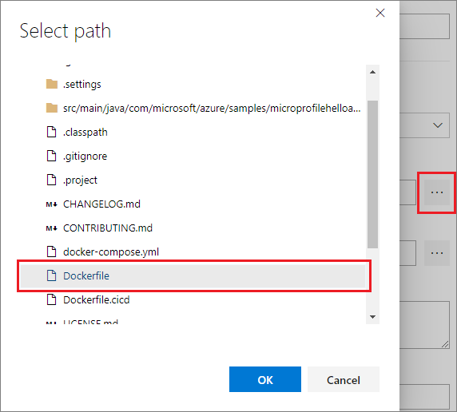
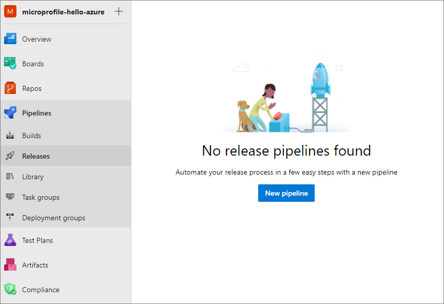
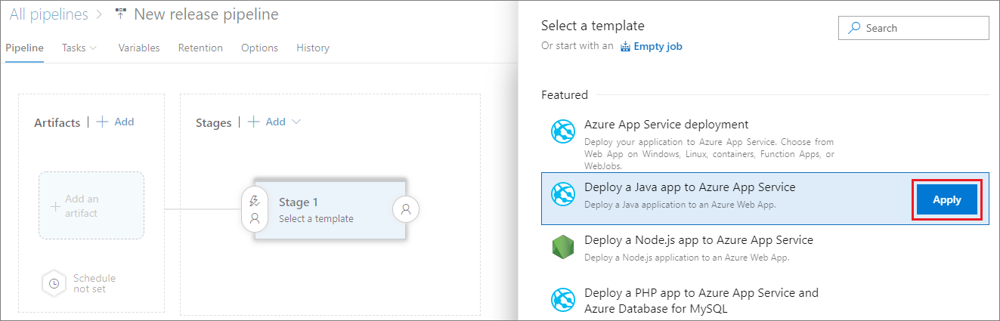
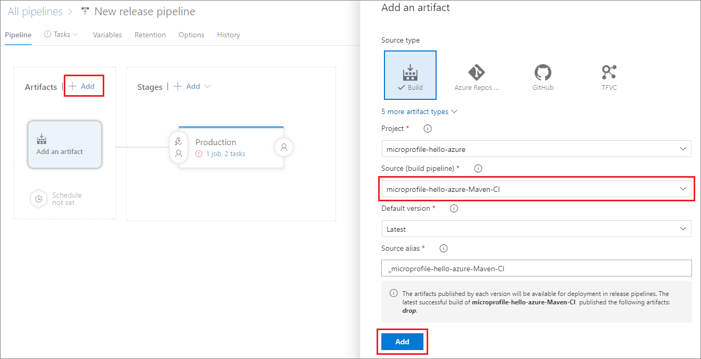
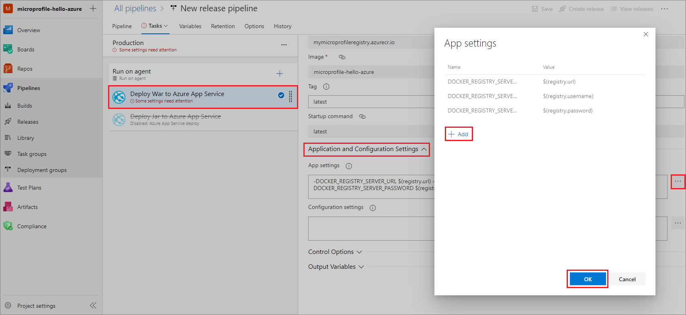
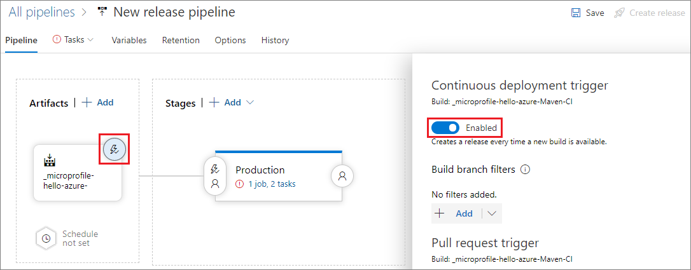

# CI/CD for MicroProfile apps using Azure Pipelines

This tutorial shows you how to easily set up an Azure Pipelines continuous integration and continuous deployment (CI/CD) release cycle to deploy your [MicroProfile](http://microprofile.io) Java EE application to an Azure Web App for Containers. The MicroProfile app in this tutorial uses a [Payara Micro](https://www.payara.fish/payara_micro) base image. 

```Dockerfile
FROM payara/micro:5.182
COPY target/*.war $DEPLOY_DIR/ROOT.war
EXPOSE 8080
```
You start the Azure Pipelines containerize process by building a Docker image and pushing the container image to an Azure Container Registry (ACR). You complete the process by creating an Azure Pipelines release pipeline and deploying the container image to a web app.

## Prerequisites
1. Copy and save the clone URL from [GitHub](https://github.com/Azure-Samples/microprofile-hello-azure).
1. Register or log into your [Azure DevOps](https://dev.azure.com) organization and create a new [project](/vsts/organizations/projects/create-project). 
1. From your project page, select **Repos** in the left navigation, select **Import**, and use the Git clone URL you saved to **Import a Git repository**.
1. In the [Azure portal](https://portal.azure.com), create an [Azure Container Registry](https://azure.microsoft.com/services/container-registry).
1. In the Azure portal, create an Azure Web App for Containers. Select **Linux** for the **OS**, and for **Configure container**, select **Quickstart** as the **Image source**.  
  
## Create a build pipeline

The continuous integration build pipeline in Azure Pipelines automatically executes all build tasks each time there's a commit in the Java EE source app. In this example, Azure Pipelines uses Maven to build the Java MicroProfile project.

1. From your Azure Repos Git repository, select **Pipelines** > **Builds** in the left navigation. 
   
   
   
1. Select **New Pipeline**.
   
1. Select **Maven** from the list of templates, and then select **Apply**.
   
1. In the left pane, select **Agent job 1**. In the right pane, select **Hosted Ubuntu 1604** from the **Agent pool** dropdown.
   
   > [!NOTE]
   > This setting lets Azure Pipelines know which build server to use.  You can also use your private customized build server.
   
1. To configure the pipeline for continuous integration, select the **Triggers** tab, and then select the checkbox next to **Enable continuous integration**.  
   
   
   
1. Select the dropdown next to **Save & queue**, and select **Save**. 

## Create a Docker build image

Azure Pipelines uses a Dockerfile with a base image from Payara Micro to create a Docker image.  

1. On the **Tasks** tab, select the **+** next to **Agent job 1** to add a task.
   
   
   
1. In the right pane, select **Docker** from the list of templates, and then select **Add**. 
   
1. Select **buildAndPush** in the left pane, and in the right pane, enter a description in the **Display name** field.
   
1. Under **Container Repository**, select **New** next to the **Container Registry** field. 
   
1. In the **Add a Docker Registry service connection** dialog:
   1. Select **Azure Container Registry** next to **Registry type**.
   1. Enter a name next to **Connection Name**.
   1. Select your Azure subscription from the **Azure subscription** dropdown.
   1. Select your Azure Container Registry name from the **Azure container registry** dropdown. 
   1. Select **OK**.
   
   > [!NOTE]
   > If you're using Docker Hub or another registry, select **Docker Hub** or **Others** instead of **Azure Container Registry** next to **Registry type**. Then provide the credentials and connection information for your container registry.
   
1. Under **Commands**, select **build** from the **Command** dropdown.
   
1. Select the ellipsis **...** next to the **Dockerfile** field, browse to and select the **Dockerfile** from the GitHub project, and then select **OK**. 
   
   
   
1. Under **Tags**, enter *latest* on a new line. 
   
1. Select the dropdown next to **Save & queue**, and select **Save**. 

## Push the Docker image to ACR

Azure Pipelines pushes the Docker image to your Azure Container Registry, and uses it to run the MicroProfile API app as a containerized Java web app.

1. Since you're using Docker in Azure Pipelines, create a new Docker template by repeating the steps under [Create a Docker build image](#create-a-docker-build-image). This time, select **push** in the **Command** dropdown.
   
1. Select the dropdown next to **Save & queue**, and select **Save & queue**. 
   
1. In the **Run pipeline** popup, make sure **Hosted Ubuntu 1604** is selected under **Agent pool**, and select **Save and run**. 
   
1. After the build finishes, you can select the hyperlink on the **Build** page to verify build success and see other details.
   
   

## Create a release pipeline

An Azure Pipelines continuous release pipeline automatically triggers deployment to a target environment like Azure as soon as a build succeeds. You can create release pipelines for environments like dev, test, staging, or production.

1. On your Azure DevOps project page, select **Pipelines** > **Releases** in the left navigation. 
   
1. Select **New Pipeline**.
   
   
   
1. Select **Deploy a Java app to Azure App Service** in the list of templates, and then select **Apply**. 
   
   
   
1. In the popup window, change **Stage 1** to a stage name like *Dev*, *Test*, *Staging*, or *Production*, and then close the window. 
   
1. Under **Artifacts** in the left pane, select **Add** to link artifacts from the build pipeline to the release pipeline. 
   
1. Select your build pipeline in the dropdown under **Source (build pipeline)**, and then select **Add**.
   
   
   
1. Select the hyperlink in the **Production** stage to **View stage tasks**.
   
   
   
1. In the right pane:
   
   1. Select your Azure subscription in the **Azure subscription** dropdown, and if necessary, select **Authorize**.
      
   1. Select **Web App for Containers (Linux)** from the **App type** dropdown.
      
   1. Select your ACR instance in the **App service name** dropdown.
      
   1. Enter your ACR name in the **Registry or Namespaces** field. For example, enter *myregistry.azure.io*.
      
   1. Enter the repository that contains your Docker image in the **Repository** field, such as *samples/nginx*.
   
1. In the left pane, select **Deploy War to Azure App Service**, and in the right pane, enter the *latest* tag for the container image in the **Tag** field. 
   
   > [!NOTE]
   > Use the fully-qualified image name in the tag: `<registry or namespace>/<repository>:<tag>`. For example, *mymicroprofileregistry.azurecr.io/nginx:latest*.
   
1. In the left pane, select **Run on agent**, and in the right pane, select **Hosted Ubuntu 1604** in the **Agent pool** dropdown. 

## Set up environment variables

Add and define environment variables to connect to the container registry during deployment.

1. Select the **Variables** tab, and then select **Add**.
   
1. Add the variable names and values for your container registry URL, username, and password. For security, select the lock icon to keep the password value hidden.
   
   For example, add:
   - registry.url
   - registry.username
   - registry.password
   
   
   
1. On the **Tasks** tab, select **Deploy War to Azure App Service** in the left pane. 
   
1. In the right pane, expand **Application and Configuration Settings**, and then select the ellipsis **...** next to the **App Settings** field.
   
1. In the **App settings** popup, select **Add** to define and assign the app setting variables:
   - DOCKER_REGISTRY_SERVER_PASSWORD = $(registry.password)
   - DOCKER_REGISTRY_SERVER_URL = $(registry.url)
   - DOCKER_REGISTRY_SERVER_USERNAME = $(registry.username)
   
1. Select **OK**.
   
   
   
## Set up continuous deployment 

To enable continuous deployment: 

1. On the **Pipeline** tab, under **Artifacts**, select the lightning icon in the build artifact. 
   
1. In the right pane, set the **Continuous deployment trigger** to **Enabled**.
   
   
   
1. Select **Save** at upper right, and then select **OK**. 
   
## Deploy the Java app

Now that you enabled CI/CD, modifying the source code creates and runs builds and releases automatically. You can also create and run releases manually.

1. Select **Create release** at the upper right on the pipeline page.
   
1. Select your stage in the left pane, and in the right pane, select the stage name under **Stages for a trigger change from automated to manual**. 
   
1. Select **Create**. 
   
1. Select the release number in the banner, and then select your stage name and select **Deploy**. 
   
1. Select **Deploy** again in the popup window to start the deployment to Azure. 

## Test the Java web app

After deployment completes successfully, test your web app. 

1. Copy your web app URL from the Azure portal.
   
   
   
1. Enter the URL in your web browser to run your app. The web page should say **Hello Azure!**
   
   

