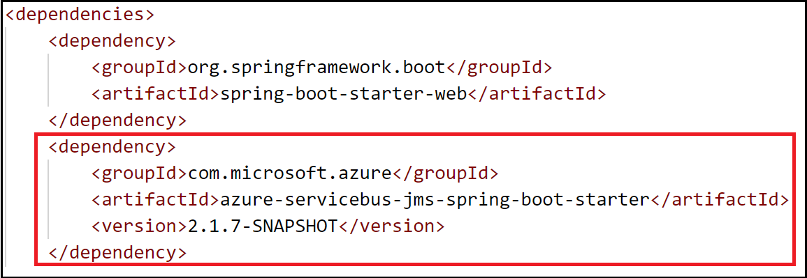
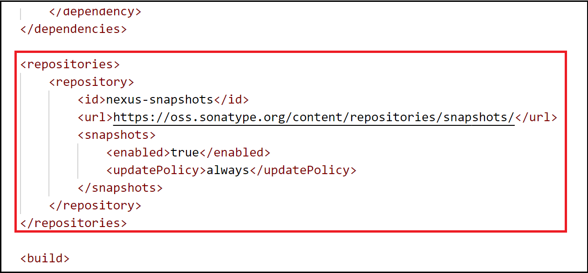

# How to use the Spring Boot Starter for Azure Service Bus JMS

[!INCLUDE [spring-boot-20-note.md](../includes/spring-boot-20-note.md)]

## Overview

Azure provides an asynchronous messaging platform called [Azure Service Bus](https://docs.microsoft.com/azure/service-bus-messaging/service-bus-messaging-overview) ("Service Bus") that is based on the [Advanced Message Queueing Protocol 1.0](http://www.amqp.org/) ("AMQP 1.0") standard. Service Bus can be used across the range of supported Azure platforms.

The Spring Boot Starter for Azure Service Bus JMS provides Spring integration with Service Bus.

This article demonstrates how to use Spring Boot Starter for Azure Service Bus JMS to send messages to and receive messages from Service Bus `queues` and `topics`.

> [!NOTE]
> Currently, this article uses the `SNAPSHOT` version of the starter.

## Prerequisites

The following prerequisites are required for this article:

1. If you don't already have an Azure subscription, you can activate your [MSDN subscriber benefits](https://azure.microsoft.com/pricing/member-offers/credit-for-visual-studio-subscribers/) or sign up for a [free account](https://azure.microsoft.comfree/).

1. A supported Java Development Kit (JDK), version 8 or later. For more information about the JDKs available for use when developing on Azure, see <https://aka.ms/azure-jdks>.

1. Apache's [Maven](http://maven.apache.org/), version 3.2 or later.

1. If you already have a configured Service Bus queue or topic, ensure that the Service Bus namespace meets the following requirements:

    1. Allows access from all networks
    1. Is Premium (or higher)
    1. Has an access policy with read/write access for your queue and topic

1. If you don't have a configured Service Bus queue or topic, use the Azure portal to [create a Service Bus queue](https://docs.microsoft.com/azure/service-bus-messaging/service-bus-quickstart-portal) or [create a Service Bus topic](https://docs.microsoft.com/azure/service-bus-messaging/service-bus-quickstart-topics-subscriptions-portal). Ensure that the namespace meets the requirements specified in the previous step.

1. If you don't have a Spring Boot application, [create a **Maven** project with the Spring Initializer](https://start.spring.io/). Remember to select **Maven Project** and, under **Dependencies**, add the **Web** dependency.

## Use the Azure Service Bus JMS starter

1. Locate the *pom.xml* file in the parent directory of your app; for example:

    `C:\SpringBoot\servicebus\pom.xml`

    -or-

    `/users/example/home/servicebus/pom.xml`

1. Open the *pom.xml* file in a text editor.

1. Add the Spring Boot Azure Service Bus JMS starter to the list of `<dependencies>`:

    ```xml
    <dependency>
        <groupId>com.microsoft.azure</groupId>
        <artifactId>azure-servicebus-jms-spring-boot-starter</artifactId>
        <version>2.1.7-SNAPSHOT</version>
    </dependency>
    ```

    

1. Add the [maven repositories](https://maven.apache.org/settings.html#Repositories) configuration to use SNAPSHOT version:

    ```xml
    <repositories>
        <repository>
            <id>nexus-snapshots</id>
            <url>https://oss.sonatype.org/content/repositories/snapshots/</url>
            <snapshots>
            <enabled>true</enabled>
            <updatePolicy>always</updatePolicy>
            </snapshots>
        </repository>
    </repositories>
    ```

    

1. Save and close the *pom.xml* file.

## Configure the app for your service bus 

In this section, you see how to configure your app to use either a Service Bus queue or topic.

### Use a Service Bus queue

1. Locate the *application.properties* in the *resources* directory of your app; for example:

    `C:\SpringBoot\servicebus\application.properties`

    -or-

    `/users/example/home/servicebus/application.properties`

1. Open the *application.properties* file in a text editor.

1. Append the following code to the end of the *application.properties* file. Replace the sample values with the appropriate values for your service bus:

    ```yml
    spring.jms.servicebus.connection-string=<ServiceBusNamespaceConnectionString>
    spring.jms.servicebus.idle-timeout=<IdleTimeout>
    ```

    **Field Descriptions**

    | Field                                     | Description                                                                                     |
    |-------------------------------------------|-------------------------------------------------------------------------------------------------|
    | `spring.jms.servicebus.connection-string` | Specify the connection string you obtained in your service bus namespace from the Azure portal. |
    | `spring.jms.servicebus.idle-timeout`      | Specify the idle timeout in milliseconds. The recommended value for this tutorial is 1800000.   |

3. Save and close the *application.properties* file.

### Use Service Bus topic

1. Locate the *application.properties* in the *resources* directory of your app; for example:

    `C:\SpringBoot\servicebus\application.properties`

    -or-

    `/users/example/home/servicebus/application.properties`

2. Open the *application.properties* file in a text editor, add the following lines and then replace the sample values with the appropriate properties for your Service Bus.

    ```yml
    spring.jms.servicebus.connection-string=<ServiceBusNamespaceConnectionString>
    spring.jms.servicebus.topic-client-id=<ServiceBusTopicClientId>
    spring.jms.servicebus.idle-timeout=<IdleTimeout>
    ```

    **Field Descriptions**

    | Field                                     | Description                                                                                       |
    |-------------------------------------------|---------------------------------------------------------------------------------------------------|
    | `spring.jms.servicebus.connection-string` | Specify the connection string you obtained in your service bus namespace from the Azure portal.   |
    | `spring.jms.servicebus.topic-client-id`   | Specify the JMS client id if you're using an Azure Service Bus topic with a durable subscription. |
    | `spring.jms.servicebus.idle-timeout`      | Specify the idle timeout in milliseconds. The recommended value for this tutorial is 1800000.     |

3. Save and close the *application.properties* file.

## Add sample code to implement basic Service Bus functionality

In this section, you create the necessary Java classes for sending messages to your Service Bus queue or topic and receive messages from your corresponding queue or subscription.

### Modify the main application class

1. Locate the main application Java file in the package directory of your app; for example:

    `C:\SpringBoot\servicebus\src\main\java\com\wingtiptoys\servicebus\ServiceBusJmsStarterApplication.java`

    -or-

    `/users/example/home/servicebus/src/main/java/com/wingtiptoys/servicebus/ServiceBusJmsStarterApplication.java`

2. Open the main application Java file in a text editor, and add the following lines to the file:

   ```java
    package com.wingtiptoys.servicebus;

    import org.springframework.boot.SpringApplication;
    import org.springframework.boot.autoconfigure.SpringBootApplication;

    @SpringBootApplication
    public class ServiceBusJmsStarterApplication {

        public static void main(String[] args) {
            SpringApplication.run(ServiceBusJmsStarterApplication.class, args);
        }
    }
    ```

3. Save and close the main application Java file.

### Define a simple Java class

1. Create a new Java file named *User.java* in the package directory of your app.

2. Open the *User.java* file in a text editor, and add the following lines to define a generic user class that stores and retrieves user's name:

    ```java
    package com.wingtiptoys.servicebus;

    import java.io.Serializable;

    // Define a generic User class.
    public class User implements Serializable {

        private static final long serialVersionUID = -295422703255886286L;

        private String name;

        public User() {
        }

        public User(String name) {
            setName(name);
        }

        public String getName() {
            return name;
        }

        public void setName(String name) {
            this.name = name;
        }

    }
    ```

    Here, `Serializable` is implemented in order to use the send method in `JmsTemplate` in Spring framework correctly. Otherwise, a customized `MessageConverter` bean should be defined to serialize the content to json in text format (i.e. as a `TextMessage`). For more details about `MessageConverter`, see the official [Spring JMS starter project](https://spring.io/guides/gs/messaging-jms/).

3. Save and close the *User.java* file.

### Create a new class for the message send controller

1. Create a new Java file named *SendController.java* in the package directory of your app, then open the file in a text editor and add the following lines:

    ```java
    package com.wingtiptoys.servicebus;

    import org.slf4j.Logger;
    import org.slf4j.LoggerFactory;
    import org.springframework.beans.factory.annotation.Autowired;
    import org.springframework.jms.core.JmsTemplate;
    import org.springframework.web.bind.annotation.PostMapping;
    import org.springframework.web.bind.annotation.RequestParam;
    import org.springframework.web.bind.annotation.RestController;

    @RestController
    public class SendController {

        private static final String DESTINATION_NAME = "<DestinationName>";

        private static final Logger logger = LoggerFactory.getLogger(SendController.class);

        @Autowired
        private JmsTemplate jmsTemplate;

        @PostMapping("/messages")
        public String postMessage(@RequestParam String message) {
            logger.info("Sending message");
            jmsTemplate.convertAndSend(DESTINATION_NAME, new User(message));
            return message;
        }
    }
    ```

    > [!NOTE]
    > Replace `<DestinationName>` with your own queue name or topic name configured in your Service Bus namespace.

2. Save and close the *SendController.java*.

### Create a new class for the message receive controller

#### Receive messages from a Service Bus queue

1. Create a new Java file named *QueueReceiveController.java* in the package directory of your app, then open the file in a text editor and add the following lines:

    ```java
    package com.wingtiptoys.servicebus;

    import org.slf4j.Logger;
    import org.slf4j.LoggerFactory;
    import org.springframework.jms.annotation.JmsListener;
    import org.springframework.stereotype.Component;

    @Component
    public class QueueReceiveController {

        private static final String QUEUE_NAME = "<ServiceBusQueueName>";

        private final Logger logger = LoggerFactory.getLogger(QueueReceiveController.class);

        @JmsListener(destination = QUEUE_NAME, containerFactory = "jmsListenerContainerFactory")
        public void receiveMessage(User user) {
            logger.info("Received message: {}", user.getName());
        }
    }
    ```

    > [!NOTE]
    > Replace `<ServiceBusQueueName>` with your own queue name configured in your Service Bus namespace.

2. Save and close the *QueueReceiveController.java* file.

#### Receive messages from a Service Bus subscription

1. Create a new Java file named *TopicReceiveController.java* in the package directory of your app, then open the file in a text editor and add the following lines:

    ```java
    package com.wingtiptoys.servicebus;

    import org.slf4j.Logger;
    import org.slf4j.LoggerFactory;
    import org.springframework.jms.annotation.JmsListener;
    import org.springframework.stereotype.Component;

    @Component
    public class TopicReceiveController {

        private static final String TOPIC_NAME = "<ServiceBusTopicName>";

        private static final String SUBSCRIPTION_NAME = "<ServiceBusSubscriptionName>";

        private final Logger logger = LoggerFactory.getLogger(TopicReceiveController.class);

        @JmsListener(destination = TOPIC_NAME, containerFactory = "topicJmsListenerContainerFactory",
                subscription = SUBSCRIPTION_NAME)
        public void receiveMessage(User user) {
            logger.info("Received message: {}", user.getName());
        }
    }
    ```

    > [!NOTE]
    > Replace `<ServiceBusTopicName>` with your own topic name configured in your Service Bus namespace.
    >
    > Replace `<ServiceBusSubscriptionName>` with your own subscription name for your Service Bus topic.

## Build and test your application

1. Open a command prompt and change directory to the folder where your *pom.xml* file is located; for example:

    `cd C:\SpringBoot\servicebus`

    -or-

    `cd cd /users/example/home/servicebus`

2. Build your Spring Boot application with Maven and run it; for example:

    ```shell
    mvn clean spring-boot:run
    ```

3. Once your application is running, you can use *curl* to test your application; for example:

    ```shell
    curl -X POST localhost:8080/messages?message=hello
    ```

    You will see "Sending message" and "hello" posted to your application log. For example:

    ```shell
    [nio-8080-exec-1] com.wingtiptoys.servicebus.SendController : Sending message
    [enerContainer-1] com.wingtiptoys.servicebus.ReceiveController : Received message: hello
    ```

## Clean up resources

You can delete the resources on your [Azure Portal](http://ms.portal.azure.com/) to avoid unexpected charges.

## Next steps

For more information about using Azure Service Bus with JMS, see [How to use JMS API with Service Bus and AMQP 1.0](https://docs.microsoft.com/azure/service-bus-messaging/service-bus-java-how-to-use-jms-api-amqp).

For more information about using Java with the Azure platform see [Azure for Java cloud developers](https://docs.microsoft.com/en-us/azure/java)

For more information on using the Spring framework in your app see the Spring web site [Spring](https://spring.io/). It provides developers with a JMS integration framework, simplifying the use of the JMS API.
