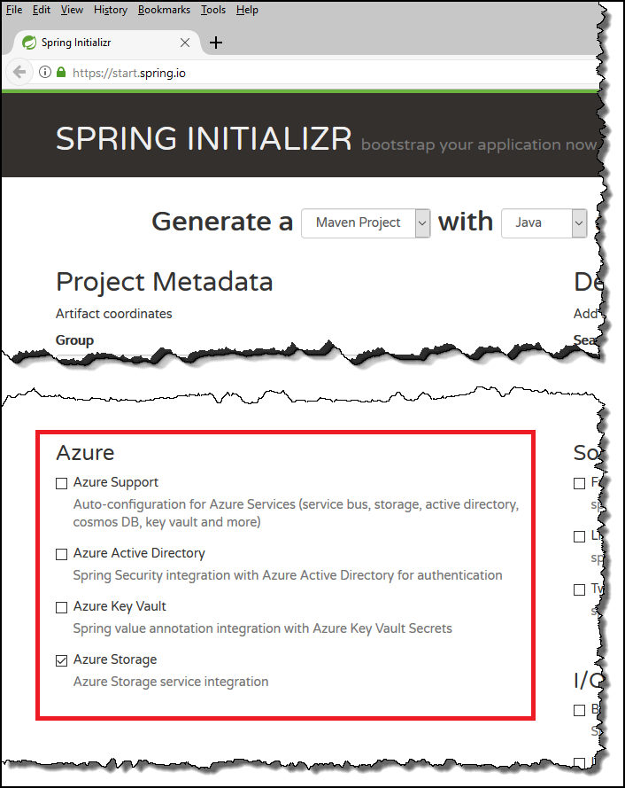
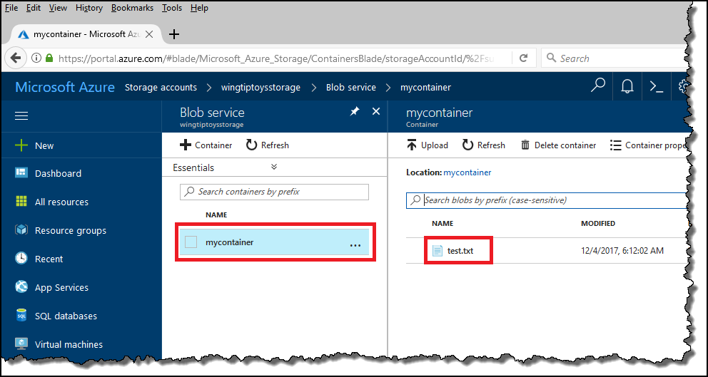

# How to use the Spring Boot Starter with the Azure Storage API

## Overview

This article walks you through creating a custom application using the **Spring Initializr**, and then using that application to access Azure storage by using the Azure Storage API.

## Prerequisites

The following prerequisites are required in order to follow the steps in this article:

* An Azure subscription; if you don't already have an Azure subscription, you can activate your [MSDN subscriber benefits](https://azure.microsoft.com/pricing/member-offers/msdn-benefits-details/) or sign up for a [free Azure account](https://azure.microsoft.com/pricing/free-trial/).
* The [Azure Command-Line Interface (CLI)](http://docs.microsoft.com/cli/azure/overview).
* A supported Java Development Kit (JDK). For more information about the JDKs available for use when developing on Azure, see <https://aka.ms/azure-jdks>.
* Apache's [Maven](http://maven.apache.org/), version 3.0 or later.

## Create a custom application using the Spring Initializr

1. Browse to <https://start.spring.io/>.

1. Specify that you want to generate a **Maven** project with **Java**, enter the **Group** and **Artifact** names for your application, and then click the link to **Switch to the full version** of the Spring Initializr.

   

   > [!NOTE]
   >
   > The Spring Initializr will use the **Group** and **Artifact** names to create the package name; for example: *com.contoso.wingtiptoysdemo*.
   >

1. Scroll down to the **Azure** section and check the box for **Azure Storage**.

   

1. Scroll to the bottom of the page and click the button to **Generate Project**.

   

1. When prompted, download the project to a path on your local computer.

   

## Sign into Azure and select the subscription to use

1. Open a command prompt.

1. Sign into your Azure account by using the Azure CLI:

   ```azurecli
   az login
   ```
   Follow the instructions to complete the sign-in process.

1. List your subscriptions:

   ```azurecli
   az account list
   ```
   Azure will return a list of your subscriptions, and you will need to copy the GUID for the subscription that you want to use; for example:

   ```json
   [
     {
       "cloudName": "AzureCloud",
       "id": "ssssssss-ssss-ssss-ssss-ssssssssssss",
       "isDefault": true,
       "name": "Converted Windows Azure MSDN - Visual Studio Ultimate",
       "state": "Enabled",
       "tenantId": "tttttttt-tttt-tttt-tttt-tttttttttttt",
       "user": {
         "name": "contoso@microsoft.com",
         "type": "user"
       }
     }
   ]
   ```

1. Specify the GUID for the account you want to use with Azure; for example:

   ```azurecli
   az account set -s ssssssss-ssss-ssss-ssss-ssssssssssss
   ```

## Create an Azure Storage account

1. Create a resource group for the Azure resources you will use in this article; for example:
   ```azurecli
   az group create --name wingtiptoysresources --location westus
   ```
   Where:

   | Parameter | Description |
   |---|---|
   | `name` | Specifies a unique name for your resource group. |
   | `location` | Specifies the [Azure region](https://azure.microsoft.com/regions/) where your resource group will be hosted. |

   The Azure CLI will display the results of your resource group creation; for example:  

   ```json
   {
     "id": "/subscriptions/ssssssss-ssss-ssss-ssss-ssssssssssss/resourceGroups/wingtiptoysresources",
     "location": "westus",
     "managedBy": null,
     "name": "wingtiptoysresources",
     "properties": {
       "provisioningState": "Succeeded"
     },
     "tags": null
   }
   ```

2. Create an Azure storage account in the in the resource group for your Spring Boot app; for example:
   ```azurecli
   az storage account create --name wingtiptoysstorage --resource-group wingtiptoysresources --location westus --sku Standard_LRS
   ```
   Where:

   | Parameter | Description |
   |---|---|
   | `name` | Specifies a unique name for your storage account. |
   | `resource-group` | Specifies the name of the resource group group you created in the previous step. |
   | `location` | Specifies the [Azure region](https://azure.microsoft.com/regions/) where your storage account will be hosted. |
   | `sku` | Specifies one of the following: `Premium_LRS`, `Standard_GRS`, `Standard_LRS`, `Standard_RAGRS`, `Standard_ZRS`. |

   Azure will return a long JSON string which contains the provisioning state; for example: |

   ```json
   {
     "id": "/subscriptions/ssssssss-ssss-ssss-ssss-ssssssssssss/...",
     "identity": null,
     "kind": "Storage"
       ...
       ... (A long list of values will be displayed here.)
       ...
     "statusOfPrimary": "available",
     "statusOfSecondary": null,
     "tags": {},
     "type": "Microsoft.Storage/storageAccounts"
   }
   ```

3. Retrieve the connection string for your storage account; for example:
   ```azurecli
   az storage account show-connection-string --name wingtiptoysstorage --resource-group wingtiptoysresources
   ```
   Where:

   | Parameter | Description |
   | ---|---|
   | `name` | Specifies a unique name of the storage account you created in previous steps. |
   | `resource-group` | Specifies the name of the resource group you created in previous steps. |

   Azure will return a JSON string which contains the connection string for your storage account; for example:

   ```json
   {
     "connectionString": "DefaultEndpointsProtocol=https;EndpointSuffix=core.windows.net;AccountName=wingtiptoysstorage;AccountKey=AbCdEfGhIjKlMnOpQrStUvWxYz=="
   }
   ```

## Configure and compile your Spring Boot application

1. Extract the files from the downloaded project archive into a directory.

1. Navigate to the *src/main/resources* folder in your project and open the *application.properties* file in a text editor.

1. Add the key for your storage account; for example:
   ```yaml
   azure.storage.connection-string=DefaultEndpointsProtocol=https;EndpointSuffix=core.windows.net;AccountName=wingtiptoysstorage;AccountKey=AbCdEfGhIjKlMnOpQrStUvWxYz==
   ```

1. Navigate to the */src/main/java/com/example/wingtiptoysdemo* folder in your project and open the *WingtiptoysdemoApplication.java* file in a text editor.

1. Replace the existing Java code with the following example that lists the blobs in a container:

   ```java
   package com.example.wingtiptoysdemo;

   import com.microsoft.azure.storage.*;
   import com.microsoft.azure.storage.blob.*;
   import org.springframework.beans.factory.annotation.Autowired;
   import org.springframework.boot.CommandLineRunner;
   import org.springframework.boot.SpringApplication;
   import org.springframework.boot.autoconfigure.SpringBootApplication;

   import java.net.URISyntaxException;

   @SpringBootApplication
   public class WingtiptoysdemoApplication implements CommandLineRunner {

      @Autowired
      private CloudStorageAccount cloudStorageAccount;

      final String containerName = "mycontainer";

      public static void main(String[] args) {
         SpringApplication.run(WingtiptoysdemoApplication.class, args);
      }

      public void run(String... var1)
             throws URISyntaxException, StorageException {
          // Create a container (if it does not exist).
          createContainerIfNotExists(containerName);
          // Upload a blob to the container.
          uploadTextBlob(containerName);
      }

      private void createContainerIfNotExists(String containerName)
            throws URISyntaxException, StorageException {
         try
         {
            // Create a blob client.
            final CloudBlobClient blobClient = cloudStorageAccount.createCloudBlobClient();
            // Get a reference to a container. (Name must be lower case.)
            final CloudBlobContainer container = blobClient.getContainerReference(containerName);
            // Create the container if it does not exist.
            container.createIfNotExists();
         }
         catch (Exception e)
         {
            // Output the stack trace.
            e.printStackTrace();
         }
      }

      private void uploadTextBlob(String containerName)
            throws URISyntaxException, StorageException {
         try
         {
            // Create a blob client.
            final CloudBlobClient blobClient = cloudStorageAccount.createCloudBlobClient();
            // Get a reference to a container. (Name must be lower case.)
            final CloudBlobContainer container = blobClient.getContainerReference(containerName);
            // Get a blob reference for a text file.
            CloudBlockBlob blob = container.getBlockBlobReference("test.txt");
            // Upload some text into the blob.
            blob.uploadText("Hello World!");
         }
         catch (Exception e)
         {
            // Output the stack trace.
            e.printStackTrace();
         }
      }
   }
   ```
   > [!NOTE]
   >
   > The above example autowires the storage account settings that you defined in the *application.properties* file.
   >

1. Compile and run the application:
   ```shell
   mvn clean package spring-boot:run
   ```

   The application will create a container and upload a text file as a blob to the container, which will be listed under your storage account in the [Azure portal](https://portal.azure.com).

   

   > [!NOTE]
   > 
   > When you compile your application, you might see the following error message:
   > 
   > `[INFO] ------------------------------------------------------------------------`<br/>
   > `[INFO] BUILD FAILURE`<br/>
   > `[INFO] ------------------------------------------------------------------------`<br/>
   > `[INFO] Total time: 2.616 s`<br/>
   > `[INFO] Finished at: 2017-11-11T13:14:15Z`<br/>
   > `[INFO] Final Memory: 26M/213M`<br/>
   > `[INFO] ------------------------------------------------------------------------`<br/>
   > `[ERROR] Failed to execute goal org.apache.maven.plugins:maven-surefire-plugin:2`<br/>
   > `.18.1:test (default-test) on project wingtiptoysdemo: Execution default-test of`<br/>
   > `goal org.apache.maven.plugins:maven-surefire-plugin:2.18.1:test failed: The for`<br/>
   > `ked VM terminated without properly saying goodbye. VM crash or System.exit called?`<br/>
   > `[ERROR] Command was /bin/sh -c cd /home/robert/SpringBoot/wingtiptoysdemo && /u`<br/>
   > `sr/lib/jvm/java-8-openjdk-amd64/jre/bin/java -jar /home/robert/SpringBoot/wingt`<br/>
   > `iptoysdemo/target/surefire/surefirebooter6371623993063346766.jar /home/robert/S`<br/>
   > `pringBoot/wingtiptoysdemo/target/surefire/surefire5107893623933537917tmp /home/`<br/>
   > `robert/SpringBoot/wingtiptoysdemo/target/surefire/surefire_01414159391084128068tmp`<br/>
   > `[ERROR] -> [Help 1]`<br/>
   > 
   > If this happens, you might want to disable the Maven Surefire testing; to do so,
   > add the following plugin entry in your *pom.xml* file:
   > 
   > ```xml
   > <plugin>
   >   <groupId>org.apache.maven.plugins</groupId>
   >   <artifactId>maven-surefire-plugin</artifactId>
   >   <version>2.20.1</version>
   >   <configuration>
   >     <skipTests>true</skipTests>
   >   </configuration>
   > </plugin>
   > ```
   > 

## Next steps

To learn more about Spring and Azure, continue to the Spring on Azure documentation center.

> [!div class="nextstepaction"]
> [Spring on Azure](/java/azure/spring-framework)

### Additional Resources

For more information about the additional Spring Boot Starters that are available for Microsoft Azure, see [Spring Boot Starters for Azure](spring-boot-starters-for-azure.md).

For additional information about integrating Azure functionality into your Spring-based applications, see [Spring Framework on Azure](/java/azure/spring-framework/).

For detailed information about additional Azure storage APIs that you can call from your Spring Boot applications, see the following articles:
* [How to use Azure Blob storage from Java](/azure/storage/blobs/storage-java-how-to-use-blob-storage)
* [How to use Azure Queue storage from Java](/azure/storage/queues/storage-java-how-to-use-queue-storage)
* [How to use Azure Table storage from Java](/azure/cosmos-db/table-storage-how-to-use-java)
* [How to use Azure File storage from Java](/azure/storage/files/storage-java-how-to-use-file-storage)
