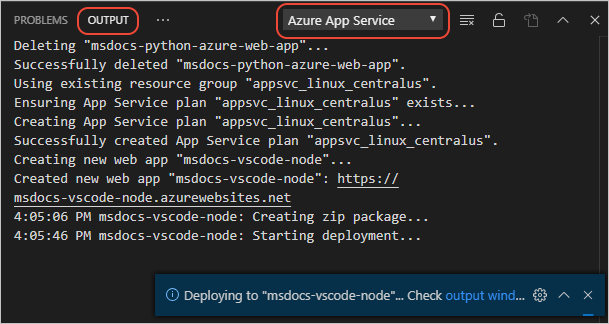

# Deploy the website

[Previous step: create the app](tutorial-vscode-azure-app-service-node-02.md)

In this step, you deploy your Node.js website to using Visual Studio Code and the Azure App Service extension. This tutorial uses the most basic deployment model where your app is zipped and deployed to Azure App Service on Linux.

1. Before deploying the app, sure that it's listening on the port provided by the `PORT` environment variable: `process.env.PORT`.

1. In your app folder (such as `myExpressApp` from the previous step), launch VS Code in that folder by using the following command:

    ```bash
    code .
    ```

1. In VS Code, select the Azure icon to open the **Azure App Service** explorer, then select the blue up arrow icon to deploy the app to Azure:

    

    > [!TIP]
    > Alternately, open the **Command Palette** (**F1**), type 'deploy to web app', and select the **Azure App Service: Deploy to Web App** command.

1. At the prompts, enter the following information:

    a. Select your current folder for the app (`myExpressApp` as used in this tutorial).

    a. Select **Create new Web App**.

    a. Enter a globally unique name for your app and press **Enter**. Valid characters for an app name are 'a-z', '0-9', and '-'.

    a. Choose a location in an Azure region (as explained on [Regions](https://azure.microsoft.com/regions/))near you or near other services you may need to access.

    a. Choose your **Node.js version**; LTS is recommended.

1. As the extension creates the app, progress appears in the **Output** window in VS Code (you may need to select the **Azure App Service** output).

    

1. Select **Yes** when prompted to update your configuration to run `npm install` on the target server. Your app is then deployed.

    

1. Once the deployment starts, you're prompted to update your workspace so that all subsequent deploys automatically target the same App Service Web App. Choose **Yes** to ensure your changes are deployed to the correct app.

    

1. Once the deployment completes, select **Browse Website** in the prompt to view your freshly deployed website.

## Troubleshooting

The error "You do not have permission to view this directory or page" indicates that the app probably failed to start correctly. Viewing logs, as described in the [next step](tutorial-vs-code-azure-app-service-node-04.md) can help to diagnose and fix the problem. If you aren't able to fix it, contact us by clicking the **I ran into an issue** button below. We're happy to help!

## Updating the website

You can deploy changes to this app by using the same process and choosing the existing app rather than creating a new one.

----

> [!div class="nextstepaction"]
> [My site is on Azure](tutorial-vs-code-azure-app-service-node-04.md) [I ran into an issue](https://www.research.net/r/PWZWZ52?tutorial=node-deployment-azureappservice&step=deploy-app)
