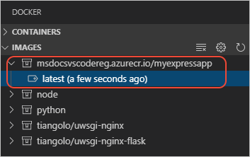

# Create your Node.js application image

[Previous step: use a container registry](tutorial-vscode-docker-node-02.md)

In this step, you use the Docker extension in Visual Studio Code to add the necessary files to create an image for your app, build the image, and push it to a registry.

If you don't already have an app for this walkthrough, use the app from the [Visual Studio Code Node.js tutorial](https://code.visualstudio.com/docs/nodejs/nodejs-tutorial).

## Add Docker files

1. In Visual Studio Code, open the **Command Palette** (**F1**), type `add docker files to workspace`, then select the **Docker: Add Docker files to workspace** command.

1. When prompted, select **Node.js** for the application type, then select the post on which your application listens.

1. The command creates a `Dockerfile` along with some configuration files for Docker compose and a `.dockerignore`.

> **Tip**: VS Code has great support for Docker files. See the [Working with Docker](https://code.visualstudio.com/docs/azure/docker) in the VS Code documentation to learn about rich language features like smart suggestions, completions, and error detection.

## Build a Docker image

The `Dockerfile` describe the environment for your app including the location of the source files and the command to start the app within a container.

> **Tip:** Containers versus images: A container is an instance of an image.

1. Open the **Command Palette** (**F1**) and run **Docker Images: Build Image** to build the image.

1. When prompted, choose the `Dockerfile` that was just created then give the image a name. The name must include your target registry or Docker Hub account:

    `[registry or username]/[image name]:[tag]`

    In this tutorial, which uses the Azure Container Registry, the image name is as follows:

    `msdocsvscodereg.azurecr.io/myexpressapp:latest`

    If you are using Docker Hub, use your Docker Hub username. For example:

    `fiveisprime/myexpressapp:latest`

1. Once completed, the **Terminal** panel of Visual Studio Code opens to run the `docker build` command. The output also shows each step, or layer, that makes up the app environment.

1. Once built, the image appears in the **DOCKER** explorer under **Images**.

    

## Push the image to a registry

1. In Visual Studio Code, open the **Command Palette** (**F1**) and run **Docker Images: Push** and choose the image you just built. The **Terminal** panel shows the `docker push` commands used for this operation.

1. Once completed, expand the **Images** node in the Docker extension explorer to see your image.

> [!div class="nextstepaction"]
> [I've created an image for my application](tutorial-vs-code-docker-node-04.md) [I ran into an issue](https://www.research.net/r/PWZWZ52?tutorial=docker-extension&step=containerize-app)
