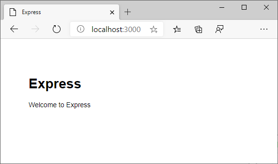

# Create your Node.js application

[Previous step: Introduction and prerequisites](tutorial-vscode-azure-app-service-node-01.md)

In this step, you create a simple Node.js app using the Express application generator that you can then deploy to Azure.

You can also use the app from the [Visual Studio Code Node.js tutorial](https://code.visualstudio.com/docs/nodejs/nodejs-tutorial), in which case you can skip ahead to [Deploy the app](tutorial-vscode-azure-app-service-node-03.md).

1. In a terminal or command prompt, use the following command to run the Express Generator and scaffold a new Express app called "myExpressApp". (The `--view pug --git` parameters tell the generator to use the [pug](https://pugjs.org/api/getting-started.html) template engine, formerly known as Jade, and to create a *.gitignore* file.)

    ```bash
    npx express-generator myExpressApp --view pug –git
    ```

1. Install the application's dependencies by running `npm install` in the app folder:

    ```bash
    cd myExpressApp
    npm install
    ```

1. Start the server by running `npm start`:

    ```bash
    npm start
    ```

1. Test the app by opening a browser to [http://localhost:3000](http://localhost:3000). The site should appear as follows:

    

> [!div class="nextstepaction"]
> [I created the  Node.js app](tutorial-vscode-azure-app-service-node-03.md) [I ran into an issue](https://www.research.net/r/PWZWZ52?tutorial=node-deployment-azureappservice&step=create-app)
