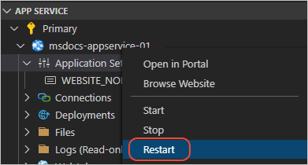

# Deploy the app to Azure

[Previous step: Create the app](tutorial-vscode-azure-app-service-node-02.md)

In this step, you deploy your Node.js app to Azure using Visual Studio Code and the Azure App Service extension.

1. In the terminal, make sure you're in the *nodejs-docs-hello-world* folder, then start Visual Studio Code with the following command:

    ```bash
    code .
    ```

1. In VS Code, select the Azure icon to open the **Azure App Service** explorer, then select the blue up arrow icon to deploy the app to Azure:

    

    You can also invoke the same command from the **Command Palette** (**Ctrl**+**Shift**+**P**) by typing 'deploy to web app' and choosing **Azure App Service: Deploy to Web App**.

1. Choose the *nodejs-docs-hello-world* folder.

1. Choose a creation option based on the operating system to which you want to deploy:

    - Linux: Choose **Create new Web App**
    - Windows: Choose **Create new Web App... Advanced**

1. Enter a globally unique name for your web app. The name must be unique across all of Azure and use only alphanumeric characters ('A-Z', 'a-z', and '0-9') and hyphens ('-').

1. If targeting Linux, select a Node.js version when prompted. An **LTS** version is recommended.

1. If targeting Windows, follow the additional prompts:
    1. Select **Create a new resource group**, then enter a name for the resource group, such as `AppServiceQS-rg`.
    1. Select **Windows** for the operating system.
    1. Select **Create new App Service plan**, then enter a name for the plan (such as `AppServiceQS-plan`), then select **F1 Free** for the pricing tier.
    1. Choose **Skip for now** when prompted about Application Insights.
    1. Choose a region near you or near resources you wish to access.

1. After you respond to all the prompts, VS Code shows the Azure resources that are being created for your app in its notification popup.

    When deploying to Linux, select **Yes** when prompted to update your configuration to run `npm install` on the target server.

    

1. Select **Yes** when prompted with **Always deploy the workspace "nodejs-docs-hello-world" to (app name)"**. Selecting **Yes** tells VS Code to automatically target the same App Service Web App with subsequent deployments.

1. If deploying to Linux, select **Browse Website** in the prompt to view your freshly deployed web app once deployment is complete. The browser should display "Hello World!"

1. If deploying to Windows, you must first set the Node.js version number for the web app:

    1. In VS Code, expand the node for the new app service, right-click **Application Settings**, and select **Add New Setting...**:

        

    1. Enter `WEBSITE_NODE_DEFAULT_VERSION` for the setting key.
    1. Enter `10.15.2` for the setting value.
    1. Right-click the node for the app service and select **Restart**

        

    1. Right-click the node for the app service once more and select **Browse Website**.
    1. Note that Windows deployments require that the app has a *web.config* file. The sample repository used with this tutorial already includes such a file.

## Update the website

You can deploy changes to this app by making edits in VS Code, saving your files, and then using the same process as before only choosing the existing app rather than creating a new one.

----

> [!div class="nextstepaction"]
> [My site is on Azure](tutorial-vscode-azure-app-service-node-04.md) [I ran into an issue](https://www.research.net/r/PWZWZ52?tutorial=node-deployment-azureappservice&step=deploy-app)
