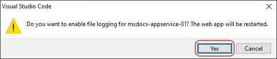

# Stream logs from Azure App Service

[Previous step: deploy the website](tutorial-vscode-azure-app-service-node-03.md)

In this step, you learn how to view or "tail" any output that the running website generates through calls to `console.log`. This output appears in the **Output** window in Visual Studio Code.

1. In the **Azure App Service** explorer, right-click the app node and choose **Start Streaming Logs**.

    

1. When prompted, choose to enable logging and restart the application.

    

1. Once the app is restarted, the VS Code **Output** window opens with a connection to the log stream that shows output.

    ```bash
    Connecting to log-streaming service...
    2019-09-20 17:33:51.428 INFO  - Container msdocs-vscode-node_2 for site msdocs-vscode-node initialized successfully.
    2019-09-20 17:33:56.500 INFO  - Container logs
    ```

1. Refresh the web page a few times in the browser to see additional log output.

> [!div class="nextstepaction"]
> [I see the logs](tutorial-vscode-azure-app-service-node-05.md) [I ran into an issue](https://www.research.net/r/PWZWZ52?tutorial=node-deployment-azureappservice&step=tailing-logs)
